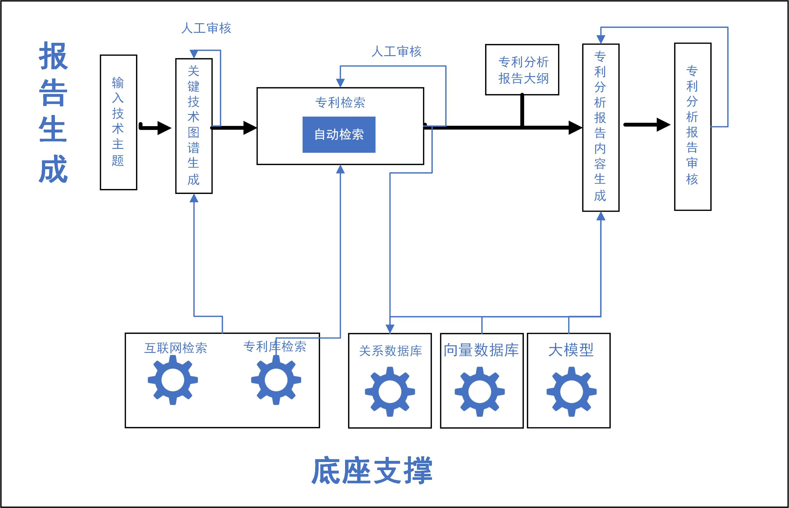

# 专利分析报告自动撰写系统
<p align="center">
   参赛队伍: 复兴15号
</p>
<p align="center">
  <strong></strong><br>
  陈亮<sup>1</sup>, 李子由<sup>1</sup>, 舒磊<sup>1</sup>, 马纯健<sup>2</sup>, 王康乐<sup>3</sup>
  <br><br>
  <strong></strong><br>
  <sup>1</sup>中国科学技术信息研究所,<sup>2</sup>齐鲁工业大学（山东省科学院）, <sup>3</sup>山东理工大学
</p>

## 介绍

用户输入综述主题后，大模型开始准备技术图谱并检索专利，之后按照既定专利分析大纲，对每一节的内容展开撰写，审阅Agent在审阅后给出稿件得分、存在问题和修改建议，之后系统判断本次稿件得分是否及格，或者循环迭代次数达到最大，如果满足两个条件之一，停止循环，并输出最终稿件；如果没有达成循环终止条件，则参考稿件存在问题、修改建议、原始稿件，综述主题，对稿件进行修改。.




## 环境要求

- Python 3.10.x
- 必要的Python包列表 `requirements.txt`

## 安装

1. 克隆仓储:
   ```sh
   git clone -b patent_anaysis_agent git@github.com:awesome-patent-mining/patent_anaysis_agent.git
   ```

2. 安装必要的python包:
   ```sh
   pip install -r requirements.txt
   ```

## 示例


## License

该项目使用的开源License为MIT License，欢迎提ISSUE.
