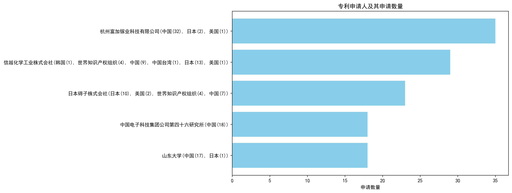
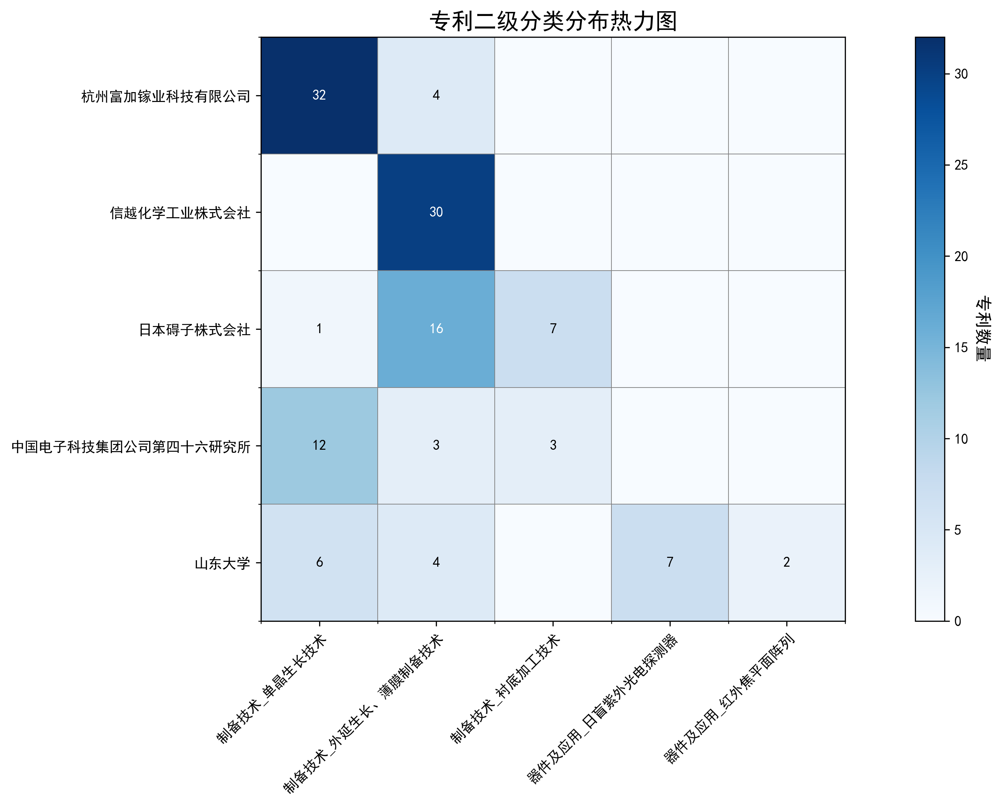

### 专利申请人分析报告

#### 一、专利申请人排名分析

根据提供的专利申请人排名数据，杭州富加镓业科技有限公司以35件专利位居榜首，其专利主要集中在中国（32件），同时在日本和美国也有少量布局。信越化学工业株式会社以29件专利紧随其后，其专利分布较为广泛，涉及韩国、世界知识产权组织、中国、中国台湾、日本和美国。日本碍子株式会社以23件专利排名第三，其专利主要分布在日本、美国、世界知识产权组织和中国。中国电子科技集团公司第四十六研究所和山东大学均以18件专利并列第四，前者专利全部集中在中国，后者则在中国和日本均有布局。

主要发现：
1. 杭州富加镓业科技有限公司在专利数量上占据明显优势，且主要集中在中国市场。
2. 信越化学工业株式会社和日本碍子株式会社的专利布局较为国际化，涉及多个国家和地区。
3. 中国电子科技集团公司第四十六研究所和山东大学的专利布局相对集中，主要在中国市场。

*图1：专利申请人排名柱状图*

#### 二、专利申请人技术分布

从技术分布数据来看，各主要申请人的技术布局特点如下：

1. **杭州富加镓业科技有限公司**：专注于“制备技术-单晶生长技术”，拥有32件相关专利，同时在“制备技术-外延生长、薄膜制备技术”也有少量布局。
2. **信越化学工业株式会社**：主要布局在“制备技术-外延生长、薄膜制备技术”，拥有30件相关专利，其他技术领域未见明显布局。
3. **日本碍子株式会社**：在“制备技术-外延生长、薄膜制备技术”和“制备技术-衬底加工技术”均有较多专利，分别有16件和7件，同时在“制备技术-单晶生长技术”也有少量布局。
4. **中国电子科技集团公司第四十六研究所**：在“制备技术-单晶生长技术”拥有12件专利，同时在“制备技术-外延生长、薄膜制备技术”和“制备技术-衬底加工技术”也有少量布局。
5. **山东大学**：在“制备技术-单晶生长技术”和“器件及应用-日盲紫外光电探测器”分别拥有6件和7件专利，同时在“制备技术-外延生长、薄膜制备技术”和“器件及应用-红外焦平面阵列”也有少量布局。

主要发现：
1. 杭州富加镓业科技有限公司和信越化学工业株式会社分别在“单晶生长技术”和“外延生长、薄膜制备技术”领域占据主导地位。
2. 日本碍子株式会社在多个制备技术领域均有布局，显示出较为全面的技术能力。
3. 山东大学在器件及应用领域有较多专利，显示出其在应用技术方面的优势。

*图2：专利申请人技术分布热力图*

#### 三、专利申请人技术布局分析

##### 1. 杭州富加镓业科技有限公司
**背景信息:**  
杭州富加镓业科技有限公司在氧化镓领域取得显著进展，成功研发MOCVD同质外延技术，实现高质量氧化镓薄膜制备，并突破6英寸氧化镓单晶生长技术，为下游功率电子器件提供关键材料支撑。

**技术分布:**  
根据专利技术分布数据，该公司在“制备技术-单晶生长技术”领域拥有32项专利，显著领先于其他技术领域，如“制备技术-外延生长、薄膜制备技术”（4项）和“器件及应用”领域（0项）。

**核心技术方向:**  
- 氧化镓单晶生长技术  
- 氧化镓外延薄膜制备技术  
- 氧化镓晶体生长装置优化  
- 氧化镓晶体质量预测与优化  
- 氧化镓晶体掺杂与性能调控  

**技术问题解决分析:**  
- **技术痛点:** 氧化镓晶体生长过程中易产生杂晶、裂纹等缺陷。  
  **解决方案:** 引入激光辅助加热器，精准加热并去除杂晶（CN113957529A）。  
  **效果指标:** 提高晶体质量，减少缺陷。  
- **技术痛点:** 氧化镓晶体生长过程中挥发物附着导致生长失败。  
  **解决方案:** 使用螺旋式籽晶杆或遮挡片组件吸附挥发物（CN215976140U, CN215976141U）。  
  **效果指标:** 提高晶体生长成功率和实时观测效果。  

**典型案例说明:**  
- **专利ID:** CN113957529A  
  **技术问题:** 导模法生长氧化镓晶体过程中模具口附近的固液界面处由于不可预知的微小的扰动导致杂晶产生。  
  **解决方案:** 通过激光辅助加热器发出的激光加热并熔化氧化镓晶体上出现的杂晶。  
  **效果:** 直接快速，定位精准高效，有效解决了杂晶产生的技术难题。

##### 2. 信越化学工业株式会社
**背景信息:**  
信越化学工业株式会社专注于外延生长和薄膜制备技术，通过结合化学束外延（CBE）和分子束外延（MBE）等先进技术，致力于开发高质量半导体薄膜材料，并在化合物半导体、量子阱和超晶格结构材料等领域取得显著进展。

**技术分布:**  
该公司在“制备技术-外延生长、薄膜制备技术”领域拥有30项专利，而在“制备技术-单晶生长技术”和“器件及应用”领域则无专利布局。

**核心技术方向:**  
- 氧化镓半导体膜的制造方法  
- 雾化CVD法在成膜中的应用  
- 结晶性氧化物膜的制备与优化  
- 层叠结构体的制造与性能提升  
- 高生产性成膜装置的设计与改进  

**技术问题解决分析:**  
- **技术痛点:** 氧化镓半导体膜的膜厚均匀性和成膜速度问题。  
  **解决方案:** 采用雾化CVD法，通过雾化工序、载气供给工序、整流工序和热处理工序，优化成膜过程（JP6925548B1, US20230257880A1）。  
  **效果指标:** 膜厚的面内均匀性优异，成膜速度显著提高。  

**典型案例说明:**  
- **专利ID:** JP6925548B1  
  **技术问题:** 氧化镓半导体膜的膜厚均匀性和成膜速度问题。  
  **解决方案:** 采用雾化CVD法，通过雾化工序、载气供给工序、整流工序和热处理工序，优化成膜过程。  
  **效果:** 膜厚的面内均匀性优异，成膜速度显著提高。

##### 3. 日本碍子株式会社
**背景信息:**  
日本碍子株式会社在衬底加工技术、外延生长与薄膜制备技术以及单晶生长技术方面拥有显著的技术布局。公司通过专利技术，如III族氮化物单晶制造方法，实现了高质量半导体衬底的生产，并采用同步横向外延生长法等先进技术，提升了外延层生长和薄膜制备的效率与质量。此外，公司还开发了钠助熔剂法等单晶生长技术，以减少晶体缺陷，提高晶体质量。

**技术分布:**  
该公司在“制备技术-外延生长、薄膜制备技术”领域拥有16项专利，在“制备技术-衬底加工技术”领域拥有7项专利，而在“制备技术-单晶生长技术”领域仅有1项专利。

**核心技术方向:**  
- ε-Ga2O3和α-Ga2O3半导体薄膜的制备与优化  
- 高电阻半导体层的开发与应用  
- 基底基板的改进与优化  
- 半导体薄膜的缺陷控制与性能提升  
- 复合基板的结构设计与应用  

**技术问题解决分析:**  
- **技术痛点:** 半导体薄膜中的裂纹和缺陷。  
  **解决方案:** 通过控制半导体膜的偏角分布和裂纹数量，如专利WO2023021815A1中提到的每20cm²的单位面积上长度为50μm以上的裂纹数为20条以下。  
  **效果指标:** 裂纹数量显著减少，薄膜质量提高。  

**典型案例说明:**  
- **专利ID:** WO2023021815A1  
  **技术问题:** 半导体薄膜中的裂纹和缺陷。  
  **解决方案:** 通过控制半导体膜的偏角分布和裂纹数量，显著减少了裂纹的产生。  
  **效果:** 裂纹数量显著减少，薄膜质量提高。

##### 4. 中国电子科技集团公司第四十六研究所
**背景信息:**  
中国电子科技集团公司第四十六研究所专注于衬底加工、外延生长和单晶生长技术。该所在半导体材料、特种光纤等领域取得显著成果，拥有多项专利，致力于第一、二、三代半导体材料研发，并建有相关技术重点实验室，推动产业化和技术创新。

**技术分布:**  
该研究所在“制备技术-单晶生长技术”领域拥有12项专利，在“制备技术-外延生长、薄膜制备技术”和“制备技术-衬底加工技术”领域各拥有3项专利。

**核心技术方向:**  
- 氧化镓单晶生长技术  
- 氧化镓衬底加工技术  
- 氧化镓外延膜制备技术  
- 氧化镓晶体缺陷控制技术  
- 氧化镓晶体生长设备优化技术  

**技术问题解决分析:**  
- **技术痛点:** 氧化镓单晶生长过程中晶体质量不稳定，存在空洞和缺陷。  
  **解决方案:** 通过改进模具设计和原料处理方法，如CN117552087A中提到的模具清洗和CO2保护气使用，以及CN114574966B中的原料处理方法。  
  **效果指标:** 提高了晶体质量，减少了空洞，增加了单晶可利用率。  

**典型案例说明:**  
- **专利ID:** CN117552087A  
  **技术问题:** 氧化镓单晶生长过程中晶体质量不稳定。  
  **解决方案:** 通过模具清洗和CO2保护气使用，优化了晶体生长环境。  
  **效果:** 提高了晶体质量，减少了空洞。

##### 5. 山东大学
**背景信息:**  
山东大学在材料科学领域取得显著成就，专注于外延生长和薄膜制备技术，如氧化镓和氮化镓单晶生长，并发展了红外焦平面阵列和日盲紫外光电探测器技术，推动光电和半导体材料应用。

**技术分布:**  
该校在“器件及应用-日盲紫外光电探测器”领域拥有7项专利，在“器件及应用-红外焦平面阵列”领域拥有2项专利，而在“制备技术”领域则相对较少。

**核心技术方向:**  
- 氧化镓单晶生长技术  
- 氧化镓薄膜制备技术  
- 日盲紫外光电探测器  
- 红外发光材料  
- 磁光晶体应用  

**技术问题解决分析:**  
- **技术痛点:** 氧化镓单晶生长中固液界面失稳问题。  
  **解决方案:** 通过实时调控结晶固液界面，解决了β-Ga2O3单晶生长中固液界面失稳问题（CN112795986A）。  
  **效果指标:** 提高了晶体质量和长度。  

**典型案例说明:**  
- **专利ID:** CN112795986A  
  **技术问题:** 氧化镓单晶生长中固液界面失稳问题。  
  **解决方案:** 通过实时调控结晶固液界面，解决了β-Ga2O3单晶生长中固液界面失稳问题。  
  **效果:** 提高了晶体质量和长度。

---

通过上述分析，可以看出各申请人在氧化镓相关技术领域的布局各有侧重，杭州富加镓业科技有限公司和信越化学工业株式会社分别专注于单晶生长和外延薄膜制备技术，而山东大学则在器件应用领域取得了显著进展。日本碍子株式会社和中国电子科技集团公司第四十六研究所在衬底加工和薄膜制备技术方面也有较强的技术积累。