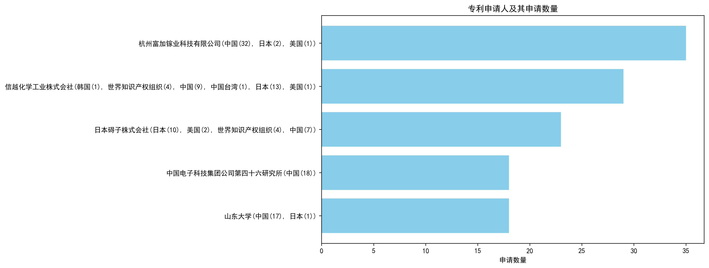
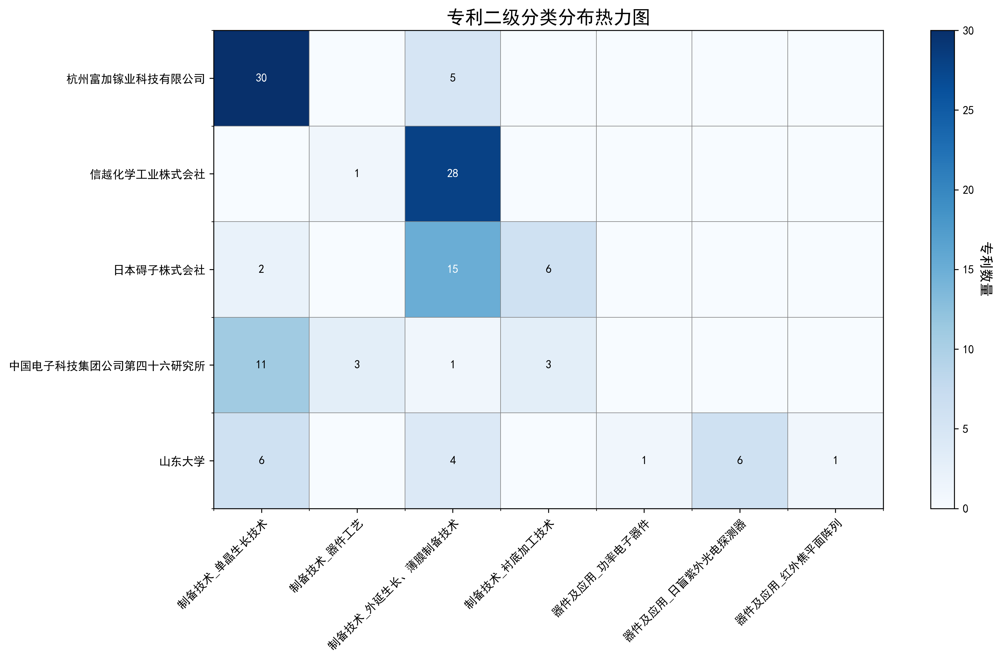

### 专利申请人分析报告

#### 一、专利申请人排名分析

根据提供的专利申请人排名数据，以下是主要发现和总结：

1. **杭州富加镓业科技有限公司**以35件专利位居榜首，其专利主要集中在中国（32件），同时在日本和美国也有少量布局。这表明该公司在中国市场具有显著的技术优势，并开始向国际市场扩展。
   
2. **信越化学工业株式会社**以29件专利排名第二，其专利分布较为广泛，涉及韩国、世界知识产权组织、中国、中国台湾、日本和美国。特别是其在日本（13件）和世界知识产权组织（4件）的专利数量较多，显示出其全球化的技术布局。

3. **日本碍子株式会社**以23件专利排名第三，其专利主要分布在日本（10件）、世界知识产权组织（4件）和中国（7件）。该公司在国际专利布局上较为均衡，尤其是在世界知识产权组织的专利数量较多，表明其注重国际市场的技术保护。

4. **中国电子科技集团公司第四十六研究所**和**山东大学**均以18件专利并列第四。前者所有专利均集中在中国，显示出其在中国市场的专注；后者则在中国（17件）和日本（1件）有少量布局，表明其技术研发主要集中在中国，但已开始尝试国际化。

  
*图1：专利申请人排名柱状图，展示了各申请人的专利数量分布。*

#### 二、专利申请人技术分布

通过对专利申请人技术分布数据的分析，可以识别出各主要申请人的技术布局特点：

1. **杭州富加镓业科技有限公司**的技术布局主要集中在**制备技术-单晶生长技术**（30件），其次是**制备技术-外延生长、薄膜制备技术**（5件）。这表明该公司在单晶生长技术领域具有显著的技术优势，并在此领域进行了大量的研发投入。

2. **信越化学工业株式会社**的技术布局主要集中在**制备技术-外延生长、薄膜制备技术**（28件），其次是**制备技术-器件工艺**（1件）。该公司在外延生长和薄膜制备技术领域具有显著的技术优势，显示出其在该领域的专注。

3. **日本碍子株式会社**的技术布局较为均衡，主要集中在**制备技术-外延生长、薄膜制备技术**（15件）和**制备技术-衬底加工技术**（6件），同时在**制备技术-单晶生长技术**（2件）也有少量布局。这表明该公司在多个制备技术领域均有涉猎，技术布局较为全面。

4. **中国电子科技集团公司第四十六研究所**的技术布局主要集中在**制备技术-单晶生长技术**（11件），其次是**制备技术-器件工艺**（3件）和**制备技术-衬底加工技术**（3件）。该公司在单晶生长技术领域具有显著的技术优势，同时在器件工艺和衬底加工技术领域也有一定的研发投入。

5. **山东大学**的技术布局较为多样化，主要集中在**制备技术-单晶生长技术**（6件）和**器件及应用-日盲紫外光电探测器**（6件），同时在**制备技术-外延生长、薄膜制备技术**（4件）和**器件及应用-功率电子器件**（1件）也有少量布局。这表明该校在单晶生长技术和日盲紫外光电探测器领域具有显著的技术优势，同时在多个技术领域均有涉猎。

  
*图2：专利申请人技术分布热力图，展示了各申请人在不同技术分类下的专利分布情况。*

通过以上分析，可以看出各主要申请人在技术布局上各有侧重，杭州富加镓业科技有限公司和信越化学工业株式会社分别在单晶生长技术和外延生长、薄膜制备技术领域具有显著优势，而日本碍子株式会社和中国电子科技集团公司第四十六研究所则在多个技术领域均有涉猎，技术布局较为全面。山东大学则在单晶生长技术和日盲紫外光电探测器领域具有显著的技术优势。

#### 三、专利申请人技术布局分析

##### 1. 杭州富加镓业科技有限公司
**背景信息:**  
杭州富加镓业科技有限公司在氧化镓领域取得显著进展，成功研发MOCVD同质外延技术，实现高质量氧化镓薄膜制备，并突破6英寸氧化镓单晶生长技术，为功率电子器件提供关键材料支撑。

**技术分布:**  
根据技术分布数据，该公司在“制备技术-单晶生长技术”领域拥有30项专利，而在“制备技术-外延生长、薄膜制备技术”领域有5项专利，其他技术领域暂无专利布局。

**核心技术方向:**  
- 氧化镓单晶生长技术  
- 氧化镓薄膜外延技术  
- 晶体生长热场控制技术  
- 激光辅助加热技术  
- 深度学习在晶体生长中的应用  

**技术问题解决分析:**  
- **氧化镓单晶生长技术:** 通过激光辅助加热器精准加热去除杂晶，提高晶体质量（CN113957529A）。  
- **氧化镓薄膜外延技术:** 采用激光加热方法均匀加热衬底，制备高质量、厚度均匀的薄膜（CN114908418A）。  
- **晶体生长热场控制技术:** 动态调整反射屏高度，优化热场温度梯度，降低晶体内部缺陷密度（CN114134561A）。  

**典型案例说明:**  
- **CN113957529A:** 通过激光辅助加热器去除杂晶，提高晶体质量。  
- **CN114908418A:** 采用激光加热方法制备高质量、厚度均匀的薄膜。  
- **CN114134561A:** 动态调整反射屏高度，优化热场温度梯度，降低晶体内部缺陷密度。

##### 2. 信越化学工业株式会社
**背景信息:**  
信越化学工业株式会社在外延生长和薄膜制备技术上，专注于开发高质量半导体材料，如GaN基材料，并采用MOCVD等先进技术制备薄膜。在器件工艺方面，公司致力于提高光电半导体和电子器件的性能，如通过外延层生长技术优化器件结构。

**技术分布:**  
该公司在“制备技术-外延生长、薄膜制备技术”领域拥有28项专利，在“制备技术-器件工艺”领域有1项专利，其他技术领域暂无专利布局。

**核心技术方向:**  
- 氧化镓薄膜的制备技术  
- 雾化CVD法的优化  
- 结晶性氧化物膜的质量提升  
- 大面积基板上的均匀成膜  
- 低成本高效成膜技术  

**技术问题解决分析:**  
- **氧化镓薄膜的制备技术:** 采用雾化CVD法，优化载气流量和温度控制，提升成膜速度和均匀性（JP7075525B2, CN117286470A）。  
- **结晶性氧化物膜的质量提升:** 通过光吸收层分解技术分离结晶层与衬底，减少晶体缺陷（JP6941208B2, CN115038825A）。  

**典型案例说明:**  
- **JP6925548B1:** 采用雾化CVD法，引入整流工序优化雾的流动，提升成膜速度和均匀性。  
- **JP6941208B2:** 通过光吸收层分解技术分离结晶层与衬底，减少晶体缺陷。

##### 3. 日本碍子株式会社
**背景信息:**  
日本碍子株式会社在半导体领域的技术布局包括：外延生长和薄膜制备技术，如III族氮化物单晶生长；衬底加工技术，如复合衬底制作；单晶生长技术，如采用钠助熔剂法的高品质氮化镓晶体生长。这些技术支持了其在电子器件和光学器件领域的创新与发展。

**技术分布:**  
该公司在“制备技术-外延生长、薄膜制备技术”领域拥有15项专利，在“制备技术-衬底加工技术”领域有6项专利，在“制备技术-单晶生长技术”领域有2项专利，其他技术领域暂无专利布局。

**核心技术方向:**  
- ε-Ga2O3和α-Ga2O3半导体薄膜的制备  
- 高电阻半导体层的开发  
- 基底基板的优化与缺陷控制  
- 半导体薄膜的裂纹抑制与杂质控制  
- 复合基板的结构设计与性能提升  

**技术问题解决分析:**  
- **ε-Ga2O3和α-Ga2O3半导体薄膜的制备:** 通过控制半导体膜表面的偏角分布和裂纹数量，解决裂纹产生问题（WO2023021815A1）。  
- **基底基板的优化与缺陷控制:** 通过优化基底基板的取向层，显著降低结晶缺陷（CN113614293A）。  

**典型案例说明:**  
- **WO2023021815A1:** 通过控制半导体膜表面的偏角分布和裂纹数量，成功抑制裂纹产生。  
- **CN113614293A:** 通过优化基底基板的取向层，显著降低结晶缺陷。

##### 4. 中国电子科技集团公司第四十六研究所
**背景信息:**  
中国电子科技集团公司第四十六研究所专注于外延生长、薄膜制备技术，衬底加工技术，器件工艺，以及单晶生长技术。该所通过VGF法等先进技术，生产超薄锗片和硅外延片，并致力于提高晶体质量和器件性能，推动半导体材料及器件的产业化发展。

**技术分布:**  
该研究所在“制备技术-单晶生长技术”领域拥有11项专利，在“制备技术-器件工艺”领域有3项专利，在“制备技术-外延生长、薄膜制备技术”领域有1项专利，在“制备技术-衬底加工技术”领域有3项专利，其他技术领域暂无专利布局。

**核心技术方向:**  
- 氧化镓单晶生长技术  
- 氧化镓衬底加工技术  
- 氧化镓外延膜制备技术  
- 氧化镓器件工艺优化  

**技术问题解决分析:**  
- **氧化镓单晶生长技术:** 通过改进模具设计和优化生长参数，提高晶体质量（CN117552087A）。  
- **氧化镓衬底加工技术:** 采用保护基板防止晶片解理，提高加工精度（CN114161258A）。  

**典型案例说明:**  
- **CN117552087A:** 通过模具设计和CO2气体环境控制，提高晶体质量。  
- **CN114161258A:** 采用保护基板防止晶片解理，提高加工精度。

##### 5. 山东大学
**背景信息:**  
山东大学在红外焦平面阵列、单晶生长技术、功率电子器件等领域具有显著优势。该校致力于日盲紫外光电探测器和外延生长、薄膜制备技术的研究，不断推动相关技术发展。

**技术分布:**  
该校在“制备技术-单晶生长技术”领域拥有6项专利，在“器件及应用-日盲紫外光电探测器”领域有6项专利，在“器件及应用-红外焦平面阵列”领域有1项专利，在“器件及应用-功率电子器件”领域有1项专利，在“制备技术-外延生长、薄膜制备技术”领域有4项专利，其他技术领域暂无专利布局。

**核心技术方向:**  
- 单晶生长技术  
- 外延生长与薄膜制备技术  
- 日盲紫外光电探测器  
- 红外焦平面阵列  
- 功率电子器件  

**技术问题解决分析:**  
- **单晶生长技术:** 通过实时调控结晶固液界面，提高晶体生长稳定性（CN112795986A）。  
- **日盲紫外光电探测器:** 基于非晶氧化镓肖特基日盲紫外探测器，提升亮暗电流比和响应速度（CN115566086A）。  

**典型案例说明:**  
- **CN112795986A:** 通过实时调控结晶固液界面，提高晶体生长稳定性。  
- **CN115566086A:** 基于非晶氧化镓肖特基日盲紫外探测器，提升亮暗电流比和响应速度。