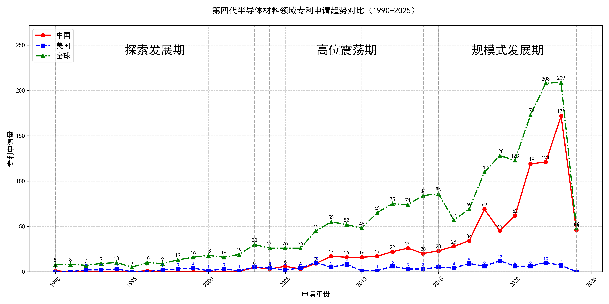

## （一）专利申请趋势分析

根据专利统计数据，全球专利申请量自1990年以来整体呈现上升趋势，尤其是在2015年后增长显著。中国专利申请量在早期相对较低，但自2003年起逐渐增加，并在2015年后迅速增长，远超美国。美国专利申请量在早期较为稳定，但在2010年后出现明显下降趋势。
### (1)探索发展期(1990-2003年)

在探索发展期中，全球专利申请量较少，主要集中在国外，尤其是美国。中国专利申请量在这一阶段非常低，显示出技术发展的初步阶段。国外在该时期的相关研究主要围绕氧化物单晶的制造方法展开，处于对材料科学和晶体生长技术的初步探索阶段。

日本胜利株式会社在这一阶段主要专注于氧化物单晶的制造方法，特别是通过改进化学组成和热处理方法，以提高晶体的纯度和性能。例如，JP2002053951A专利提出了一种通过混合氧化镧、氧化钽和氧化镓来制造Langasite型薄膜的方法，显著提高了晶体的生长效率和质量。三菱综合材料株式会社则侧重于压电元件用基板的制造方法，通过精确控制La3Ga5SiO14单晶的化学组成，提高了基板的均匀性和压电性能，如JP4239506B2专利所示。住友电气工业株式会社则专注于氮化镓单晶的生长方法，通过改进气相沉积技术，提高了晶体的纯度和生长速度，如DE60226292T2专利所示。株式会社小松制作所则致力于氧化物单晶的制造方法，特别是通过改进SrLaGaO4单晶的生长工艺，提高了晶体的光学性能，如JP1995157398A专利所示。株式会社力森诺科则专注于石榴石单晶基板的制造方法，通过优化Gd2.68+xCa0.32Ga4.02-xMg0.33Zr0.65O12单晶的化学组成，提高了基板的晶体质量和性能，如JP4292565B2专利所示。

### (2)高位震荡期(2004-2014年)

在高位震荡期中，全球专利申请量有所增加，但波动较大。中国专利申请量开始逐渐上升，而美国专利申请量则保持相对稳定。中国在这一阶段的技术发展主要集中在半导体材料领域，尤其是氧化镓（Ga2O3）相关技术，而美国则继续保持其在半导体器件和材料领域的领先地位。

田村株式会社和株式会社光波在这一阶段的技术路线主要集中在氧化镓（Ga2O3）单晶衬底的制备及其在半导体器件中的应用。例如，JP2016082200A专利提出了一种通过控制晶体生长方向来减少裂纹的Ga2O3基板，JP2016013933A则通过退火处理提高了Ga2O3基板的电阻率。中国科学院福建物质结构研究所则专注于Ga2S3晶体的制备及其在光学中的应用，如CN103484938A专利提出了一种高温固相硼硫化制备单斜相Ga2S3晶体的方法。株式会社半导体能源研究所则致力于氧化物半导体膜的形成及其在晶体管中的应用，如JP6568353B2专利提出了一种通过控制溅射条件来形成高结晶性氧化物半导体膜的方法。出光兴产株式会社则专注于溅射靶材的制备及其在半导体薄膜中的应用，如JP5829659B2专利提出了一种含有铟、镓和锌的复合氧化物溅射靶材，用于提高薄膜晶体管的性能。

### (3)规模式发展期(2015-2024年)

在规模式发展期中，全球专利申请量显著增加，尤其是中国专利申请量迅速增长，远超美国。美国专利申请量在这一阶段出现明显下降趋势，显示出中国在该技术领域的快速发展。中国在氧化镓晶体生长、外延技术、设备改进等方面取得了显著进展，专利申请量大幅增加，表明中国在该领域的技术创新能力和产业化水平显著提升。

杭州富加镓业科技有限公司在氧化镓晶体生长技术方面取得了显著进展，其专利主要集中在导模法生长氧化镓晶体的装置和方法，通过改进模具设计和热场结构，提高了晶体生长的质量和效率。信越化学工业株式会社则专注于氧化镓薄膜的外延生长技术，其专利涉及雾化CVD法、MOCVD法等，通过优化成膜工艺和设备设计，提高了薄膜的结晶质量和均匀性。日本碍子株式会社在氧化镓半导体薄膜的制备和应用方面进行了深入研究，其专利涉及α-Ga2O3和ε-Ga2O3薄膜的生长技术，通过改进基底材料和生长条件，提高了薄膜的电学性能和器件性能。株式会社FLOSFIA在氧化镓半导体器件的设计和制造方面取得了重要突破，其专利涉及p型氧化镓半导体材料、功率器件结构等，通过优化材料掺杂和器件结构，提高了器件的性能和可靠性。中国电子科技集团公司第四十六研究所在氧化镓晶体的生长、加工、外延等方面进行了系统研究，其专利涉及导模法、提拉法、HVPE法等，通过改进生长工艺和设备设计，提高了晶体的质量和成品率。

