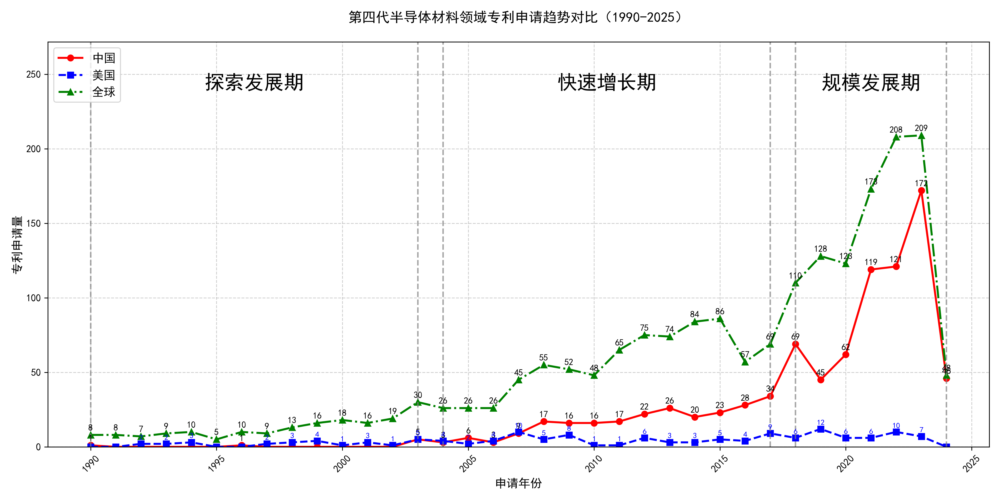

## （一）专利申请趋势分析

根据专利统计数据，全球专利申请量自1990年以来整体呈现上升趋势，尤其是在2007年后增长显著。中国专利申请量在早期相对较低，但自2003年起开始逐步增加，并在2018年后迅速增长，远超美国。美国专利申请量在2007年达到高峰后逐渐下降，显示出技术成熟或转移的趋势。
### (1)探索发展期(1990-2003年)

在探索发展期中，全球专利申请量较低，主要集中在国外，尤其是美国。中国在此阶段的专利申请量极少，显示出技术起步较晚。美国在此阶段的专利申请量相对稳定，而中国的专利申请量在1990年和1996年各有一件，显示出中国在该技术领域的研发活动非常有限。

日本胜利株式会社在此阶段主要专注于氧化物单晶的制造方法，尤其是Langasite型薄膜及其制造技术。其专利技术涉及通过控制化学量论组成比和热处理方法，提高单晶的纯度和结晶质量。三菱综合材料株式会社则侧重于压电元件用基板的制造方法，通过精确控制La3Ga5SiO14单晶的组成和生长条件，提高基板的均匀性和压电性能。住友电气工业株式会社的研究方向集中在单晶氮化镓衬底的氧掺杂工艺，通过气相合成和三维面结构生长技术，提高GaN单晶的质量和性能。株式会社小松制作所则专注于氧化物单晶的制造方法，尤其是SrLaGaO4单晶的生长技术，通过控制原料组成和生长条件，获得高质量的单晶基板。株式会社力森诺科的研究方向是石榴石单晶基板及其制造方法，通过精确控制Gd2O3、CaO、Ga2O3等原料的组成比例，获得高纯度和低缺陷的单晶基板。

### (2)快速增长期(2004-2017年)

在快速增长期（2004-2017年），全球专利申请量显著增加，中国专利申请量逐步上升，显示出技术研发的加速。美国专利申请量在此阶段达到高峰后开始下降。中国在这一阶段的技术研发逐渐崭露头角，尤其是在半导体材料领域，如β-Ga2O3单晶衬底及其相关技术，中国科研机构的专利申请量显著增加，表明中国在该领域的技术创新能力和研发投入逐步增强。

在快速增长期，田村株式会社和株式会社光波在β-Ga2O3单晶衬底技术领域取得了显著进展，其专利技术主要集中在单晶衬底的制备方法、晶体叠层结构及半导体器件的应用。例如，JP2016117643A专利提出了一种通过EFG法制备双晶含量低的β-Ga2O3单晶衬底的技术，显著提高了晶体质量。中国科学院福建物质结构研究所在激光晶体材料领域取得了重要突破，如CN109428257B专利提出了一种铒离子掺杂的硅酸盐晶体及其1.5微米波段激光器件，展示了中国科研机构在激光晶体材料领域的创新能力。株式会社半导体能源研究所在氧化物半导体薄膜技术领域也有重要贡献，如JP2017050553A专利提出了一种具有稳定电导率的氧化物半导体膜，显著提高了半导体器件的可靠性。出光兴产株式会社在溅射靶材及其制造方法方面取得了多项专利，如JP5829659B2专利提出了一种含有铟、镓和锌的氧化物溅射靶材，显著提高了薄膜晶体管的性能。总体来看，各申请主体的技术路线差异明显，田村株式会社和株式会社光波专注于β-Ga2O3单晶衬底技术，中国科学院福建物质结构研究所则侧重于激光晶体材料，株式会社半导体能源研究所和出光兴产株式会社则分别在氧化物半导体薄膜和溅射靶材领域取得了重要进展。

### (3)规模发展期(2018-2024年)

在规模发展期中，中国专利申请量迅速增长，成为全球专利申请的主要来源，尤其是在氧化镓晶体及其相关技术领域。美国专利申请量继续下降，显示出技术成熟或转移的趋势。全球专利申请量在此阶段达到历史新高，表明该技术领域正处于快速发展阶段。中国在这一阶段的技术创新和专利申请量显著增加，显示出中国在氧化镓晶体技术领域的领先地位。

在规模发展期内，杭州富加镓业科技有限公司、信越化学工业株式会社、日本碍子株式会社、中国电子科技集团公司第四十六研究所和山东大学是氧化镓晶体技术领域的重要申请主体。杭州富加镓业科技有限公司主要关注氧化镓薄膜外延方法和晶体生长装置，其专利技术涉及低成本、高效率的氧化镓晶体生长方法。信越化学工业株式会社则专注于氧化镓半导体薄膜的制造方法，其专利技术强调高结晶度和低杂质浓度的氧化镓薄膜。日本碍子株式会社的专利技术主要集中在氧化镓半导体薄膜的制造和层叠结构体，其技术路线注重提高薄膜的结晶性和降低缺陷密度。中国电子科技集团公司第四十六研究所的专利技术涉及氧化镓单晶的生长方法和原料处理，其创新点在于通过优化生长工艺提高晶体质量。山东大学的专利技术则集中在氧化镓薄膜的制备和光电探测器的应用，其技术路线强调高响应度和低背景噪声的氧化镓光电探测器。

