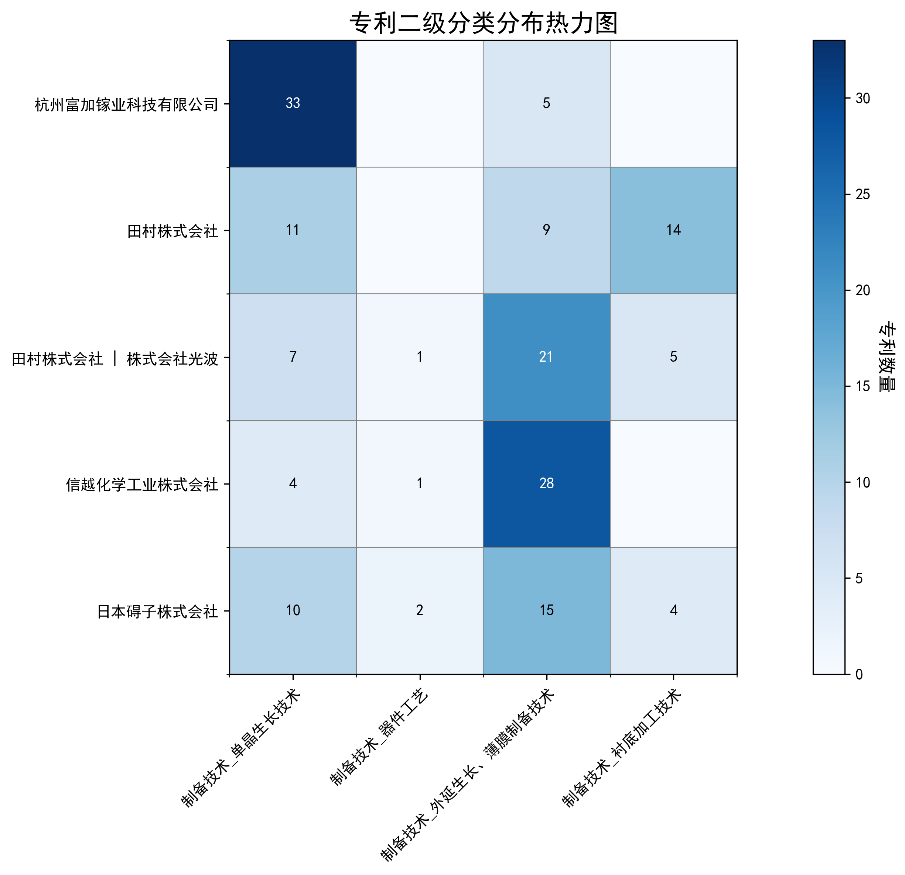

## （一）专利申请趋势分析

根据专利统计数据，全球专利申请量自1990年以来整体呈现上升趋势，尤其是在2007年后增长显著。中国专利申请量在早期相对较低，但自2003年起开始逐步增加，并在2018年后迅速增长，远超美国。美国专利申请量在2007年达到高峰后逐渐下降，显示出技术成熟或转移的趋势。
### (1)探索发展期(1990-2003年)

在探索发展期中，全球专利申请量较低，主要集中在国外，尤其是美国。中国在此阶段的专利申请量极少，显示出技术起步较晚。美国在此阶段的专利申请量相对稳定，而中国的专利申请量在1990年和1996年各有一件，显示出中国在该技术领域的研发活动非常有限。

日本胜利株式会社在此阶段主要专注于氧化物单晶的制造方法，尤其是Langasite型薄膜及其制造技术。其专利技术涉及通过控制化学量论组成比和热处理方法，提高单晶的纯度和结晶质量。三菱综合材料株式会社则侧重于压电元件用基板的制造方法，通过精确控制La3Ga5SiO14单晶的组成和生长条件，提高基板的均匀性和压电性能。住友电气工业株式会社的研究方向集中在单晶氮化镓衬底的氧掺杂工艺，通过气相合成和三维面结构生长技术，提高GaN单晶的质量和性能。株式会社小松制作所则专注于氧化物单晶的制造方法，尤其是SrLaGaO4单晶的生长技术，通过控制原料组成和生长条件，获得高质量的单晶基板。株式会社力森诺科的研究方向是石榴石单晶基板及其制造方法，通过精确控制Gd2O3、CaO、Ga2O3等原料的组成比例，获得高纯度和低缺陷的单晶基板。

### (2)快速增长期(2004-2017年)

在快速增长期（2004-2017年），全球专利申请量显著增加，中国专利申请量逐步上升，显示出技术研发的加速。美国专利申请量在此阶段达到高峰后开始下降。中国在这一阶段的技术研发逐渐崭露头角，尤其是在半导体材料领域，如β-Ga2O3单晶衬底及其相关技术，中国科研机构的专利申请量显著增加，表明中国在该领域的技术创新能力和研发投入逐步增强。

在快速增长期，田村株式会社和株式会社光波在β-Ga2O3单晶衬底技术领域取得了显著进展，其专利技术主要集中在单晶衬底的制备方法、晶体叠层结构及半导体器件的应用。例如，JP2016117643A专利提出了一种通过EFG法制备双晶含量低的β-Ga2O3单晶衬底的技术，显著提高了晶体质量。中国科学院福建物质结构研究所在激光晶体材料领域取得了重要突破，如CN109428257B专利提出了一种铒离子掺杂的硅酸盐晶体及其1.5微米波段激光器件，展示了中国科研机构在激光晶体材料领域的创新能力。株式会社半导体能源研究所在氧化物半导体薄膜技术领域也有重要贡献，如JP2017050553A专利提出了一种具有稳定电导率的氧化物半导体膜，显著提高了半导体器件的可靠性。出光兴产株式会社在溅射靶材及其制造方法方面取得了多项专利，如JP5829659B2专利提出了一种含有铟、镓和锌的氧化物溅射靶材，显著提高了薄膜晶体管的性能。总体来看，各申请主体的技术路线差异明显，田村株式会社和株式会社光波专注于β-Ga2O3单晶衬底技术，中国科学院福建物质结构研究所则侧重于激光晶体材料，株式会社半导体能源研究所和出光兴产株式会社则分别在氧化物半导体薄膜和溅射靶材领域取得了重要进展。

### (3)规模发展期(2018-2024年)

在规模发展期中，中国专利申请量迅速增长，成为全球专利申请的主要来源，尤其是在氧化镓晶体及其相关技术领域。美国专利申请量继续下降，显示出技术成熟或转移的趋势。全球专利申请量在此阶段达到历史新高，表明该技术领域正处于快速发展阶段。中国在这一阶段的技术创新和专利申请量显著增加，显示出中国在氧化镓晶体技术领域的领先地位。

在规模发展期内，杭州富加镓业科技有限公司、信越化学工业株式会社、日本碍子株式会社、中国电子科技集团公司第四十六研究所和山东大学是氧化镓晶体技术领域的重要申请主体。杭州富加镓业科技有限公司主要关注氧化镓薄膜外延方法和晶体生长装置，其专利技术涉及低成本、高效率的氧化镓晶体生长方法。信越化学工业株式会社则专注于氧化镓半导体薄膜的制造方法，其专利技术强调高结晶度和低杂质浓度的氧化镓薄膜。日本碍子株式会社的专利技术主要集中在氧化镓半导体薄膜的制造和层叠结构体，其技术路线注重提高薄膜的结晶性和降低缺陷密度。中国电子科技集团公司第四十六研究所的专利技术涉及氧化镓单晶的生长方法和原料处理，其创新点在于通过优化生长工艺提高晶体质量。山东大学的专利技术则集中在氧化镓薄膜的制备和光电探测器的应用，其技术路线强调高响应度和低背景噪声的氧化镓光电探测器。

## 二、专利申请人分析报告

### (1) 专利申请人排名分析

根据提供的专利申请人排名数据，以下是主要发现：

1. **杭州富加镓业科技有限公司**以38件专利位居榜首，其专利主要集中在中国（35件），同时在美国和日本也有少量布局。这表明该公司在中国市场具有显著的技术优势，并逐步向国际市场扩展。

2. **田村株式会社**和**田村株式会社 | 株式会社光波**分别以34件专利并列第二。田村株式会社的专利分布较为均衡，主要集中在中国和日本，而田村株式会社与株式会社光波的合作则更侧重于日本市场（24件）。这两者的专利布局显示出其在日本市场的技术主导地位。

3. **信越化学工业株式会社**以33件专利排名第四，其专利分布广泛，覆盖日本、中国、美国、韩国、中国台湾以及世界知识产权组织。这种全球化的专利布局表明该公司在多个市场均有技术影响力。

4. **日本碍子株式会社**以31件专利排名第五，其专利主要分布在日本和中国，同时在韩国、美国及世界知识产权组织也有少量布局。这表明该公司在亚洲市场具有较强技术实力。

总体来看，排名前五的申请人均以日本和中国为主要市场，显示出这两个地区在相关技术领域的重要性。同时，部分企业（如信越化学工业株式会社）已开始向全球市场扩展，体现了其技术布局的国际化趋势。

  
*图1：专利申请人排名柱状图，展示了各申请人的专利数量分布。*

---

### (2) 专利申请人技术分布

根据技术分布数据，以下是主要申请人的技术布局特点：

1. **杭州富加镓业科技有限公司**的技术布局高度集中于**单晶生长技术**（33件），而在其他技术领域（如器件工艺、衬底加工技术）几乎没有专利。这表明该公司在单晶生长技术领域具有显著的技术优势，但技术布局较为单一。

2. **田村株式会社**在**单晶生长技术**（11件）和**衬底加工技术**（14件）领域均有较多专利，同时在**外延生长、薄膜制备技术**（9件）也有一定布局。这种多元化的技术布局表明该公司在多个制备技术领域均有技术积累。

3. **田村株式会社 | 株式会社光波**的技术布局以**外延生长、薄膜制备技术**（21件）为主，同时在**单晶生长技术**（7件）和**衬底加工技术**（5件）也有一定专利。这种布局显示出其在薄膜制备技术领域的领先地位。

4. **信越化学工业株式会社**的技术布局高度集中于**外延生长、薄膜制备技术**（28件），而在其他技术领域的专利数量较少。这表明该公司在薄膜制备技术领域具有显著的技术优势。

5. **日本碍子株式会社**的技术布局较为均衡，在**单晶生长技术**（10件）、**外延生长、薄膜制备技术**（15件）和**衬底加工技术**（4件）均有专利布局。这种均衡的技术分布表明该公司在多个制备技术领域均有技术实力。

总体来看，主要申请人的技术布局呈现出以下特点：
- **单晶生长技术**和**外延生长、薄膜制备技术**是各企业重点布局的领域。
- 部分企业（如杭州富加镓业科技有限公司、信越化学工业株式会社）的技术布局较为单一，而其他企业（如田村株式会社、日本碍子株式会社）则呈现出多元化的技术布局。

  
*图2：专利申请人技术分布热力图，展示了各申请人在不同技术领域的专利分布情况。*

### (3) 专利申请人技术布局分析

#### 杭州富加镓业科技有限公司
杭州富加镓业科技有限公司专注于氧化镓单晶生长和外延生长、薄膜制备技术。公司成功突破6英寸氧化镓单晶生长技术，并实现高质量外延薄膜制备，达到国际领先水平，为新能源汽车、智能电网等高端装备提供关键材料支撑。其专利技术分布显示，公司在“制备技术-单晶生长技术”领域拥有33项专利，而在“制备技术-外延生长、薄膜制备技术”领域有5项专利。这表明公司在单晶生长技术方面具有显著优势，尤其是在氧化镓单晶生长技术领域。

**核心技术方向:**
- 氧化镓单晶生长技术
- 氧化镓薄膜外延技术
- 氧化镓晶体掺杂技术
- 氧化镓晶体生长装置优化
- 氧化镓晶体质量预测与优化

**技术问题解决分析:**
- **技术痛点:** 氧化镓晶体生长过程中热场不均匀，导致晶体质量不稳定
  - **解决方案:** 通过优化热场结构（如CN117626408A）和引入激光辅助加热（如CN113913924A），实现热场的精确控制
  - **效果指标:** 提高晶体生长质量，减少缺陷

**典型案例说明:**
- **专利id:** CN117626408A
  - **技术问题:** 热场不均匀导致晶体生长质量不稳定
  - **解决方案:** 通过设计具有多个通孔的热场结构，引导热气流走向，形成稳定的热场
  - **效果:** 提高晶体生长质量，减少缺陷

#### 田村株式会社
田村株式会社在衬底加工技术、单晶生长技术及外延生长、薄膜制备技术领域拥有显著技术布局。其专利涉及高品质Ga2O3系单晶衬底生产，通过限制熔膜供料和优化晶体生长条件，实现低缺陷密度和高质量外延层。专利技术分布显示，公司在“制备技术-单晶生长技术”领域有11项专利，在“制备技术-外延生长、薄膜制备技术”领域有9项专利，在“制备技术-衬底加工技术”领域有14项专利。

**核心技术方向:**
- β-Ga2O3单晶生长技术
- β-Ga2O3衬底加工技术
- β-Ga2O3外延生长与薄膜制备技术
- β-Ga2O3基器件工艺

**技术问题解决分析:**
- **技术痛点:** β-Ga2O3单晶生长过程中孪晶和缺陷的控制
  - **解决方案:** 采用EFG法（边缘定义薄膜馈送生长法）并通过调整晶种位置和生长条件（如JP5777756B2、JP5864998B2）
  - **效果指标:** 孪晶密度降低至30.7个/cm²以下，位错密度小于7.31×10⁴ cm⁻²

**典型案例说明:**
- **专利id:** JP5777756B2
  - **技术问题:** β-Ga2O3单晶生长过程中孪晶的控制
  - **解决方案:** 通过EFG法生长单晶，并优化晶种位置和生长条件
  - **效果:** 孪晶密度降低至30.7个/cm²以下，单晶质量显著提高

#### 田村株式会社 | 株式会社光波
田村株式会社和株式会社光波专注于器件工艺、衬底加工技术、单晶生长技术以及外延生长和薄膜制备技术。它们通过专利技术，如Ga2O3系单晶衬底和氧化镓衬底，致力于提高晶体生长质量和表面质量，以推动高性能电子器件的发展。专利技术分布显示，公司在“制备技术-单晶生长技术”领域有7项专利，在“制备技术-器件工艺”领域有1项专利，在“制备技术-外延生长、薄膜制备技术”领域有21项专利，在“制备技术-衬底加工技术”领域有5项专利。

**核心技术方向:**
- β-Ga2O3单晶生长技术
- 氮化物半导体外延生长技术
- 衬底加工与质量控制
- 低电阻半导体层叠结构
- 高结晶质量氮化物半导体层

**技术问题解决分析:**
- **技术痛点:** β-Ga2O3单晶生长过程中孪晶和多晶化问题
  - **解决方案:** 通过EFG法生长β-Ga2O3单晶，抑制孪晶和多晶化
  - **效果指标:** 获得不含双晶的β-Ga2O3单晶衬底

**典型案例说明:**
- **专利id:** JP2016117643A
  - **技术问题:** β-Ga2O3单晶生长过程中孪晶和多晶化问题
  - **解决方案:** 通过EFG法生长β-Ga2O3单晶，抑制孪晶和多晶化
  - **效果:** 获得不含双晶的β-Ga2O3单晶衬底

#### 信越化学工业株式会社
信越化学工业株式会社在器件工艺领域，专注于单晶硅片、有机硅等原材料生产；在单晶生长技术上，掌握高纯度单晶硅制备技术；在外延生长和薄膜制备技术上，擅长气相外延、化学气相沉积等，并致力于高性能半导体材料研发。专利技术分布显示，公司在“制备技术-单晶生长技术”领域有4项专利，在“制备技术-器件工艺”领域有1项专利，在“制备技术-外延生长、薄膜制备技术”领域有28项专利。

**核心技术方向:**
- 氧化镓薄膜的制备技术
- 雾化CVD法的优化与应用
- 结晶性氧化物膜的表面平滑性提升
- 低成本、高生产性的成膜方法
- 大直径基板上的均匀成膜技术

**技术问题解决分析:**
- **技术痛点:** 氧化镓薄膜的成膜速度慢、成本高
  - **解决方案:** 采用雾化CVD法，优化载气流量和温度，提高成膜速度（JP7164685B2, CN117286470A）
  - **效果指标:** 成膜速度提升至0.002秒以上且6秒以下

**典型案例说明:**
- **专利id:** JP7164685B2
  - **技术问题:** 氧化镓薄膜的成膜速度慢、成本高
  - **解决方案:** 采用雾化CVD法，优化载气流量和温度，提高成膜速度
  - **效果:** 成膜速度提升至0.002秒以上且6秒以下

#### 日本碍子株式会社
日本碍子株式会社在器件工艺、衬底加工技术、单晶生长技术以及外延生长和薄膜制备技术方面拥有显著技术布局。公司通过专利技术，如使用助熔剂法生长III族氮化物单晶，以及开发适用于氮化物外延层的复合衬底，展现了其在半导体材料领域的先进技术实力。专利技术分布显示，公司在“制备技术-单晶生长技术”领域有10项专利，在“制备技术-器件工艺”领域有2项专利，在“制备技术-外延生长、薄膜制备技术”领域有15项专利，在“制备技术-衬底加工技术”领域有4项专利。

**核心技术方向:**
- α-Ga2O3和ε-Ga2O3半导体膜的制备与优化
- 基底基板的加工与优化
- 单晶生长技术的改进
- 半导体膜的缺陷控制与性能提升
- 复合基板的结构设计与应用

**技术问题解决分析:**
- **技术痛点:** 半导体膜中的结晶缺陷
  - **解决方案:** 通过优化基底基板的材料和结构，减少半导体膜中的结晶缺陷。例如，JP7439117B2和JP7320070B2通过使用特定的取向层材料，显著降低了α-Ga2O3系半导体膜的晶体缺陷。
  - **效果指标:** 结晶缺陷密度降低至1.0×106/cm2以下

**典型案例说明:**
- **专利id:** JP7439117B2
  - **技术问题:** α-Ga2O3系半导体膜的晶体缺陷和翘曲问题
  - **解决方案:** 通过使用特定的取向层材料，显著降低了α-Ga2O3系半导体膜的晶体缺陷和翘曲。
  - **效果:** 结晶缺陷密度降低至1.0×106/cm2以下，翘曲量显著减少

通过以上分析，可以看出各申请人在不同技术领域的专利布局和技术优势，为后续的技术研发和市场应用提供了重要参考。