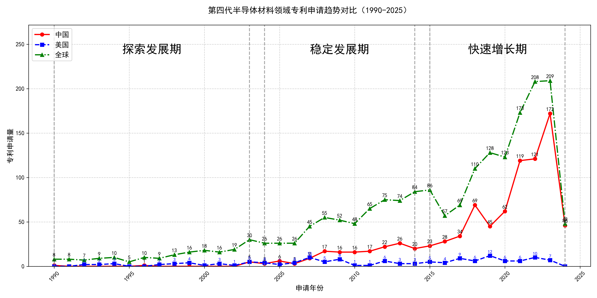

## （一）专利申请趋势分析

根据专利统计数据，全球专利申请量自1990年以来整体呈现上升趋势，尤其是在2015年后增长显著。中国专利申请量在早期相对较低，但自2003年起开始逐步增加，并在2015年后迅速增长，远超美国。美国专利申请量在1990年至2000年间波动较大，之后逐渐趋于稳定，并在2015年后有所下降。
### (1)探索发展期(1990-2003年)

在探索发展期中，全球专利申请量较少，主要集中在1990年代末期。中国专利申请量极低，美国专利申请量波动较大，但整体呈上升趋势。日本在该阶段的技术发展较为活跃，尤其是在氧化物单晶制造和压电元件基板技术领域，专利申请量显著增加。相比之下，中国在该阶段的技术积累较少，专利申请量几乎为零，显示出技术发展的滞后性。

日本胜利株式会社在该阶段主要专注于氧化物单晶的制造技术，尤其是通过改进的化学气相沉积法和晶体生长技术，提高了单晶的纯度和性能。其专利JP2002053951A和JP2002003298A分别展示了通过优化原料混合和热处理方法，获得高质量氧化物单晶的技术路线。三菱综合材料株式会社则侧重于压电元件基板的制造，其专利JP4239506B2和US7090724B2通过精确控制晶体生长过程中的成分比例，提高了基板的均匀性和压电性能。住友电气工业株式会社在氮化镓单晶衬底的氧掺杂工艺方面取得了突破，其专利DE60226292T2和US6468347B1展示了通过气相沉积法在非C面氮化镓籽晶上生长高质量单晶的技术。株式会社小松制作所则专注于氧化物单晶的超导基板应用，其专利JP1995157398A和US5259919A通过改进的晶体生长方法，获得了具有优异超导性能的基板材料。株式会社力森诺科在石榴石单晶基板的制造技术上取得了进展，其专利JP4292565B2和JP2003238294A通过优化原料配比和晶体生长条件，获得了低缺陷密度和高性能的石榴石单晶基板。

### (2)稳定发展期(2004-2014年)

在稳定发展期中，全球专利申请量逐步增加，中国专利申请量开始稳步上升，美国专利申请量相对稳定，但整体呈下降趋势。中国在这一阶段的技术发展主要集中在半导体材料领域，尤其是氧化镓（Ga2O3）单晶的生长和制备技术。相比之下，美国和日本的技术路线更加多样化，涵盖了从半导体材料到器件应用的多个方面。

田村株式会社和株式会社光波在氧化镓单晶的生长和制备技术上取得了显著进展，特别是在EFG（Edge-defined Film-fed Growth）法的应用上，成功开发了双晶化抑制技术和高品质β-Ga2O3单晶基板。中国科学院福建物质结构研究所则专注于镓基化合物的制备及其在光学和激光领域的应用，如单斜相Ga2S3晶体的制备和钆镓石榴石激光晶体的开发。株式会社半导体能源研究所在氧化物半导体薄膜的制备和晶体管应用方面取得了突破，特别是在低接触电阻和高结晶性氧化物半导体薄膜的制备技术上。出光兴产株式会社则致力于溅射靶材的研发，特别是在含铟、镓和锌的氧化物靶材的制备上，推动了氧化物半导体薄膜的工业化应用。

### (3)快速增长期(2015-2024年)

在快速增长期中，全球专利申请量显著增加，尤其是中国专利申请量迅速增长，远超美国。中国在这一阶段的技术创新和专利申请量表现出强劲的增长势头，而美国的专利申请量在2015年后有所下降，整体趋于稳定。这表明中国在氧化镓晶体技术领域的研发投入和技术创新取得了显著进展，逐渐成为该领域的主导力量。

杭州富加镓业科技有限公司在氧化镓薄膜外延、晶体生长装置及方法等方面进行了大量创新，尤其是在导模法生长氧化镓晶体技术中，通过优化模具设计和热场结构，显著提高了晶体质量和生长效率。信越化学工业株式会社则专注于氧化镓薄膜的成膜方法和半导体装置，特别是在α-Ga2O3薄膜的制备技术上取得了重要突破。日本碍子株式会社在多层结构和半导体薄膜的制造技术上进行了深入研究，尤其是在ε-Ga2O3和α-Ga2O3半导体薄膜的制备和应用方面。株式会社FLOSFIA则致力于结晶氧化物半导体膜及半导体装置的研发，特别是在p型导电氧化镓半导体的制备技术上取得了显著进展。中国电子科技集团公司第四十六研究所在氧化镓单晶的生长方法、原料处理及晶体加工技术方面进行了大量创新，尤其是在导模法生长大尺寸氧化镓晶体技术上取得了重要突破。这些申请主体的技术路线差异主要体现在晶体生长方法、薄膜制备技术及半导体装置的应用上，各自在特定技术领域内进行了深入研究和创新。

