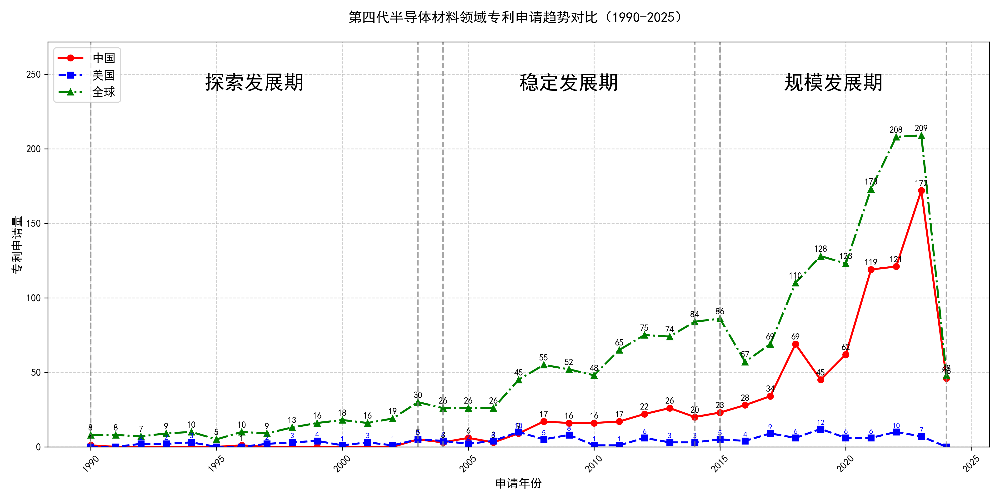

## （一）专利申请趋势分析

根据专利统计数据，全球专利申请量自1990年以来整体呈现上升趋势，尤其是在2015年后增长显著。中国专利申请量在早期相对较低，但自2003年起逐渐增加，并在2015年后迅速增长，远超美国。美国专利申请量在早期较为稳定，但在2015年后出现明显下降趋势。整体来看，该技术领域经历了从探索到规模化发展的过程。
### (1)探索发展期(1990-2003年)

在探索发展期中，全球专利申请量较少，主要集中在国外，尤其是美国。中国在该阶段的专利申请量极低，技术发展处于初步探索阶段。美国在该阶段的技术发展较为领先，尤其是在氧化物单晶制造和压电元件领域。日本也在该阶段表现出较强的技术研发能力，尤其是在氧化物单晶和压电元件的制造方法上。

日本胜利株式会社在该阶段主要专注于氧化物单晶的制造方法，尤其是通过化学量论组成比混合氧化物的方法，以提高单晶的纯度和质量。三菱综合材料株式会社则侧重于压电元件用基板的制造方法，通过精确控制氧化物的重量比例，提高基板的均匀性和性能。住友电气工业株式会社在单晶氮化镓衬底的氧掺杂工艺上取得了显著进展，通过气相合成和三维面结构生长，提高了单晶的质量。株式会社小松制作所则专注于氧化物单晶的制造方法，尤其是通过特定的化学组成和晶体结构，提高单晶的光学性能。株式会社力森诺科在石榴石单晶基板的制造方法上取得了突破，通过精确控制氧化物的原子比例，提高了基板的转位密度和晶格常数。

### (2)稳定发展期(2004-2014年)

在稳定发展期中，全球专利申请量逐渐增加，中国专利申请量开始稳步上升，但仍低于美国。美国专利申请量保持相对稳定，技术发展进入成熟阶段。中国在这一时期的专利申请主要集中在半导体材料和晶体生长技术领域，而美国和日本则在高性能半导体器件和薄膜技术方面占据主导地位。

田村株式会社和株式会社光波在β-Ga2O3单晶衬底和半导体叠层结构方面取得了显著进展，特别是在晶体生长方法和衬底制造技术上。中国科学院福建物质结构研究所则专注于单斜相Ga2S3晶体的制备及其在光学上的应用，展示了中国在新型晶体材料领域的创新能力。株式会社半导体能源研究所在氧化物半导体薄膜和半导体器件方面进行了深入研究，特别是在溅射靶材和薄膜晶体管技术上。出光兴产株式会社则在溅射靶材及其制造方法上取得了多项专利，推动了高性能半导体薄膜技术的发展。总体来看，日本企业在半导体材料和器件技术上占据领先地位，而中国科研机构在新型晶体材料和应用领域展现了独特的创新优势。

### (3)规模发展期(2015-2024年)

在规模发展期中，全球氧化镓相关专利申请量大幅增长，中国专利申请量迅速增加，远超美国。美国专利申请量出现明显下降趋势，技术发展进入规模化阶段，中国成为该领域的主要创新力量。中国在氧化镓晶体生长、外延技术、器件应用等方面取得了显著进展，专利申请量从2015年的23件增长到2023年的172件，而美国同期从5件降至7件。中国科研机构和企业在这一阶段的技术创新主要集中在氧化镓晶体的高质量生长、大尺寸晶体制备、外延膜性能优化等方面，推动了氧化镓在功率器件、光电探测器等领域的应用。

在规模发展期中，杭州富加镓业科技有限公司、信越化学工业株式会社、日本碍子株式会社、株式会社FLOSFIA、中国电子科技集团公司第四十六研究所等5个重要申请主体的技术路线存在显著差异。杭州富加镓业科技有限公司主要聚焦于氧化镓晶体的导模法生长技术，通过优化模具设计、热场结构和生长工艺，实现了大尺寸、高质量氧化镓晶体的制备，其专利CN117552091A提出了一种导模法生长大尺寸氧化镓晶体的方法及生长模具，通过模具支撑板调节温度分布，提高了晶体生长的均匀性。信越化学工业株式会社则侧重于氧化镓薄膜的成膜技术，其专利WO2024043134A1提出了一种成膜方法，通过雾化原料溶液并结合载气输送，实现了高质量α-Ga2O3膜的制备。日本碍子株式会社专注于氧化镓半导体薄膜的制备与应用，其专利US20230231013A1提出了一种多层结构，通过α-Ga2O3基半导体薄膜的优化，提高了器件的电学性能。株式会社FLOSFIA致力于氧化镓半导体器件的开发，其专利JP7358718B2提出了一种结晶氧化物半导体膜及半导体装置，通过优化成膜工艺和掺杂技术，提高了器件的电学特性。中国电子科技集团公司第四十六研究所在氧化镓晶体的生长、加工、外延等方面取得了多项创新，其专利CN118241316A提出了一种N型低阻β-Ga2O3单晶的原位退火方法，通过特定退火区域和气氛控制，提高了晶体的电阻率均匀度和质量。总体来看，中国科研机构在氧化镓晶体生长和外延技术方面具有显著优势，而日本企业则在氧化镓薄膜和器件应用方面表现突出。

