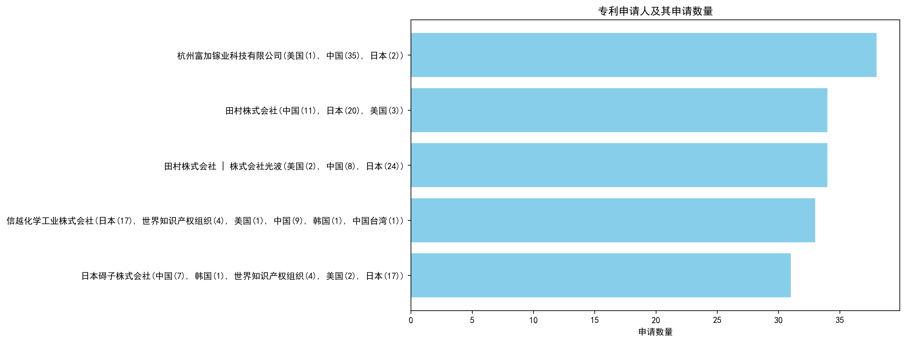
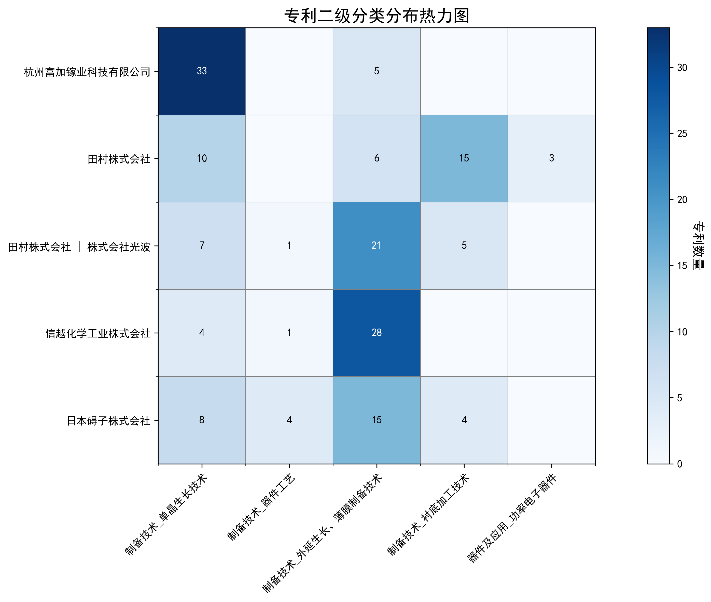

## （一）专利申请趋势分析

根据专利统计数据，全球专利申请量自1990年以来整体呈现上升趋势，尤其是在2015年后增长显著。中国专利申请量在早期相对较低，但自2003年起逐渐增加，并在2015年后迅速增长，远超美国。美国专利申请量在早期较为稳定，但在2015年后出现明显下降趋势。整体来看，该技术领域经历了从探索到规模化发展的过程。
### (1)探索发展期(1990-2003年)

在探索发展期中，全球专利申请量较少，主要集中在国外，尤其是美国。中国在该阶段的专利申请量极低，技术发展处于初步探索阶段。美国在该阶段的技术发展较为领先，尤其是在氧化物单晶制造和压电元件领域。日本也在该阶段表现出较强的技术研发能力，尤其是在氧化物单晶和压电元件的制造方法上。

日本胜利株式会社在该阶段主要专注于氧化物单晶的制造方法，尤其是通过化学量论组成比混合氧化物的方法，以提高单晶的纯度和质量。三菱综合材料株式会社则侧重于压电元件用基板的制造方法，通过精确控制氧化物的重量比例，提高基板的均匀性和性能。住友电气工业株式会社在单晶氮化镓衬底的氧掺杂工艺上取得了显著进展，通过气相合成和三维面结构生长，提高了单晶的质量。株式会社小松制作所则专注于氧化物单晶的制造方法，尤其是通过特定的化学组成和晶体结构，提高单晶的光学性能。株式会社力森诺科在石榴石单晶基板的制造方法上取得了突破，通过精确控制氧化物的原子比例，提高了基板的转位密度和晶格常数。

### (2)稳定发展期(2004-2014年)

在稳定发展期中，全球专利申请量逐渐增加，中国专利申请量开始稳步上升，但仍低于美国。美国专利申请量保持相对稳定，技术发展进入成熟阶段。中国在这一时期的专利申请主要集中在半导体材料和晶体生长技术领域，而美国和日本则在高性能半导体器件和薄膜技术方面占据主导地位。

田村株式会社和株式会社光波在β-Ga2O3单晶衬底和半导体叠层结构方面取得了显著进展，特别是在晶体生长方法和衬底制造技术上。中国科学院福建物质结构研究所则专注于单斜相Ga2S3晶体的制备及其在光学上的应用，展示了中国在新型晶体材料领域的创新能力。株式会社半导体能源研究所在氧化物半导体薄膜和半导体器件方面进行了深入研究，特别是在溅射靶材和薄膜晶体管技术上。出光兴产株式会社则在溅射靶材及其制造方法上取得了多项专利，推动了高性能半导体薄膜技术的发展。总体来看，日本企业在半导体材料和器件技术上占据领先地位，而中国科研机构在新型晶体材料和应用领域展现了独特的创新优势。

### (3)规模发展期(2015-2024年)

在规模发展期中，全球氧化镓相关专利申请量大幅增长，中国专利申请量迅速增加，远超美国。美国专利申请量出现明显下降趋势，技术发展进入规模化阶段，中国成为该领域的主要创新力量。中国在氧化镓晶体生长、外延技术、器件应用等方面取得了显著进展，专利申请量从2015年的23件增长到2023年的172件，而美国同期从5件降至7件。中国科研机构和企业在这一阶段的技术创新主要集中在氧化镓晶体的高质量生长、大尺寸晶体制备、外延膜性能优化等方面，推动了氧化镓在功率器件、光电探测器等领域的应用。

在规模发展期中，杭州富加镓业科技有限公司、信越化学工业株式会社、日本碍子株式会社、株式会社FLOSFIA、中国电子科技集团公司第四十六研究所等5个重要申请主体的技术路线存在显著差异。杭州富加镓业科技有限公司主要聚焦于氧化镓晶体的导模法生长技术，通过优化模具设计、热场结构和生长工艺，实现了大尺寸、高质量氧化镓晶体的制备，其专利CN117552091A提出了一种导模法生长大尺寸氧化镓晶体的方法及生长模具，通过模具支撑板调节温度分布，提高了晶体生长的均匀性。信越化学工业株式会社则侧重于氧化镓薄膜的成膜技术，其专利WO2024043134A1提出了一种成膜方法，通过雾化原料溶液并结合载气输送，实现了高质量α-Ga2O3膜的制备。日本碍子株式会社专注于氧化镓半导体薄膜的制备与应用，其专利US20230231013A1提出了一种多层结构，通过α-Ga2O3基半导体薄膜的优化，提高了器件的电学性能。株式会社FLOSFIA致力于氧化镓半导体器件的开发，其专利JP7358718B2提出了一种结晶氧化物半导体膜及半导体装置，通过优化成膜工艺和掺杂技术，提高了器件的电学特性。中国电子科技集团公司第四十六研究所在氧化镓晶体的生长、加工、外延等方面取得了多项创新，其专利CN118241316A提出了一种N型低阻β-Ga2O3单晶的原位退火方法，通过特定退火区域和气氛控制，提高了晶体的电阻率均匀度和质量。总体来看，中国科研机构在氧化镓晶体生长和外延技术方面具有显著优势，而日本企业则在氧化镓薄膜和器件应用方面表现突出。

## 二、专利申请人分析报告

### (1) 专利申请人排名分析

根据提供的专利申请人排名数据，杭州富加镓业科技有限公司以38件专利总数位居榜首，其专利主要分布在中国（35件），其次是美国（1件）和日本（2件）。田村株式会社及其与株式会社光波的联合申请分别以34件专利并列第二，田村株式会社的专利主要分布在日本（20件）和中国（11件），而联合申请的专利则主要集中在日本（24件）和中国（8件）。信越化学工业株式会社以33件专利位列第四，其专利分布较为广泛，涵盖日本（17件）、世界知识产权组织（4件）、中国（9件）等多个地区。日本碍子株式会社以31件专利排名第五，其专利主要分布在日本（17件）和世界知识产权组织（4件）。

主要发现：
1. 杭州富加镓业科技有限公司在中国市场的专利布局最为密集，显示出其在中国市场的主导地位。
2. 田村株式会社及其联合申请在日本的专利数量显著高于其他地区，表明其在日本市场的技术优势。
3. 信越化学工业株式会社和日本碍子株式会社的专利分布较为国际化，显示出其全球技术布局的广泛性。

*图注：专利申请人排名柱状图，展示了各申请人的专利总数及其在不同地区的分布情况。*

### (2) 专利申请人技术分布

从技术分布数据来看，杭州富加镓业科技有限公司在“制备技术-单晶生长技术”领域拥有33件专利，显示出其在该技术领域的绝对优势，但在其他技术领域的专利数量较少。田村株式会社在“制备技术-衬底加工技术”领域拥有15件专利，显示出其在该技术领域的专注度，同时在“制备技术-单晶生长技术”和“制备技术-外延生长、薄膜制备技术”领域也有一定数量的专利。田村株式会社与株式会社光波的联合申请在“制备技术-外延生长、薄膜制备技术”领域拥有21件专利，显示出其在该技术领域的领先地位。信越化学工业株式会社在“制备技术-外延生长、薄膜制备技术”领域拥有28件专利，显示出其在该技术领域的强大实力。日本碍子株式会社在“制备技术-外延生长、薄膜制备技术”领域拥有15件专利，同时在“制备技术-单晶生长技术”和“制备技术-器件工艺”领域也有一定数量的专利。

主要发现：
1. 杭州富加镓业科技有限公司在“制备技术-单晶生长技术”领域的技术布局最为集中，显示出其在该技术领域的领先地位。
2. 田村株式会社及其联合申请在“制备技术-衬底加工技术”和“制备技术-外延生长、薄膜制备技术”领域的技术布局较为突出，显示出其在这些技术领域的专注度。
3. 信越化学工业株式会社在“制备技术-外延生长、薄膜制备技术”领域的技术布局最为广泛，显示出其在该技术领域的强大实力。

*图注：专利申请人技术分布热力图，展示了各申请人在不同技术领域的专利分布情况。*

### (3) 专利申请人技术布局分析

#### 杭州富加镓业科技有限公司

**核心技术领域:**  
根据 `company_tech_json` 数据，杭州富加镓业科技有限公司的专利主要集中在“制备技术-单晶生长技术”（33件）和“制备技术-外延生长、薄膜制备技术”（5件）。这表明公司在氧化镓单晶生长和外延薄膜制备领域具有显著的技术优势。

**背景分析:**  
`company_info` 显示，杭州富加镓业科技有限公司专注于氧化镓外延生长和薄膜制备技术，成功研发出高质量氧化镓同质外延薄膜，并突破MOCVD技术，实现10微米以上薄膜量产。同时，公司掌握6英寸氧化镓单晶生长技术，是国内首家同时具备单晶生长及外延能力的公司。这一背景信息解释了公司在单晶生长和外延薄膜制备技术领域的专利布局。

**技术深度分析:**  
`patent_miner` 中的信息进一步揭示了公司在氧化镓单晶生长和薄膜外延技术方面的创新实践。公司通过优化热场结构（如CN117626408A）和引入激光辅助加热（如CN113913924A）来调控温场，确保晶体生长过程中的温度梯度稳定，从而提高晶体生长效率，降低晶体内部缺陷密度。此外，公司还通过使用低成本衬底（如CN117976518A）和优化外延工艺（如CN114908419B）来降低外延成本，提高薄膜质量。

**典型案例:**  
- **专利CN117626408A:** 通过设计具有稳定热气流的热场结构，确保晶体生长过程中的温度梯度稳定，提高晶体生长效率，降低晶体内部缺陷密度。
- **专利CN113913924A:** 引入激光辅助加热，快速消除过冷现象，确保晶体生长质量，减少晶体缺陷。
- **专利CN117976518A:** 使用低成本衬底和优化外延工艺，降低外延成本，提高薄膜的均匀性和质量。

#### 田村株式会社

**核心技术领域:**  
田村株式会社的专利主要集中在“制备技术-单晶生长技术”（10件）、“制备技术-衬底加工技术”（15件）和“制备技术-外延生长、薄膜制备技术”（6件）。这表明公司在单晶生长、衬底加工和外延薄膜制备领域具有显著的技术优势。

**背景分析:**  
`company_info` 显示，田村株式会社在单晶生长技术方面，通过EFG法等专利技术，致力于生产高品质的氧化镓和β-Ga2O3单晶衬底；在功率电子器件领域，开发基于这些衬底的高性能半导体元件；在外延生长和薄膜制备技术方面，实现氮化物半导体层的外延生长；在衬底加工技术方面，减少衬底表面的线状凹坑，提升产品品质。这一背景信息解释了公司在单晶生长、衬底加工和外延薄膜制备技术领域的专利布局。

**技术深度分析:**  
`patent_miner` 中的信息进一步揭示了公司在β-Ga2O3单晶生长、衬底加工和外延薄膜制备技术方面的创新实践。公司通过EFG法（如CN105189836B）并结合特定的晶种位置和提拉技术，有效抑制孪晶和缺陷的产生，从而获得高质量的β-Ga2O3单晶衬底。此外，公司还通过优化退火处理和切割工艺（如CN103917700B）来减少衬底在加工过程中的缺陷和裂纹。

**典型案例:**  
- **专利CN105189836B:** 采用EFG法并结合特定的晶种位置和提拉技术，通过控制晶种与熔体的接触方式和提拉速度，有效抑制孪晶和缺陷的产生。
- **专利CN103917700B:** 在还原或惰性气氛下进行退火处理，并使用金刚石磨粒进行研磨，减少裂纹和缺陷。

#### 信越化学工业株式会社

**核心技术领域:**  
信越化学工业株式会社的专利主要集中在“制备技术-外延生长、薄膜制备技术”（28件）和“制备技术-单晶生长技术”（4件）。这表明公司在外延薄膜制备和单晶生长领域具有显著的技术优势。

**背景分析:**  
`company_info` 显示，信越化学工业株式会社在外延生长、薄膜制备技术方面，专注于高精度单晶薄膜生长；在器件工艺领域，致力于提高半导体器件性能；在单晶生长技术方面，发展了高效、高质量的晶体生长方法。这一背景信息解释了公司在外延薄膜制备和单晶生长技术领域的专利布局。

**技术深度分析:**  
`patent_miner` 中的信息进一步揭示了公司在外延薄膜制备和单晶生长技术方面的创新实践。公司通过雾化CVD法优化成膜工艺（如CN116940708A）和使用特定原料溶液和加热时间控制（如JP7164685B2）来提高成膜速度和膜厚均匀性。此外，公司还通过优化载气流量和温度（如JP7090052B2）来改善薄膜表面平滑性。

**典型案例:**  
- **专利CN116940708A:** 通过雾化CVD法优化成膜工艺，使用喷嘴和顶板对雾进行整流，提高膜厚均匀性。
- **专利JP7164685B2:** 使用含有氯离子和镓离子的原料溶液，并控制加热时间在0.002秒至6秒，显著提升成膜速度，降低生产成本。

#### 日本碍子株式会社

**核心技术领域:**  
日本碍子株式会社的专利主要集中在“制备技术-外延生长、薄膜制备技术”（15件）和“制备技术-器件工艺”（4件）。这表明公司在外延薄膜制备和器件工艺领域具有显著的技术优势。

**背景分析:**  
`company_info` 显示，日本碍子株式会社在半导体领域的技术布局包括：外延生长和薄膜制备技术，如III族氮化物单晶生长；器件工艺，涉及外延晶片制造；单晶生长技术，如采用助熔剂法；衬底加工技术，涉及复合基板和功能元件制造。这些技术支持了高性能半导体器件的生产。这一背景信息解释了公司在外延薄膜制备和器件工艺技术领域的专利布局。

**技术深度分析:**  
`patent_miner` 中的信息进一步揭示了公司在外延薄膜制备和器件工艺技术方面的创新实践。公司通过优化基底基板的材料和结构（如JP7439117B2）来减少半导体膜中的结晶缺陷。此外，公司还通过控制半导体膜的厚度和基底基板的材料（如US20230231013A1）来减少半导体膜的翘曲和裂纹。

**典型案例:**  
- **专利JP7439117B2:** 通过使用α-Cr2O3中含有Ti和/或Fe的材料构成的取向层，减少了α-Ga2O3系半导体膜的晶体缺陷和翘曲。
- **专利US20230231013A1:** 通过控制半导体膜的平均膜厚和翘曲量，减少了半导体膜的翘曲。

#### 田村株式会社 | 株式会社光波

**核心技术领域:**  
田村株式会社与株式会社光波的专利主要集中在“制备技术-外延生长、薄膜制备技术”（21件）和“制备技术-单晶生长技术”（7件）。这表明公司在外延薄膜制备和单晶生长领域具有显著的技术优势。

**背景分析:**  
`company_info` 显示，田村株式会社与光波公司在“外延生长、薄膜制备技术”、“衬底加工技术”、“器件工艺”、“单晶生长技术”领域布局深厚，专注于氧化镓（Ga2O3）单晶衬底研发，通过EFG法等先进技术，实现高品质单晶生长，并应用于高功率LED和功率半导体元件制造。这一背景信息解释了公司在外延薄膜制备和单晶生长技术领域的专利布局。

**技术深度分析:**  
`patent_miner` 中的信息进一步揭示了公司在外延薄膜制备和单晶生长技术方面的创新实践。公司通过EFG法生长β-Ga2O3单晶（如JP2016117643A）来抑制孪晶和多晶化问题，从而获得高质量的β-Ga2O3单晶衬底。此外，公司还通过在β-Ga2O3衬底上外延生长AlxGayInzN缓冲层（如CN103518008A）来降低氮化物半导体层与β-Ga2O3衬底之间的电阻。

**典型案例:**  
- **专利JP2016117643A:** 通过EFG法生长β-Ga2O3单晶，抑制孪晶和多晶化，获得不含双晶的β-Ga2O3单晶衬底，主面平行于b轴。
- **专利CN103518008A:** 在β-Ga2O3衬底上外延生长AlxGayInzN缓冲层，降低电阻，形成低电阻的半导体层叠结构，电阻率控制在5×10^18/cm^3以下。

---

通过以上分析，可以看出各主要申请人在其核心技术领域的专利布局和技术创新实践，这些布局和创新不仅反映了公司的技术优势，也为其在市场竞争中提供了有力的支持。