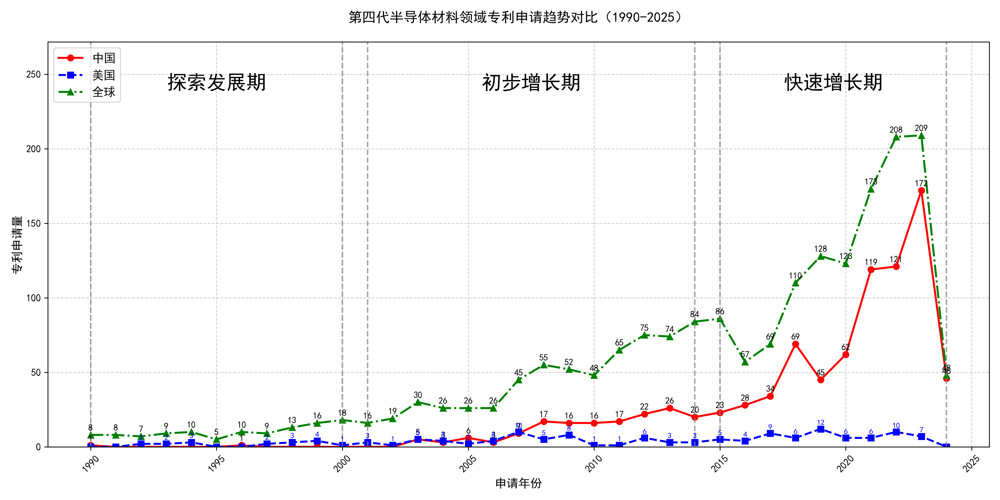

## （一）专利申请趋势分析

根据专利统计数据，全球专利申请量自1990年以来整体呈现波动上升趋势。早期（1990-2000年）专利申请量较低，且主要由美国主导。进入21世纪后，中国专利申请量逐渐增加，特别是在2015年后，中国专利申请量迅速增长，远超美国。全球专利申请量在2018年后显著上升，2023年达到峰值。
### (1)探索发展期(1990-2000年)

在探索发展期中，全球专利申请量较低，主要集中在1990年代末期。美国在该时期的专利申请量相对较多，而中国专利申请量极少，显示出技术发展的初步阶段。日本在该时期的技术研发较为活跃，特别是在氧化物单晶制造和压电器件领域，专利申请量显著高于其他国家。

日本胜利株式会社在探索发展期主要集中在氧化物单晶的制造方法上，特别是通过改进的化学量论组成和热处理方法，提高了单晶的质量和制造效率。三菱综合材料株式会社则专注于压电器件用基板的制造，通过精确控制成分比例和生长条件，获得了高质量的压电基板。株式会社小松制作所的研究重点在于氧化物单晶的超导性能，通过优化晶体结构和生长工艺，提升了超导器件的性能。旭硝子株式会社在热射线屏蔽膜和溅射靶材的制造上取得了显著进展，通过添加Ga2O3等成分，提高了膜的透明性和导电性。住友电气工业株式会社则致力于半绝缘气体单晶的制造，通过控制碳浓度和生长环境，获得了高性能的GaN单晶。这些公司的技术路线各有侧重，但都通过优化材料和工艺，推动了相关领域的技术进步。

### (2)初步增长期(2001-2014年)

在初步增长期中，全球专利申请量逐步增加，但中国和美国的专利申请量增长趋势有所不同。中国在2003年后专利申请量有所增长，但整体仍低于美国。美国在该时期的专利申请量波动较大，显示出技术发展的不稳定阶段。日本在该阶段的技术发展较为稳定，专利申请量保持较高水平，显示出其在相关技术领域的领先地位。

田村株式会社和株式会社光波在该阶段主要专注于β-Ga2O3单晶衬底及其制造方法的研究，通过EFG法（Edge-defined Film-fed Growth）等技术，成功开发出高质量的单晶衬底，并应用于半导体器件中。其专利技术主要集中在提高晶体质量、减少双晶化以及优化晶体生长工艺等方面。中国科学院福建物质结构研究所则侧重于单斜相Ga2S3晶体的制备及其在光学领域的应用，通过高温固相反应法成功制备出具有高非线性光学系数的晶体，并在红外波段实现了相位匹配。株式会社半导体能源研究所则致力于氧化物半导体膜的研究，通过溅射技术制备出高结晶性的氧化物半导体膜，应用于薄膜晶体管等半导体器件中。出光兴产株式会社则专注于溅射靶材的研发，通过优化靶材成分和结构，提高了溅射薄膜的质量和性能，应用于电界效应型晶体管等器件中。

### (3)快速增长期(2015-2024年)

在2015年至2024年的快速增长期中，中国在氧化镓晶体技术领域的专利申请量迅速增长，远超美国。全球专利申请量在2018年后显著上升，2023年达到峰值。中国在这一时期的技术发展迅速，显示出技术创新的活跃期，尤其是在氧化镓晶体的生长、外延和器件应用方面取得了显著进展。相比之下，美国的专利申请量相对较少，主要集中在氧化镓薄膜的制备和半导体器件的应用上。

在5个重要申请主体中，杭州富加镓业科技有限公司的专利申请主要集中在氧化镓晶体的生长方法和设备上，如导模法、热交换法等，其专利技术通过优化热场结构和模具设计，显著提高了晶体质量和生长效率。信越化学工业株式会社则专注于氧化镓薄膜的制备技术，特别是通过雾化CVD法实现高质量薄膜的成膜，其专利技术在薄膜的均匀性和结晶性方面具有优势。日本碍子株式会社的专利技术则集中在氧化镓晶体的多层结构和半导体器件的应用上，特别是在高阻氧化镓晶体的制备和器件性能优化方面取得了突破。株式会社FLOSFIA的专利技术则侧重于氧化镓半导体膜的电学性能优化，特别是在p型导电性和器件应用方面具有创新性。中国电子科技集团公司第四十六研究所的专利技术则集中在氧化镓晶体的生长、加工和器件应用上，特别是在大尺寸氧化镓晶体的生长和加工工艺方面取得了显著进展。

