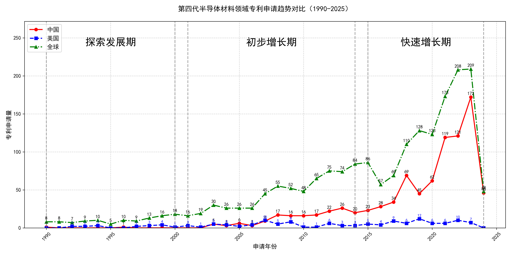

## （一）专利申请趋势分析

根据专利统计数据，全球专利申请量自1990年以来整体呈现波动上升趋势。早期（1990-2000年）专利申请量较低，且主要由美国主导。进入21世纪后，中国专利申请量逐渐增加，特别是在2015年后，中国专利申请量迅速增长，远超美国。全球专利申请量在2018年后显著上升，2023年达到峰值。
### (1)探索发展期(1990-2000年)

在探索发展期中，全球专利申请量较低，主要集中在1990年代末期。美国在该时期的专利申请量相对较多，而中国专利申请量极少，显示出技术发展的初步阶段。日本在该时期的技术研发较为活跃，特别是在氧化物单晶制造和压电器件领域，专利申请量显著高于其他国家。

日本胜利株式会社在探索发展期主要集中在氧化物单晶的制造方法上，特别是通过改进的化学量论组成和热处理方法，提高了单晶的质量和制造效率。三菱综合材料株式会社则专注于压电器件用基板的制造，通过精确控制成分比例和生长条件，获得了高质量的压电基板。株式会社小松制作所的研究重点在于氧化物单晶的超导性能，通过优化晶体结构和生长工艺，提升了超导器件的性能。旭硝子株式会社在热射线屏蔽膜和溅射靶材的制造上取得了显著进展，通过添加Ga2O3等成分，提高了膜的透明性和导电性。住友电气工业株式会社则致力于半绝缘气体单晶的制造，通过控制碳浓度和生长环境，获得了高性能的GaN单晶。这些公司的技术路线各有侧重，但都通过优化材料和工艺，推动了相关领域的技术进步。

### (2)初步增长期(2001-2014年)

在初步增长期中，全球专利申请量逐步增加，但中国和美国的专利申请量增长趋势有所不同。中国在2003年后专利申请量有所增长，但整体仍低于美国。美国在该时期的专利申请量波动较大，显示出技术发展的不稳定阶段。日本在该阶段的技术发展较为稳定，专利申请量保持较高水平，显示出其在相关技术领域的领先地位。

田村株式会社和株式会社光波在该阶段主要专注于β-Ga2O3单晶衬底及其制造方法的研究，通过EFG法（Edge-defined Film-fed Growth）等技术，成功开发出高质量的单晶衬底，并应用于半导体器件中。其专利技术主要集中在提高晶体质量、减少双晶化以及优化晶体生长工艺等方面。中国科学院福建物质结构研究所则侧重于单斜相Ga2S3晶体的制备及其在光学领域的应用，通过高温固相反应法成功制备出具有高非线性光学系数的晶体，并在红外波段实现了相位匹配。株式会社半导体能源研究所则致力于氧化物半导体膜的研究，通过溅射技术制备出高结晶性的氧化物半导体膜，应用于薄膜晶体管等半导体器件中。出光兴产株式会社则专注于溅射靶材的研发，通过优化靶材成分和结构，提高了溅射薄膜的质量和性能，应用于电界效应型晶体管等器件中。

### (3)快速增长期(2015-2024年)

在2015年至2024年的快速增长期中，中国在氧化镓晶体技术领域的专利申请量迅速增长，远超美国。全球专利申请量在2018年后显著上升，2023年达到峰值。中国在这一时期的技术发展迅速，显示出技术创新的活跃期，尤其是在氧化镓晶体的生长、外延和器件应用方面取得了显著进展。相比之下，美国的专利申请量相对较少，主要集中在氧化镓薄膜的制备和半导体器件的应用上。

在5个重要申请主体中，杭州富加镓业科技有限公司的专利申请主要集中在氧化镓晶体的生长方法和设备上，如导模法、热交换法等，其专利技术通过优化热场结构和模具设计，显著提高了晶体质量和生长效率。信越化学工业株式会社则专注于氧化镓薄膜的制备技术，特别是通过雾化CVD法实现高质量薄膜的成膜，其专利技术在薄膜的均匀性和结晶性方面具有优势。日本碍子株式会社的专利技术则集中在氧化镓晶体的多层结构和半导体器件的应用上，特别是在高阻氧化镓晶体的制备和器件性能优化方面取得了突破。株式会社FLOSFIA的专利技术则侧重于氧化镓半导体膜的电学性能优化，特别是在p型导电性和器件应用方面具有创新性。中国电子科技集团公司第四十六研究所的专利技术则集中在氧化镓晶体的生长、加工和器件应用上，特别是在大尺寸氧化镓晶体的生长和加工工艺方面取得了显著进展。

## 二、专利申请人分析报告

### (1) 专利申请人排名分析

根据提供的专利申请人排名数据，杭州富加镓业科技有限公司以38件专利总数位居榜首，其专利主要分布在中国（35件）、美国（1件）和日本（2件）。田村株式会社及其与株式会社光波的联合申请分别以34件专利并列第二，田村株式会社的专利主要分布在日本（20件）和中国（11件），而联合申请的专利则集中在日本（24件）和中国（8件）。信越化学工业株式会社以33件专利排名第四，其专利分布较为广泛，涉及日本（17件）、世界知识产权组织（4件）、中国（9件）等多个地区。日本碍子株式会社以31件专利位列第五，其专利主要分布在日本（17件）和世界知识产权组织（4件）。

从整体来看，中国和日本是这些申请人的主要专利布局地区，显示出这些企业在亚洲市场的重要战略地位。此外，部分企业如信越化学工业株式会社和日本碍子株式会社也在全球范围内进行了专利布局，体现了其国际化战略。

  
*图1：专利申请人排名柱状图，展示了各申请人的专利总数及其分布情况。*

### (2) 专利申请人技术分布

从技术分布数据来看，各申请人在不同技术领域的专利布局呈现出显著差异。杭州富加镓业科技有限公司的技术布局高度集中于“制备技术-单晶生长技术”（33件），而在其他技术领域的专利数量较少。田村株式会社在“制备技术-单晶生长技术”（11件）和“制备技术-衬底加工技术”（14件）方面均有较多专利，显示出其在多个技术领域的均衡布局。田村株式会社与株式会社光波的联合申请则更侧重于“制备技术-外延生长、薄膜制备技术”（21件），表明其在该技术领域的领先地位。

信越化学工业株式会社的技术布局主要集中在“制备技术-外延生长、薄膜制备技术”（28件），而在其他技术领域的专利数量较少。日本碍子株式会社在“制备技术-外延生长、薄膜制备技术”（15件）和“制备技术-单晶生长技术”（10件）方面均有较多专利，显示出其在这两个技术领域的较强实力。

总体来看，各申请人的技术布局呈现出明显的专业化趋势，部分企业在特定技术领域具有显著优势，而另一些企业则在多个技术领域进行了均衡布局。

  
*图2：专利申请人技术分布热力图，展示了各申请人在不同技术领域的专利分布情况。*

### (3) 专利申请人技术布局分析

#### 申请人背景介绍
杭州富加镓业科技有限公司是一家专注于氧化镓外延生长和薄膜制备技术的企业，成功研发出高质量氧化镓同质外延薄膜，并突破了MOCVD技术，实现了10微米以上薄膜的量产。此外，公司还掌握了6英寸氧化镓单晶生长技术，成为国内首家同时具备单晶生长及外延能力的公司。这一技术优势使富加镓业在半导体材料领域占据了重要地位，尤其是在氧化镓材料的研发和应用方面。

#### 技术分布与焦点
根据技术分布数据，富加镓业在“制备技术-单晶生长技术”领域拥有33项专利，显著高于其他技术领域，如“制备技术-外延生长、薄膜制备技术”（5项）和“制备技术-衬底加工技术”（0项）。这表明公司的主要技术投入集中在单晶生长技术，尤其是氧化镓单晶的生长与质量控制。这一技术分布与公司的核心业务高度一致，即通过高质量氧化镓单晶的研发，推动半导体材料的技术进步。

相比之下，其他公司如田村株式会社和信越化学工业株式会社在外延生长和薄膜制备技术领域拥有更多的专利布局，而富加镓业则更专注于单晶生长技术的突破。这种技术分布差异反映了富加镓业在氧化镓单晶领域的独特优势，以及其在半导体材料制备中的战略定位。

#### 创新焦点与关键成就
富加镓业的核心技术方向包括氧化镓单晶生长技术、氧化镓外延薄膜制备技术、氧化镓晶体掺杂技术、氧化镓晶体生长设备优化以及氧化镓晶体质量预测与控制。以下通过代表性专利分析其创新成就：

1. **专利CN117626408A**  
   - **技术问题**：氧化镓晶体生长过程中热场不均匀导致晶体质量下降。  
   - **解决方案**：通过设计具有多个通孔的热场结构，引导热气流走向，形成稳定的热场。  
   - **效果**：提高晶体生长效率，降低晶体内部缺陷密度。  

2. **专利CN113913924A**  
   - **技术问题**：晶体生长过程中过冷现象导致晶体质量下降。  
   - **解决方案**：引入激光辅助加热器，快速局部升温，消除过冷现象。  
   - **效果**：确保高质量氧化镓晶体的顺利生长。  

3. **专利CN106868593B**  
   - **技术问题**：氧化镓晶体电导率不稳定。  
   - **解决方案**：通过共掺杂Sn和In元素，提高载流子浓度，实现高电导率。  
   - **效果**：获得电阻率低至10^-3Ω·cm量级的氧化镓晶体。  

这些专利展示了富加镓业在氧化镓单晶生长技术中的创新实力，尤其是在热场优化、激光辅助加热和掺杂技术方面的突破。这些技术不仅解决了晶体生长中的关键问题，还显著提升了晶体质量和性能，为半导体器件的应用提供了高质量的基础材料。

#### 总结
杭州富加镓业科技有限公司在氧化镓单晶生长技术领域展现了强大的技术实力和创新能力。通过优化热场结构、引入激光辅助加热和精确控制掺杂浓度，公司成功解决了晶体生长中的关键问题，显著提升了晶体质量和性能。这一技术优势使富加镓业在半导体材料领域占据了重要地位，尤其是在氧化镓材料的研发和应用方面。未来，随着氧化镓材料在功率器件和光电子器件中的广泛应用，富加镓业的技术布局将进一步巩固其行业领先地位。