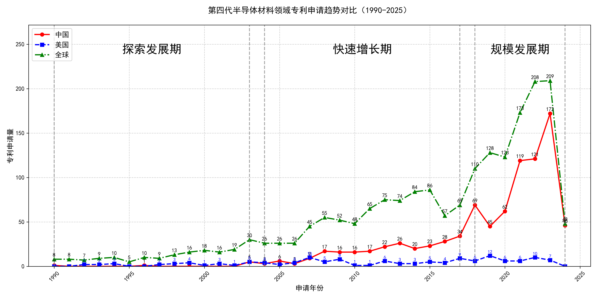
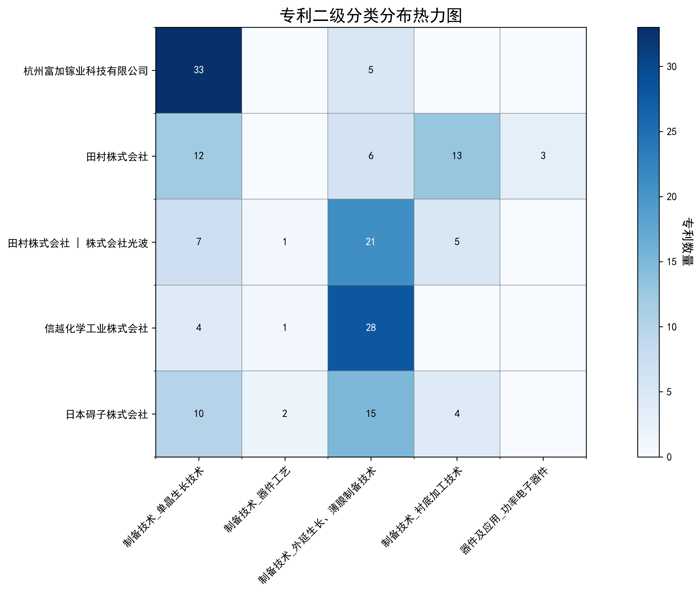

## （一）专利申请趋势分析

根据专利统计数据，全球专利申请量自1990年以来整体呈现上升趋势，尤其是在2010年后增长显著。中国专利申请量在早期相对较低，但自2003年起开始逐步增加，并在2018年后迅速增长，远超美国和其他国家。美国专利申请量在2007年达到峰值后逐渐下降，显示出技术成熟和市场竞争的变化。
### (1)探索发展期(1990-2003年)

在探索发展期中，全球专利申请量较低，主要集中在国外，尤其是美国。中国专利申请量极少，显示出技术领域的初步探索阶段。美国在该时期的技术研发较为活跃，专利申请量逐年增加，而中国的专利申请量几乎为零，表明中国在该技术领域的研发尚处于起步阶段。

日本胜利株式会社在该阶段主要专注于氧化物单晶的制造方法，尤其是通过改进化学组成和热处理方法，提升单晶的质量和性能。其专利JP2002053951A通过优化原料混合比例和热处理方法，显著提高了单晶的纯度和结晶质量。三菱综合材料株式会社则侧重于压电元件用基板的制造，其专利JP4239506B2通过精确控制La3Ga5SiO14单晶的化学组成，提升了基板的均匀性和压电性能。住友电气工业株式会社则专注于氮化镓单晶的氧掺杂工艺，其专利DE60226292T2通过控制氧掺杂浓度，改善了氮化镓单晶的电学性能。株式会社小松制作所则致力于氧化物单晶的制造，其专利JP1995157398A通过优化SrLaGaO4单晶的化学组成，提升了单晶的光学性能。株式会社力森诺科则专注于石榴石单晶基板的制造，其专利JP4292565B2通过控制Gd2.68+xCa0.32Ga4.02-xMg0.33Zr0.65O12单晶的化学组成，提升了基板的晶格常数和光学性能。

### (2)快速增长期(2004-2017年)

在快速增长期中，全球专利申请量显著增加，尤其是中国专利申请量逐步上升，显示出技术研发的加速。美国专利申请量在2007年达到峰值后开始波动，表明美国在该领域的技术发展趋于稳定。中国在这一阶段的专利申请量增长迅速，表明中国在相关技术领域的研发投入和技术创新能力的提升。

田村株式会社和株式会社光波在β-Ga2O3单晶衬底技术领域表现突出，其专利主要集中在高纯度β-Ga2O3单晶衬底的制备方法及其在半导体器件中的应用。例如，JP2016117643A专利提出了一种通过EFG法制备双晶含量极低的β-Ga2O3单晶衬底的技术，显著提高了衬底的晶体质量。中国科学院福建物质结构研究所在激光晶体材料领域取得了重要进展，其专利如CN109428257B提出了一种铒离子掺杂的硅酸盐晶体，能够实现1.5微米波段的高效激光输出。株式会社半导体能源研究所在氧化物半导体薄膜技术方面具有领先优势，其专利如JP6568353B2提出了一种通过溅射法制备高结晶性氧化物半导体薄膜的方法，显著提高了薄膜的导电性和稳定性。出光兴产株式会社在III族氮化物半导体生长模板技术方面取得了重要突破，其专利如JP2018168029A提出了一种通过Ga2O3主成分的绝缘膜制备低缺陷密度的III族氮化物半导体生长模板的技术，显著提高了半导体材料的晶体质量。

### (3)规模发展期(2018-2024年)

在规模发展期中，中国在氧化镓技术领域的专利申请量迅速增长，成为全球专利申请的主要来源，尤其是在2023年达到峰值。相比之下，美国的专利申请量持续下降，显示出技术成熟和市场竞争的变化。中国在这一阶段的技术创新主要集中在氧化镓薄膜外延、晶体生长装置及方法等方面，而日本则继续在氧化镓半导体膜和层叠结构体等领域保持技术优势。

杭州富加镓业科技有限公司在这一阶段的技术创新主要集中在氧化镓薄膜外延方法和晶体生长装置上，如CN117976518A专利提出了一种氧化镓薄膜外延方法，通过纳米孔结构提高外延质量。信越化学工业株式会社则专注于氧化镓半导体膜的制造技术，如WO2024122463A1专利提出了一种结晶氧化物半导体膜的制造方法，通过控制结晶结构提高膜的质量。日本碍子株式会社在氧化镓半导体薄膜的制造技术上也有显著进展，如US20230231013A1专利提出了一种多层结构，通过优化半导体膜的结构提高性能。中国电子科技集团公司第四十六研究所在氧化镓单晶的生长和退火技术上取得了突破，如CN118241316A专利提出了一种N型低阻β-Ga2O3单晶的原位退火方法，提高了电阻率均匀度。山东大学则在氧化镓薄膜的低温制备和光电探测器应用上有所创新，如CN118292099A专利提出了一种在掺铝氧化锌表面低温制备β相氧化镓薄膜的方法，降低了制备成本。

## 二、专利申请人分析报告

### (1) 专利申请人排名分析

根据提供的专利申请人排名数据，杭州富加镓业科技有限公司以38件专利总数位居榜首，其专利主要分布在中国（35件）、美国（1件）和日本（2件）。田村株式会社及其与株式会社光波的联合申请分别以34件专利并列第二，田村株式会社的专利主要分布在日本（20件）和中国（11件），而联合申请的专利则集中在日本（24件）和中国（8件）。信越化学工业株式会社以33件专利排名第四，其专利分布较为广泛，涉及日本（17件）、世界知识产权组织（4件）、中国（9件）等多个地区。日本碍子株式会社以31件专利位列第五，其专利主要分布在日本（17件）和中国（7件）。

主要发现：
1. 杭州富加镓业科技有限公司在中国市场的专利布局最为密集，显示出其对中国市场的重视。
2. 田村株式会社及其联合申请在日本的专利数量显著高于其他地区，表明其在日本的技术研发和专利保护力度较大。
3. 信越化学工业株式会社和日本碍子株式会社的专利分布较为国际化，涉及多个国家和地区，显示出其全球化的专利布局策略。

*图1：专利申请人排名柱状图，展示了各申请人的专利总数及其在不同地区的分布情况。*

### (2) 专利申请人技术分布

从技术分布数据来看，杭州富加镓业科技有限公司在“制备技术-单晶生长技术”领域拥有33件专利，显示出其在该技术领域的绝对优势。田村株式会社在“制备技术-衬底加工技术”和“制备技术-单晶生长技术”领域分别拥有13件和12件专利，表明其在这两个技术领域具有较强的研发实力。田村株式会社与株式会社光波的联合申请在“制备技术-外延生长、薄膜制备技术”领域拥有21件专利，显示出其在该技术领域的领先地位。信越化学工业株式会社在“制备技术-外延生长、薄膜制备技术”领域拥有28件专利，进一步巩固了其在该技术领域的优势。日本碍子株式会社在“制备技术-外延生长、薄膜制备技术”和“制备技术-单晶生长技术”领域分别拥有15件和10件专利，表明其在这两个技术领域也有一定的研发投入。

主要发现：
1. 杭州富加镓业科技有限公司在“制备技术-单晶生长技术”领域的技术布局最为集中，显示出其在该技术领域的领先地位。
2. 田村株式会社及其联合申请在多个技术领域均有专利布局，显示出其多元化的技术研发策略。
3. 信越化学工业株式会社和日本碍子株式会社在“制备技术-外延生长、薄膜制备技术”领域的技术布局较为突出，表明其在该技术领域的研发投入较大。

*图2：专利申请人技术分布热力图，展示了各申请人在不同技术领域的专利分布情况。*

### (3) 专利申请人技术布局分析

#### 杭州富加镓业科技有限公司

**背景介绍**  
杭州富加镓业科技有限公司是一家专注于氧化镓（Ga₂O₃）材料研发与生产的高科技企业，尤其在氧化镓外延生长和薄膜制备技术领域处于国内领先地位。公司成功研发出高质量氧化镓同质外延薄膜，并突破了金属有机物化学气相沉积（MOCVD）技术，实现了10微米以上薄膜的量产。此外，公司还掌握了6英寸氧化镓单晶生长技术，成为国内首家同时具备单晶生长及外延能力的公司。富加镓业的技术创新不仅推动了氧化镓材料在半导体领域的应用，还为其在功率电子器件等领域的拓展奠定了坚实基础。

**技术分布与焦点**  
根据技术分布数据，富加镓业的专利主要集中在“制备技术-单晶生长技术”领域，专利数量达到33件，占总专利数的绝大部分。此外，公司在“制备技术-外延生长、薄膜制备技术”领域也有少量专利布局（5件），而在“制备技术-器件工艺”和“器件及应用-功率电子器件”领域尚未有专利布局。这表明富加镓业的核心技术焦点在于氧化镓单晶生长及其相关工艺优化，这与公司背景中提到的“6英寸氧化镓单晶生长技术”和“MOCVD技术突破”高度吻合。

**创新焦点与关键成就**  
富加镓业在氧化镓单晶生长技术领域取得了多项重要突破，解决了多个技术痛点：  
1. **技术痛点：热场不均匀导致晶体质量下降**  
   - **解决方案：** 通过优化热场结构（如专利CN117626408A）和引入激光辅助加热（如专利CN113913924A）来调控热场分布，确保晶体生长过程中的温度梯度稳定。  
   - **效果：** 提高晶体质量，减少内部缺陷，提升晶体生长效率。  

2. **技术痛点：挥发物附着导致杂晶和裂纹**  
   - **解决方案：** 通过设计新型籽晶杆（如专利CN215976141U）和引入激光辅助加热（如专利CN113957518A）来去除挥发物，减少杂晶和裂纹的产生。  
   - **效果：** 提高晶体生长成功率，减少晶体缺陷，提升晶体质量。  

3. **技术痛点：掺杂不均匀导致电导率不稳定**  
   - **解决方案：** 通过优化掺杂工艺（如专利CN106868593B）和引入深度学习模型（如专利CN112837758A）来预测和控制掺杂效果，确保晶体电导率稳定。  
   - **效果：** 提高晶体电导率稳定性，优化晶体性能。  

**总结**  
杭州富加镓业科技有限公司在氧化镓单晶生长技术领域展现了强大的研发实力，通过优化热场结构、引入激光辅助加热和改进掺杂工艺，成功解决了晶体生长中的关键问题，显著提升了晶体质量和性能。其专利布局集中体现了公司在单晶生长技术领域的核心优势，为其在半导体材料领域的持续发展提供了坚实的技术支撑。

---

#### 田村株式会社

**背景介绍**  
田村株式会社是一家在半导体材料领域具有深厚技术积累的企业，专注于外延生长、薄膜制备、单晶生长和衬底加工技术。公司在β-Ga₂O₃（氧化镓）单晶生长和功率电子器件应用领域取得了显著进展，拥有多项核心专利技术，如Ga₂O₃系单晶衬底和半导体多层结构。田村株式会社的技术创新不仅推动了高性能氧化镓基半导体材料的研发，还为其在功率电子器件领域的应用拓展提供了重要支持。

**技术分布与焦点**  
田村株式会社的专利分布较为均衡，主要集中在“制备技术-单晶生长技术”（12件）、“制备技术-衬底加工技术”（13件）和“制备技术-外延生长、薄膜制备技术”（6件）领域。此外，公司在“器件及应用-功率电子器件”领域也有少量专利布局（3件）。这表明田村株式会社的技术焦点不仅在于β-Ga₂O₃单晶生长和衬底加工，还涉及其在功率电子器件中的应用。

**创新焦点与关键成就**  
田村株式会社在β-Ga₂O₃单晶生长、衬底加工和功率电子器件应用领域取得了多项重要突破：  
1. **技术痛点：β-Ga₂O₃单晶生长过程中易产生孪晶和缺陷**  
   - **解决方案：** 采用EFG法（边缘定义薄膜馈送生长法）并优化晶种位置和生长条件（如专利CN105189836B）。  
   - **效果：** 孪晶密度降低至30.7个/cm²以下，位错密度小于7.31×10⁴ cm⁻²。  

2. **技术痛点：β-Ga₂O₃衬底加工过程中易产生裂纹和缺陷**  
   - **解决方案：** 优化切割和退火工艺，控制施主和受主杂质浓度（如专利CN109056053B）。  
   - **效果：** 裂纹密度小于0.05条/cm，X射线摇摆曲线半高宽小于75秒。  

3. **技术痛点：β-Ga₂O₃薄膜外延生长过程中难以控制导电性和表面粗糙度**  
   - **解决方案：** 采用MBE法（分子束外延法）并优化生长温度和气氛（如专利US9657410B2）。  
   - **效果：** 表面粗糙度（RMS）小于1nm，厚度不小于300nm。  

4. **技术痛点：β-Ga₂O₃基功率电子器件的光输出效率低**  
   - **解决方案：** 在β-Ga₂O₃基板上形成氮化物半导体层并优化界面结构（如专利CN104885195B）。  
   - **效果：** 光输出效率显著提高，适用于紫外LED等器件。  

**总结**  
田村株式会社在β-Ga₂O₃单晶生长、衬底加工和功率电子器件应用领域展现了强大的技术实力，通过优化生长工艺、改进加工技术和创新器件设计，成功解决了多个技术痛点，显著提升了材料性能和器件效率。其专利布局体现了公司在氧化镓材料及其应用领域的全面技术优势。

---

#### 信越化学工业株式会社

**背景介绍**  
信越化学工业株式会社是全球领先的半导体材料供应商，专注于高纯度化学气相沉积（CVD）和金属有机物化学气相沉积（MOCVD）技术。公司在单晶生长和器件工艺领域具有深厚的技术积累，特别是在半导体和太阳能电池领域，通过持续的技术创新推动高性能材料与器件的发展。信越化学的技术优势为其在半导体材料市场的领先地位提供了坚实支撑。

**技术分布与焦点**  
信越化学的专利主要集中在“制备技术-外延生长、薄膜制备技术”领域，专利数量达到28件，占总专利数的绝大部分。此外，公司在“制备技术-单晶生长技术”和“制备技术-器件工艺”领域也有少量专利布局（分别为4件和1件）。这表明信越化学的核心技术焦点在于外延生长和薄膜制备技术，这与公司背景中提到的“高纯度CVD和MOCVD技术”高度吻合。

**创新焦点与关键成就**  
信越化学在外延生长和薄膜制备技术领域取得了多项重要突破：  
1. **技术痛点：氧化镓薄膜的热稳定性和表面平滑性不足**  
   - **解决方案：** 使用钽酸锂基板和β-Galia结构的结晶氧化膜，通过控制偏角和表面粗糙度来提升热稳定性和平滑性（如专利JP2021038118A）。  
   - **效果：** 表面粗糙度Ra为0.1μm或更小，热稳定性显著提升。  

2. **技术痛点：成膜速度慢且成本高**  
   - **解决方案：** 采用雾化CVD法，通过控制载气流量和温度，优化成膜速度（如专利CN116940708A）。  
   - **效果：** 成膜速度显著提升，成本降低。  

3. **技术痛点：薄膜厚度均匀性差**  
   - **解决方案：** 使用雾化CVD法，通过整流工序和优化喷嘴设计，提升薄膜厚度均匀性（如专利JP6925548B1）。  
   - **效果：** 膜厚的面内均匀性显著提升。  

**总结**  
信越化学工业株式会社在外延生长和薄膜制备技术领域展现了强大的技术实力，通过优化基板材料、改进成膜工艺和提升薄膜均匀性，成功解决了多个技术痛点，显著提升了薄膜质量和生产效率。其专利布局体现了公司在外延生长技术领域的核心优势，为其在半导体材料市场的持续领先提供了坚实的技术支撑。

---

#### 日本碍子株式会社

**背景介绍**  
日本碍子株式会社是一家致力于高质量半导体材料与器件研发和生产的企业，在半导体领域的技术布局包括外延生长、薄膜制备、单晶生长和衬底加工技术。公司在III族氮化物单晶生长、氧化镓晶体生长和复合基板制造领域具有深厚的技术积累，并通过持续的技术创新推动高性能半导体材料与器件的发展。

**技术分布与焦点**  
日本碍子的专利分布较为均衡，主要集中在“制备技术-外延生长、薄膜制备技术”（15件）、“制备技术-单晶生长技术”（10件）和“制备技术-衬底加工技术”（4件）领域。此外，公司在“制备技术-器件工艺”领域也有少量专利布局（2件）。这表明日本碍子的技术焦点不仅在于外延生长和单晶生长，还涉及其在衬底加工和器件工艺中的应用。

**创新焦点与关键成就**  
日本碍子在半导体膜制备与优化领域取得了多项重要突破：  
1. **技术痛点：半导体膜中的结晶缺陷**  
   - **解决方案：** 通过优化基底基板的取向层和材料组成，减少晶体缺陷（如专利CN113677833A）。  
   - **效果：** 结晶缺陷密度降低至1.0×10⁶/cm²以下。  

2. **技术痛点：半导体膜的翘曲问题**  
   - **解决方案：** 设计复合基底基板，减少翘曲（如专利JP7439117B2）。  
   - **效果：** 翘曲量控制在20μm以上且64μm以下。  

3. **技术痛点：半导体膜的杂质浓度高**  
   - **解决方案：** 优化生长条件，降低杂质浓度（如专利WO2023026633A1）。  
   - **效果：** 拉曼光谱中250cm⁻¹附近峰的半峰宽为10cm⁻¹以下。  

4. **技术痛点：单晶生长速度不稳定**  
   - **解决方案：** 改进反应容器的再生方法，稳定生长速度（如专利JP6389424B2）。  
   - **效果：** 生长速度和初始晶体缺陷得到有效控制。  

**总结**  
日本碍子株式会社在半导体膜制备与优化领域展现了强大的技术实力，通过优化基底基板、改进生长条件和设计复合结构，成功解决了多个技术痛点，显著提升了半导体膜的质量和性能。其专利布局体现了公司在半导体材料领域的全面技术优势，为其在高质量半导体材料市场的持续发展提供了坚实的技术支撑。