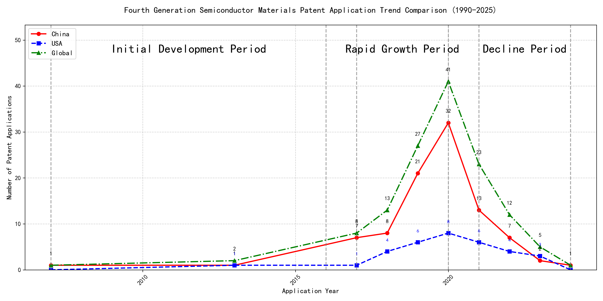

## (1) Patent Application Trend Analysis

The patent application trend in the field shows a significant increase from 2007 to 2020, followed by a decline from 2021 onwards. Chinese patent applications dominate the trend, showing rapid growth from 2017 to 2020, while US applications remain relatively stable with minor fluctuations. Global applications mirror the trend of Chinese applications, indicating China's strong influence in this field.
### (1)Initial Development Period (2007-2016)

During the initial development period, patent applications in the field of machine learning and data processing were sporadic, with minimal activity from both China and the US. The first patent in this period was filed in 2007 by Fuji Xerox in China, focusing on unsupervised and supervised learning for data processing. In 2013, EMC IP Holding Company LLC in the US filed a patent for a general framework for cross-validation of machine learning algorithms on distributed systems, indicating the early stages of technological exploration in this field. The low number of patents suggests that this was a foundational period where basic concepts and frameworks were being established.

The top applicants during this period were EMC IP Holding Company LLC, Fuji Xerox, and Internal Sales Company. EMC IP Holding Company LLC focused on developing a general framework for cross-validation of machine learning algorithms on distributed systems, which laid the groundwork for scalable machine learning solutions. Fuji Xerox's patent in 2007 introduced a data processing device that utilized unsupervised learning for dimensionality reduction and supervised learning for mapping relationships between data sets, showcasing an early integration of different learning paradigms. Internal Sales Company's patent in 2013 introduced instance-weighted learning (IWL) for training classifiers, emphasizing the importance of quality values in training instances. These patents reflect the initial exploration of machine learning techniques, with a focus on foundational algorithms, data processing, and scalable solutions. The technical routes of these applicants highlight the diversity in early approaches to machine learning, from cross-validation frameworks to integrated learning systems and weighted training methods.

### (2)Rapid Growth Period (2017-2020)

During the Rapid Growth Period, China emerged as the dominant force in patent applications, with a significant surge from 7 in 2017 to 32 in 2020. The United States also saw an increase in patent applications, but at a slower pace, growing from 1 in 2017 to 8 in 2020. Globally, the trend closely followed China's growth, indicating its leadership in this technological field. This period highlights China's aggressive investment and innovation in technology, particularly in machine learning and data processing, while the US maintained a steady but less pronounced growth trajectory.

The top five applicants during this period—谷歌有限责任公司, MICROSOFT TECHNOLOGY LICENSING, LLC, 国际商业机器公司, 维萨国际服务协会, and HRL LABORATORIES, LLC—show distinct technical routes in their patent applications. 谷歌有限责任公司 focused on unsupervised data augmentation and federated learning, emphasizing the enhancement of machine learning models through innovative data processing techniques. MICROSOFT TECHNOLOGY LICENSING, LLC concentrated on adversarial pretraining and reinforcement learning, aiming to improve model robustness and adaptability. 国际商业机器公司 explored fairness improvement in supervised learning and data anonymization, addressing ethical and privacy concerns in machine learning. 维萨国际服务协会 developed privacy-preserving unsupervised learning systems, focusing on secure data processing and privacy protection. HRL LABORATORIES, LLC specialized in understanding machine-learning decisions based on camera data, emphasizing interpretability and transparency in AI models. Chinese research institutions, particularly 谷歌有限责任公司 and 国际商业机器公司, demonstrated significant innovation in integrating advanced machine learning techniques with practical applications, showcasing their leadership in the field.

### (3)Decline Period (2021-2024)

During the decline period, both domestic (China) and foreign (US and global) patent applications experienced a significant drop. Chinese applications fell sharply from 32 in 2020 to just 1 in 2024, while US applications also decreased, albeit less dramatically. This trend suggests a potential slowdown in innovation or market saturation in the field of machine learning and related technologies. The global decline mirrors this trend, indicating a broader industry-wide shift rather than a localized phenomenon.

The top 5 applicants during this period focused on diverse aspects of machine learning, reflecting distinct technical routes. Oracle International Corporation emphasized unsupervised model ensembling and chatbot-driven ML solutions, aiming to optimize model selection and user interaction. Microsoft Technology Licensing, LLC explored adversarial pretraining and reinforcement learning with sub-goal-based reward functions, focusing on improving model robustness and training efficiency. South China University of Technology (华南理工大学) developed methods combining reinforcement and unsupervised learning for robotic skill acquisition and online label updating, highlighting innovation in adaptive learning systems. Capital One Services, LLC leveraged deep reinforcement learning for dynamic content selection, emphasizing real-time adaptability and cross-channel integration. DataTang (数据堂(北京)科技股份有限公司) focused on data annotation methods, combining unsupervised, weak, and semi-supervised learning to reduce manual labeling costs and improve efficiency. Chinese institutions, particularly South China University of Technology and DataTang, demonstrated significant innovation in integrating multiple learning paradigms and optimizing data processing workflows, showcasing their growing influence in the field.

