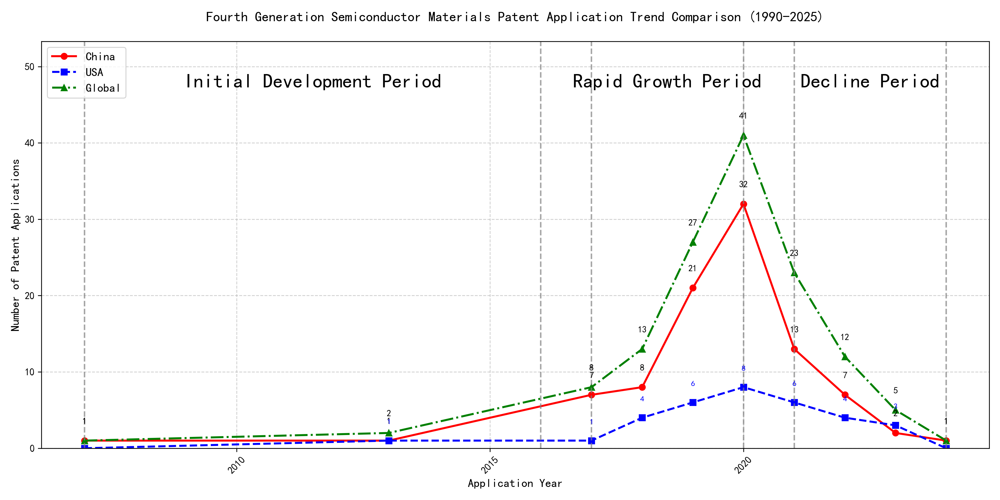

## (1) Patent Application Trend Analysis

The patent application trend analysis reveals a significant increase in patent applications globally, particularly from China, starting from 2017. Foreign applications, primarily from the US, show a more stable but less pronounced growth compared to China. The field experienced a rapid growth phase from 2017 to 2020, followed by a decline in applications from 2021 onwards. The development can be divided into the initial development period (2007-2016), rapid growth period (2017-2020), and decline period (2021-2024).
### (1)Initial Development Period (2007-2016)

During the initial development period, patent applications in the field of machine learning and distributed systems were minimal and sporadic globally. Both China and the US had very few applications, indicating the early stages of technology exploration and development. The US had a slight edge with one application in 2013, while China had one application in 2007 and another in 2013. This suggests that both countries were in the nascent phase of developing machine learning frameworks and distributed systems, with no significant dominance observed.

The top applicants during this period focused on foundational technologies in machine learning and distributed systems. EMC IP HOLDING COMPANY LLC from the US developed a general framework for cross-validation of machine learning algorithms using SQL on distributed systems, emphasizing a multi-layer software architecture to determine the best model based on prediction error. Fuji Xerox Co., Ltd. from China proposed a data processing device and method that combined unsupervised and supervised learning to classify and reduce data dimensions, establishing mapping relationships between different data groups. Internal Sales Company from China introduced an instance-weighted learning (IWL) machine learning model, which used quality values to weight training instances differently, allowing classifiers to learn more from higher-quality instances. These innovations highlight the early exploration of machine learning techniques, with a focus on improving model accuracy, data processing efficiency, and the integration of supervised and unsupervised learning methods.

### (2)Rapid Growth Period (2017-2020)

During the rapid growth period, China dominated the global patent applications, contributing the majority of the filings. The US also showed an increase in patent applications, but the growth was not as significant as in China. This period marked a surge in research and development activity, particularly in the field of machine learning and artificial intelligence, with China leading the innovation race.

Google LLC focused on unsupervised data augmentation and federated learning, with patents like CN113826125A and CN116134453A, which aimed to improve model training efficiency and accuracy. Microsoft Technology Licensing, LLC emphasized adversarial pretraining and reinforcement learning, as seen in US11803758B2 and US20210326751A, which enhanced model robustness and adaptability. IBM concentrated on fairness improvement in supervised learning and data anonymization, with patents like CN113692594A and CN112005255B, which addressed ethical and privacy concerns in AI. Visa International Service Association developed privacy-preserving unsupervised learning systems, as in CN114730389B and CN116756602A, which ensured data security while enabling collaborative learning. HRL Laboratories, LLC focused on understanding machine-learning decisions based on camera data, with patents like US20180293464A1 and WO2018187608A1, which provided insights into model interpretability and decision-making processes. Each company's technical route reflects their strategic focus, with Google and Microsoft leading in model training techniques, IBM in ethical AI, Visa in data privacy, and HRL in model interpretability.

### (3)Decline Period (2021-2024)

During the decline period, both China and the US experienced a reduction in patent applications, with China still leading in numbers but at a much lower rate than during the rapid growth period. This suggests a possible saturation or reduced innovation activity in the field. The decline in patent applications could be attributed to the maturation of the technology, leading to fewer groundbreaking innovations. Additionally, the global economic environment and shifts in research focus might have contributed to the reduced activity in this field.

During the decline period, the top 5 applicants focused on various aspects of machine learning and artificial intelligence. Oracle International Corporation concentrated on unsupervised machine learning models and chatbot systems for defining machine learning solutions, emphasizing the optimization and efficiency of model ensembles and user-friendly interfaces. Microsoft Technology Licensing, LLC explored adversarial pretraining and reinforcement learning with sub-goal based shaped reward functions, aiming to enhance model robustness and training efficiency. South China University of Technology developed methods for robot skill learning and online label updates, combining reinforcement and unsupervised learning to improve adaptability and reduce training time. Capital One Services, LLC focused on dynamic content selection using deep reinforcement learning, leveraging real-time events to enhance prediction accuracy in dynamic environments. DataTang (Beijing) Technology Co., Ltd. innovated in data annotation methods, utilizing unsupervised, weak, and semi-supervised learning to reduce manual annotation costs and improve efficiency. These diverse approaches highlight the continued evolution of machine learning technologies, even during a period of overall decline in patent activity.

