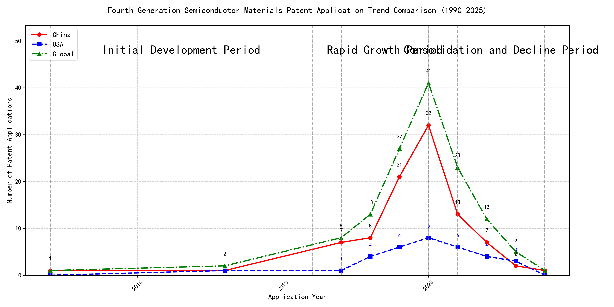

## (1) Patent Application Trend Analysis

The patent application trend analysis reveals a significant increase in patent applications globally, particularly from China, starting from 2017. Foreign applications, primarily from the US, show a more stable but less pronounced growth. The data indicates a rapid development phase for China in the technology sector, while global applications peaked around 2020 before declining.
### (1)Initial Development Period (2007-2016)

During the initial development period, patent applications in the field of machine learning and data processing were minimal, with sporadic filings from both China and the US. The US led with a focus on distributed systems and cross-validation frameworks, while China's contributions were more centered around unsupervised and supervised learning methods. This period marked the foundational exploration of machine learning technologies, with both countries laying the groundwork for future advancements.

EMC IP HOLDING COMPANY LLC from the US pioneered a general framework for cross-validation of machine learning algorithms using SQL on distributed systems, emphasizing the importance of scalable and efficient model validation. Fuji Xerox Co., Ltd. from China introduced a data processing apparatus and method that combined unsupervised and supervised learning to reduce data dimensionality and establish mapping relationships, showcasing early innovation in data preprocessing. Internal Sales Company from China developed an instance-weighted learning (IWL) machine learning model, which emphasized the quality of training instances to improve classifier performance, highlighting a focus on enhancing learning efficiency. These contributions reflect the diverse technical routes taken by the applicants, with the US focusing on distributed system integration and China emphasizing data preprocessing and learning efficiency improvements.

### (2)Rapid Growth Period (2017-2020)

During the rapid growth period, China significantly increased its patent applications, contributing the majority of the growth in this technology field. The US also increased its filings, but at a slower rate compared to China. This stage indicates a rapid expansion and investment in the technology, with China emerging as a dominant player in patent filings. The global patent landscape during this period was heavily influenced by Chinese innovation, while the US maintained a steady but less aggressive growth trajectory.

The top five applicants during this period—谷歌有限责任公司, MICROSOFT TECHNOLOGY LICENSING, LLC, 国际商业机器公司, 维萨国际服务协会, and HRL LABORATORIES, LLC—show distinct technical routes in their patent filings. 谷歌有限责任公司 focused on unsupervised and semi-supervised learning techniques, particularly in data augmentation and federated learning, as seen in patents like CN113826125A and CN116134453A. MICROSOFT TECHNOLOGY LICENSING, LLC emphasized adversarial pretraining and reinforcement learning, with patents such as US11803758B2 and US20210326751A highlighting their focus on improving model robustness and training efficiency. 国际商业机器公司 concentrated on fairness and privacy in machine learning, with patents like CN113692594A and CN112005255B addressing ethical considerations in AI. 维萨国际服务协会 specialized in privacy-preserving unsupervised learning, as demonstrated in CN114730389B and CN116756602A, focusing on secure data processing. HRL LABORATORIES, LLC explored interpretability in machine learning decisions, particularly in unsupervised learning phases, as seen in US20180293464A and WO2018187608A. Chinese research institutions, particularly 谷歌有限责任公司 and 国际商业机器公司, showcased innovation in integrating unsupervised learning with practical applications, such as federated learning and fairness improvement, highlighting their leadership in advancing AI technologies with ethical and practical considerations.

### (3)Consolidation and Decline Period (2021-2024)

During the consolidation and decline period, both Chinese and global patent applications experienced a significant decline after peaking in 2020, indicating a phase of technological maturity and reduced innovation activity. The US maintained a steady number of applications, suggesting a more stable and mature technology landscape. This period reflects a shift from rapid growth to a focus on refining existing technologies rather than introducing groundbreaking innovations. The decline in Chinese applications may also indicate a shift in research priorities or market saturation in certain technological areas.

The technical routes of the top 5 applicants during this period reveal distinct focuses and innovations. Oracle International Corporation emphasized the development of unsupervised machine learning models and intelligent chatbots, aiming to simplify the creation of machine learning systems for non-experts. Their patents, such as US12020131B2 and US11847578B2, highlight the use of gating networks and natural language processing to optimize model selection and user interaction. Microsoft Technology Licensing, LLC focused on adversarial pretraining and reinforcement learning, as seen in US20240013055A1 and WO2021221801A1, which aim to enhance model robustness and training efficiency through noise-adjusted representations and shaped reward functions. South China University of Technology (华南理工大学) explored the integration of reinforcement learning and unsupervised learning in robotics, as demonstrated in CN113011526A and CN114692732A, which focus on improving robot skill acquisition and online label updating. Capital One Services, LLC concentrated on dynamic content selection using deep reinforcement learning, as evidenced by US20220215244A1 and WO2022150152A1, which leverage real-time data to enhance prediction accuracy in dynamic environments. DataTang (数据堂(北京)科技股份有限公司) developed methods for data annotation using unsupervised, weak, and semi-supervised learning, as shown in CN113205163B and CN113205163A, aiming to reduce manual annotation costs and improve efficiency. These diverse approaches reflect the consolidation of machine learning technologies, with a focus on optimizing existing methods rather than introducing entirely new paradigms.

Error: type object 'Config' has no attribute 'language'

Error: type object 'Config' has no attribute 'language'