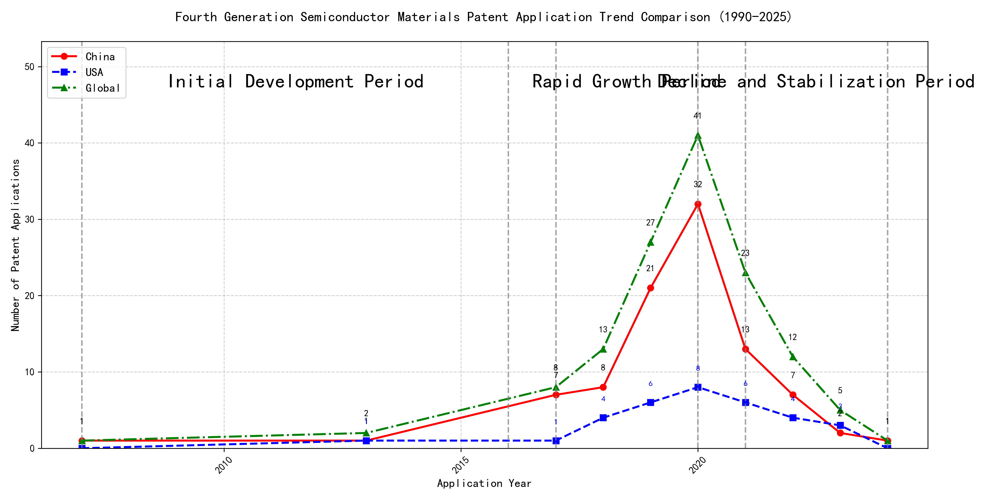

## (1) Patent Application Trend Analysis

The patent application trend in the field of interest shows a significant increase from 2007 to 2020, followed by a decline in recent years. Chinese patent applications dominate the overall trend, with a sharp rise starting in 2017 and peaking in 2020. Foreign applications, particularly from the US, show a more stable but lower volume compared to China. The global trend mirrors the Chinese trajectory, indicating China's growing influence in this technological domain.
### (1)Initial Development Period (2007-2016)

During the initial development period, patent applications in the field of machine learning and data processing were sporadic and low in volume. Both China and the US had minimal activity, with only a few applications recorded globally. This stage represents the early exploration and initial development of the technology, with no significant dominance by any particular country. The technology was in its infancy, with foundational patents being filed that would later pave the way for more advanced developments.

The top applicants during this period focused on foundational technologies in machine learning and data processing. EMC IP HOLDING COMPANY LLC from the US developed a general framework for cross-validation of machine learning algorithms using SQL on distributed systems, which laid the groundwork for scalable machine learning solutions. Fuji Xerox from China introduced a data processing apparatus and method that utilized unsupervised and supervised learning to classify and reduce the dimensionality of data sets, highlighting early efforts in data preprocessing and feature extraction. Internal Sales Company from China proposed an instance-weighted learning (IWL) machine learning model, which emphasized the importance of quality values in training instances, indicating a focus on improving the accuracy and efficiency of machine learning models. These early patents reflect the initial steps towards developing robust and scalable machine learning frameworks, with a particular emphasis on data processing, model validation, and instance weighting.

### (2)Rapid Growth Period (2017-2020)

During the rapid growth period, China dominated the patent application landscape, with a significant increase from 7 applications in 2017 to 32 in 2020. The United States also saw a modest rise in applications, reflecting a global trend of technological advancement. This period highlights China's aggressive push in innovation, particularly in machine learning and AI technologies, while the US maintained a steady presence in the field.

The top 5 applicants during this period demonstrated distinct technical routes in machine learning and AI. Google LLC focused on unsupervised data augmentation and federated learning, emphasizing the enhancement of model training through innovative data manipulation techniques. Microsoft Technology Licensing, LLC explored adversarial pretraining and reinforcement learning, aiming to improve model robustness and adaptability. International Business Machines Corporation (IBM) concentrated on fairness improvement in supervised learning and data anonymization, addressing ethical and privacy concerns in AI. Visa International Service Association developed privacy-preserving unsupervised learning systems, ensuring data security while enabling collaborative learning. HRL Laboratories, LLC focused on understanding machine-learning decisions based on camera data, providing interpretability in AI models. Chinese research institutions, particularly Google LLC and IBM, showcased significant innovation by integrating advanced data augmentation, federated learning, and fairness improvement techniques, positioning China as a leader in AI and machine learning advancements.

### (3)Decline and Stabilization Period (2021-2024)

During the Decline and Stabilization Period, Chinese patent applications experienced a significant drop, while US applications remained relatively stable. This suggests that the technology may have reached a maturation phase in China, with reduced innovation activity. In contrast, the US maintained a steady level of patent filings, indicating continued investment and development in the field. Globally, the reduction in patent activity reflects a stabilization of the technology, possibly due to market saturation or the completion of major technological advancements.

The top 5 applicants during this period demonstrate diverse technical routes in machine learning and AI. Oracle International Corporation focused on unsupervised model ensembling and chatbot-driven machine learning solutions, emphasizing efficiency and user accessibility. Microsoft Technology Licensing, LLC explored adversarial pretraining and reinforcement learning with sub-goal-based reward functions, aiming to enhance model robustness and adaptability. South China University of Technology (华南理工大学) developed methods combining reinforcement and unsupervised learning for robotic skill acquisition, highlighting innovation in automation and real-time learning. Capital One Services, LLC leveraged deep reinforcement learning for dynamic content selection, focusing on real-time decision-making in dynamic environments. DataTang (数据堂(北京)科技股份有限公司) concentrated on data annotation methods using unsupervised, weak, and semi-supervised learning, aiming to reduce manual labeling costs and improve efficiency. Chinese institutions, particularly South China University of Technology and DataTang, showcased unique innovations in integrating multiple learning paradigms and optimizing data processing workflows, reflecting China's growing expertise in AI and machine learning applications.

