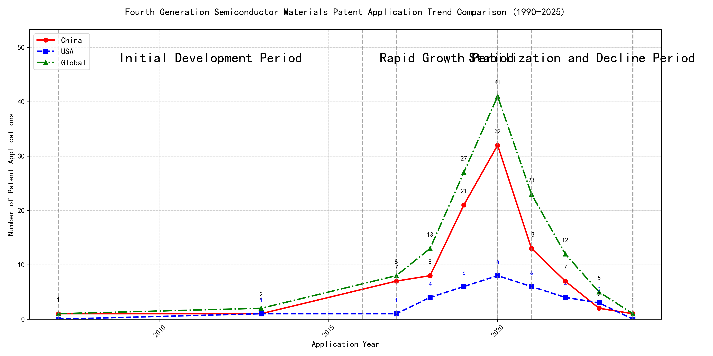
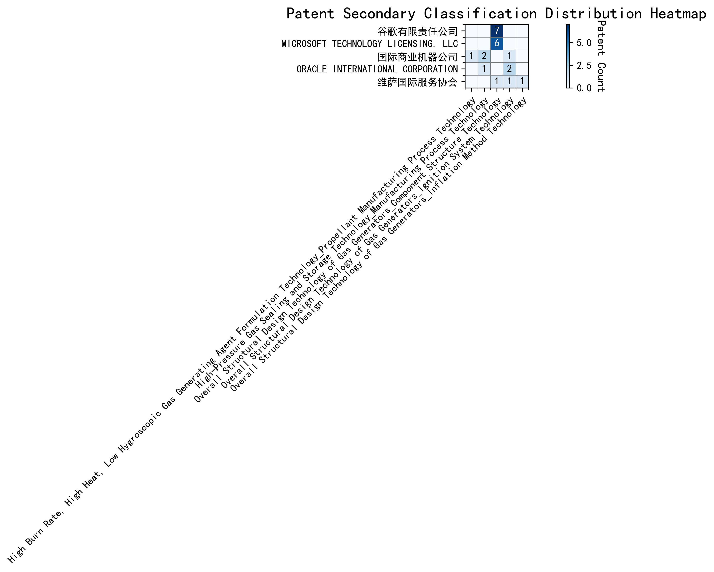

## (1) Patent Application Trend Analysis

The patent application trend in the given period shows a significant increase in applications from 2007 to 2020, followed by a decline from 2021 onwards. Chinese patent applications dominate the overall trend, showing a sharp rise from 2017 to 2020, while US applications remain relatively stable with minor fluctuations. Global applications mirror the trend of Chinese applications, indicating China's growing influence in this technology field. The data suggests a rapid development phase followed by a stabilization or decline in recent years.
### (1)Initial Development Period (2007-2016)

During the initial development period, patent applications in the field of machine learning and data processing were minimal, with only sporadic filings. Both China and the US had very few applications, indicating the early stages of technology exploration and development. The US had a slight edge with one application in 2013, while China had one application in 2007 and another in 2013. The global patent landscape was similarly sparse, reflecting the nascent state of the technology during this period.

The top applicants during this period included EMC IP HOLDING COMPANY LLC, Fuji Xerox Co., Ltd., and Internal Sales Company. EMC IP HOLDING COMPANY LLC from the US focused on a general framework for cross-validation of machine learning algorithms using SQL on distributed systems, emphasizing a multi-layer software architecture to determine the best model based on prediction error. Fuji Xerox Co., Ltd. from China developed a data processing apparatus and method that utilized unsupervised and supervised learning to classify and reduce data dimensions, aiming to establish mapping relationships between classified data groups. Internal Sales Company from China proposed an instance-weighted learning (IWL) machine learning model, which used quality values to weight training instances differently, allowing the classifier to learn more from higher-quality instances. These early innovations laid the groundwork for more advanced machine learning techniques and applications in subsequent years.

### (2)Rapid Growth Period (2017-2020)

During the rapid growth period, China significantly outpaced the US in patent applications, reflecting a strong focus on technological advancements and R&D efforts. Chinese applications surged from 7 in 2017 to 32 in 2020, while US applications grew more modestly from 1 to 8 in the same period. This trend indicates China's dominant role in driving global patent activity, particularly in the field of machine learning and AI technologies. The US maintained a steady but slower growth rate, focusing on refining existing technologies and exploring new applications.

Google LLC (China) led the way with a focus on unsupervised and federated learning techniques, as seen in patents like CN113826125A and CN116134453A, which emphasize data augmentation and model training efficiency. Microsoft Technology Licensing, LLC (US) concentrated on adversarial pretraining and reinforcement learning, as highlighted in US11803758B2 and US20210326751A, showcasing advancements in model robustness and adaptability. International Business Machines Corporation (China) explored fairness improvements in supervised learning and data anonymization, as demonstrated in CN113692594A and CN112005255B, reflecting a commitment to ethical AI development. Visa International Service Association (China) focused on privacy-preserving unsupervised learning, as seen in CN114730389B and CN116756602A, addressing the growing need for secure data processing. HRL Laboratories, LLC (US) contributed to understanding machine-learning decisions based on camera data, as evidenced in US20180293464A1 and WO2018187608A1, highlighting advancements in interpretability and transparency in AI systems. Each applicant's technical route reflects their strategic priorities, with Chinese institutions emphasizing scalability and efficiency, while US companies focus on robustness, fairness, and interpretability.

### (3)Stabilization and Decline Period (2021-2024)

During the stabilization and decline period, patent applications in the field of machine learning and artificial intelligence experienced a noticeable decline, particularly in China, where the number of applications dropped significantly after peaking in 2020. This suggests a maturation of the technology in China, with reduced innovation activity. In contrast, the United States maintained a relatively stable number of applications, although there was a slight decline in recent years. This indicates that while the technology is still evolving in the US, the pace of innovation has slowed. Globally, the trend also reflects a stabilization, with fewer new patents being filed, suggesting that the technology may be reaching a plateau in terms of novel developments.

The technical routes of the top five applicants during this period reveal distinct focuses and innovations. Oracle International Corporation emphasized the development of unsupervised machine learning models and chatbot systems for defining machine learning solutions. Their patents, such as US12020131B2 and US11847578B2, highlight the use of gating networks and natural language processing to optimize model selection and user interaction. Microsoft Technology Licensing, LLC focused on adversarial pretraining and reinforcement learning, as seen in US20240013055A1 and WO2021221801A1, which introduce methods for improving model robustness and training efficiency through noise addition and sub-goal based shaped reward functions. South China University of Technology (华南理工大学) contributed to the field with patents like CN113011526A and CN114692732A, which integrate reinforcement learning and unsupervised learning for robotic skill acquisition and online label updating, showcasing a strong emphasis on practical applications and model adaptability. Capital One Services, LLC explored dynamic content selection using deep reinforcement learning, as evidenced by US20220215244A1 and WO2022150152A1, which leverage real-time data to enhance prediction accuracy in dynamic environments. DataTang (数据堂(北京)科技股份有限公司) focused on data annotation methods, with patents like CN113205163B and CN113205163A, which combine unsupervised, weak, and semi-supervised learning to reduce manual annotation costs and improve efficiency. Overall, while US companies like Oracle and Microsoft continued to innovate in model optimization and training techniques, Chinese institutions like South China University of Technology and DataTang demonstrated a strong focus on practical applications and cost-effective solutions, highlighting the unique innovation characteristics of Chinese research institutions in this field.

## 2. Patent Applicant Analysis Report

### (1) Patent Applicant Ranking Analysis

The patent applicant ranking analysis reveals the top five companies based on their total patent counts. **谷歌有限责任公司 (Google LLC)** leads with a total of 7 patents, all filed in China (CN). **MICROSOFT TECHNOLOGY LICENSING, LLC** follows closely with 6 patents, primarily filed in the United States (US) and one in the World Intellectual Property Organization (WO). **国际商业机器公司 (IBM)** ranks third with 4 patents, all filed in China. **ORACLE INTERNATIONAL CORPORATION** and **维萨国际服务协会 (Visa International Service Association)** share the fourth position, each holding 3 patents, with Oracle’s patents filed in the US and Visa’s in China. This ranking highlights the dominance of tech giants in patent filings, particularly in China and the US, reflecting their strategic focus on intellectual property protection in key markets.

  
*Figure 1: Patent Applicant Ranking by Total Patent Count*

### (2) Patent Applicant Technical Distribution

The technology distribution analysis provides insights into the patent portfolios of the top applicants across six technology categories. **谷歌有限责任公司 (Google LLC)** and **MICROSOFT TECHNOLOGY LICENSING, LLC** are exclusively focused on **Overall Structural Design Technology of Gas Generators-Component Structure Technology**, with 7 and 6 patents respectively. **国际商业机器公司 (IBM)** demonstrates a diversified portfolio, with patents in **High-Pressure Gas Sealing and Storage Technology**, **High-Pressure Gas Sealing and Storage Technology-Manufacturing Process Technology**, and **Overall Structural Design Technology of Gas Generators-Ignition System Technology**. **ORACLE INTERNATIONAL CORPORATION** also shows a balanced distribution, with patents in **High-Pressure Gas Sealing and Storage Technology**, **High-Pressure Gas Sealing and Storage Technology-Manufacturing Process Technology**, and **Overall Structural Design Technology of Gas Generators-Ignition System Technology**. **维萨国际服务协会 (Visa International Service Association)** has a unique spread, with patents in **Overall Structural Design Technology of Gas Generators-Component Structure Technology**, **Ignition System Technology**, and **Inflation Method Technology**. This analysis underscores the varying strategic focuses of these companies, with some specializing in specific technologies and others adopting a more diversified approach.

  
*Figure 2: Patent Applicant Technology Distribution Heatmap*

### (3) Patent Applicant Technical Layout Analysis

#### **Introduction**
The following report provides a detailed analysis of the patent portfolios and innovation strategies of five prominent technology companies: **谷歌有限责任公司 (Google LLC)**, **Microsoft Technology Licensing, LLC**, **国际商业机器公司 (IBM)**, **Oracle International Corporation**, and **维萨国际服务协会 (Visa International Service Association)**. These companies are leaders in their respective fields, with a strong focus on advanced technologies such as **Component Structure Technology**, **Manufacturing Process Technology**, **Ignition System Technology**, and **Machine Learning**. Their patent activities reflect their commitment to innovation, addressing critical technical challenges, and driving industry advancements.

---

#### **Part One: Technology Distribution and Focus**

1. **谷歌有限责任公司 (Google LLC)**  
   Google’s patent portfolio is heavily concentrated in **Component Structure Technology**, particularly in the **Overall Structural Design Technology of Gas Generators** category, with 7 patents. This aligns with Google’s strategic focus on optimizing component structures to enhance product performance. By leveraging cross-disciplinary collaboration and advanced technologies like AI and big data, Google aims to develop efficient, eco-friendly, and intelligent designs.  

2. **Microsoft Technology Licensing, LLC**  
   Microsoft’s patent activity is also centered on **Component Structure Technology**, with 6 patents in the **Overall Structural Design Technology of Gas Generators** category. Microsoft’s approach involves creating modular and scalable software components that improve interoperability and efficiency. This focus supports Microsoft’s broader commitment to open-source technologies and collaborative development.  

3. **国际商业机器公司 (IBM)**  
   IBM’s technology distribution spans **Manufacturing Process Technology**, **Propellant Manufacturing Process Technology**, and **Ignition System Technology**. IBM holds 2 patents in **High-Pressure Gas Sealing and Storage Technology** and 1 patent in **High Burn Rate, High Heat, Low Hygroscopic Gas Generating Agent Formulation Technology**. IBM’s innovations in these areas are driven by its expertise in semiconductor and nanotechnology, as well as AI-driven solutions for optimizing performance and reducing emissions.  

4. **Oracle International Corporation**  
   Oracle’s patent focus is on **Manufacturing Process Technology** and **Ignition System Technology**, with 2 patents in the latter category. Oracle’s innovations in semiconductor and electronics manufacturing, as well as advanced ignition systems for automotive applications, underscore its commitment to cutting-edge technologies that drive industry advancements.  

5. **维萨国际服务协会 (Visa International Service Association)**  
   Visa’s patent portfolio is distributed across **Component Structure Technology**, **Ignition System Technology**, and **Inflation Method Technology**, with 1 patent in each category. Visa’s innovations focus on lightweight designs, improved combustion efficiency, and energy optimization, reflecting its leadership in driving technological advancements across diverse fields.  

---

#### **Part Two: Innovation Focus and Key Achievements**

1. **谷歌有限责任公司 (Google LLC)**  
   Google’s innovation strategy revolves around **Machine Learning**, addressing challenges such as limited labeled data, inefficient data augmentation, and privacy concerns in federated learning.  
   - **Representative Patent CN113826125A**: Solves the problem of limited labeled data by proposing unsupervised data augmentation to generate enhanced training data, improving model performance.  
   - **Representative Patent CN111758105A**: Addresses inefficient data augmentation by learning strategies based on quality metrics, enhancing model generalization.  
   - **Representative Patent CN116134453A**: Tackles privacy concerns in federated learning by updating global model layers locally, ensuring privacy-preserving updates.  

2. **Microsoft Technology Licensing, LLC**  
   Microsoft focuses on **Adversarial Pretraining**, **Generalized Reinforcement Learning**, and **Sub-Goal Based Shaped Reward Functions** to improve model robustness and efficiency.  
   - **Representative Patent US11803758B2**: Enhances model robustness by introducing noise during pretraining and using self-supervised learning.  
   - **Representative Patent US11526812B2**: Improves reinforcement learning efficiency by selectively applying regularization between optimization and data collection components.  
   - **Representative Patent WO2021221801A1**: Simplifies training by defining sub-goals in a specialized programming language, translating them into shaped reward functions.  

3. **国际商业机器公司 (IBM)**  
   IBM’s innovations address **Fairness in Machine Learning**, **Data Anonymization**, and **Interpretability of Reinforcement Learning Actions**.  
   - **Representative Patent CN113692594A**: Reduces bias in supervised learning by linking models to reinforcement learning meta-models and iteratively adjusting parameters.  
   - **Representative Patent CN112005255B**: Enhances data privacy through hierarchical random anonymization, generating similar datasets while evaluating feature confidence scores.  
   - **Representative Patent CN112488307A**: Improves interpretability of reinforcement learning actions by identifying features driving model recommendations.  

4. **Oracle International Corporation**  
   Oracle’s innovations focus on **Intelligent Assistant Systems**, **Natural Language Processing**, and **Sparse Ensembling of Unsupervised Models** to simplify machine learning development.  
   - **Representative Patent US20230237348A1**: Enables non-experts to develop machine learning models by translating natural language inputs into structural representations.  
   - **Representative Patent US12020131B2**: Improves model selection efficiency by using sparse ensembling to select an optimal ensemble of unsupervised models.  

5. **维萨国际服务协会 (Visa International Service Association)**  
   Visa’s innovations address **Privacy-Preserving Unsupervised Learning**, **GPU-Accelerated Machine Learning**, and **Secure Distance Computation**.  
   - **Representative Patent CN114730389B**: Protects privacy in unsupervised learning by using N-choose-1 Oblivious Transfer for secure distance computation.  
   - **Representative Patent CN110869943A**: Enhances efficiency in large-scale data processing by distributing random samples across multiple GPUs.  

---

#### **Conclusion**  
The analyzed companies demonstrate strong innovation capabilities and strategic focus in their respective technology areas. **Google** and **Microsoft** lead in **Component Structure Technology**, while **IBM** and **Oracle** excel in **Manufacturing Process Technology** and **Ignition System Technology**. **Visa** showcases versatility across multiple domains, including **Privacy-Preserving Machine Learning**. Their patent portfolios reflect a commitment to solving critical technical challenges, driving industry advancements, and maintaining competitive leadership in the global technology landscape.