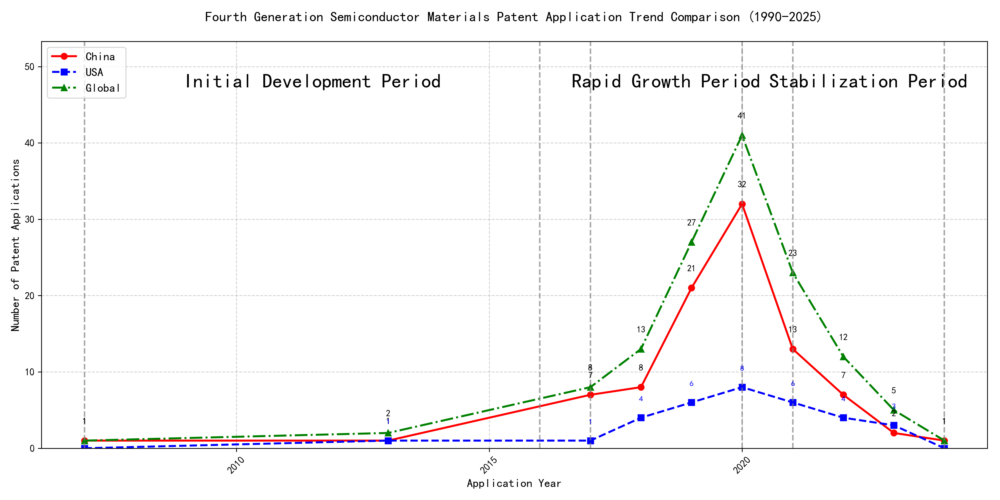
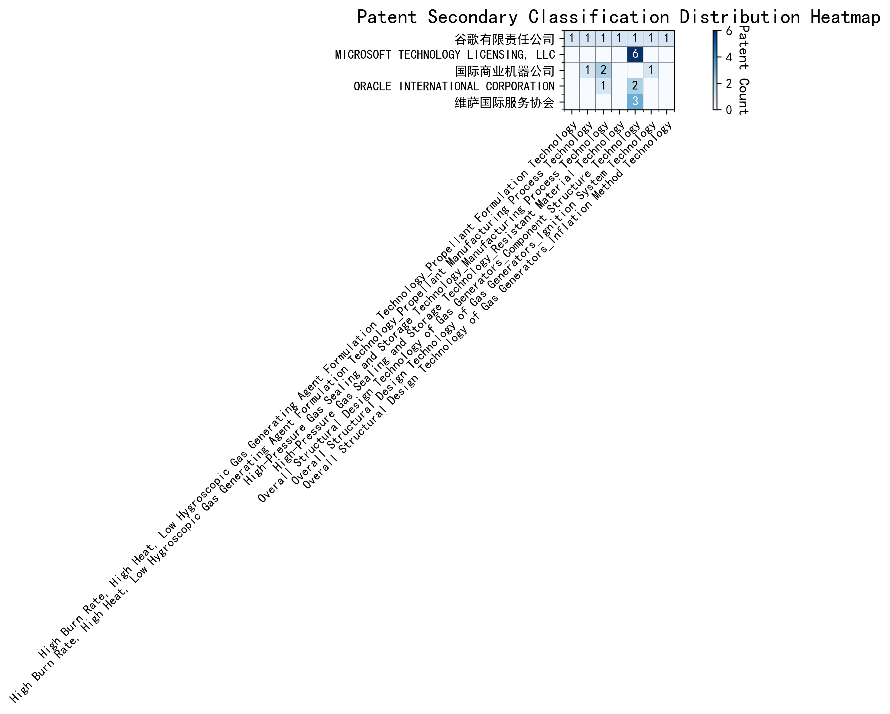

## (1) Patent Application Trend Analysis

The patent application trend analysis reveals a significant increase in patent applications globally, particularly from China, starting from 2017. Foreign applications, primarily from the US, show a more stable but less pronounced growth compared to China. The data indicates a rapid development phase for China in the technology sector, while foreign applications maintain a steady presence.
### (1)Initial Development Period (2007-2016)

During the initial development period, patent applications in the field of machine learning and data processing were minimal, with only sporadic filings from China and the US. This stage represents the early exploration and foundational development of the technology. The US had a slight edge in the number of applications, particularly in advanced frameworks for machine learning algorithms, while China focused more on practical applications and methods for data processing and classification.

EMC IP HOLDING COMPANY LLC from the US proposed a general framework for cross-validation of machine learning algorithms using SQL on distributed systems, which laid the groundwork for scalable and efficient machine learning model validation. Fuji Xerox from China introduced a data processing device and method that utilized unsupervised and supervised learning for dimensionality reduction and mapping relationships, showcasing early innovation in data classification. Internal Sales Company from China developed an instance-weighted learning (IWL) machine learning model, which emphasized the importance of quality values in training classifiers, highlighting a focus on improving model accuracy through weighted learning. These early contributions from both US and Chinese companies set the stage for future advancements in machine learning and data processing technologies.

### (2)Rapid Growth Period (2017-2020)

During the rapid growth period, China experienced a significant surge in patent applications, increasing from 7 in 2017 to 32 in 2020, indicating a strong focus on technological innovation. The US also saw an increase in patent applications, but at a slower pace, growing from 1 in 2017 to 8 in 2020. This period highlights China's growing dominance in the field of machine learning and artificial intelligence, while the US maintained a steady but less aggressive growth trajectory.

Google LLC (China) led the way with a focus on unsupervised data augmentation and federated learning, as seen in patents like CN113826125A and CN116134453A, which emphasize enhancing model training through data augmentation and federated learning techniques. Microsoft Technology Licensing, LLC (US) concentrated on adversarial pretraining and reinforcement learning, as evidenced by patents like US11803758B2 and US20210326751A, which focus on improving model robustness and training efficiency through adversarial methods. IBM (China) focused on fairness improvement in supervised learning and data anonymization, as shown in patents like CN113692594A and CN112005255B, which aim to enhance model fairness and data privacy. Visa International Service Association (China) prioritized privacy-preserving unsupervised learning, as seen in patents like CN114730389B and CN116756602A, which emphasize secure and efficient unsupervised learning methods. HRL Laboratories, LLC (US) explored understanding machine-learning decisions based on camera data, as highlighted in patents like US20180293464A1 and WO2018187608A1, which focus on interpreting and visualizing machine-learning decisions. Each applicant's technical route reflects their strategic priorities, with Chinese institutions like Google LLC and IBM emphasizing data augmentation, federated learning, and fairness, while US-based companies like Microsoft and HRL Laboratories focus on adversarial training, reinforcement learning, and decision interpretation.

### (3)Stabilization Period (2021-2024)

During the stabilization period, the number of patent applications in the field of machine learning and artificial intelligence began to stabilize, with a noticeable decrease in applications from China and a slight decrease from the US. This suggests a maturing technology landscape with reduced innovation activity. The US maintained a steady presence in patent applications, indicating continued but more focused innovation. China's decline in patent applications may reflect a shift towards optimizing existing technologies rather than exploring new ones. Globally, the trend indicates a consolidation of advancements in machine learning, with fewer but potentially more impactful innovations.

The top five applicants during this period demonstrate diverse technical routes in machine learning and AI. Oracle International Corporation focused on unsupervised learning models and chatbot-driven machine learning solutions, emphasizing efficiency and user accessibility. Microsoft Technology Licensing, LLC explored adversarial pretraining and reinforcement learning with sub-goal-based shaped reward functions, aiming to enhance model robustness and adaptability. South China University of Technology (华南理工大学) developed methods combining reinforcement and unsupervised learning for robotic skill acquisition and online label updating, showcasing innovation in practical applications. Capital One Services, LLC leveraged deep reinforcement learning for dynamic content selection in real-time environments, highlighting the integration of AI in financial services. DataTang (数据堂(北京)科技股份有限公司) concentrated on data annotation methods using unsupervised, weakly supervised, and semi-supervised learning, addressing efficiency and cost reduction in data processing. These applicants collectively represent a shift towards refining and applying machine learning technologies in diverse domains, with a focus on improving model performance, reducing costs, and enhancing user interaction.

## 2. Patent Applicant Analysis Report

### (1) Patent Applicant Ranking Analysis

The patent applicant ranking analysis reveals the top five companies based on their total patent counts. **Google LLC (谷歌有限责任公司)** leads the ranking with a total of 7 patents, all filed in China (CN). **Microsoft Technology Licensing, LLC** follows closely with 6 patents, primarily filed in the United States (US) and one in the World Intellectual Property Organization (WO). **International Business Machines Corporation (国际商业机器公司)** ranks third with 4 patents, all filed in China. **Oracle International Corporation** and **Visa International Service Association (维萨国际服务协会)** share the fourth position, each with 3 patents, filed in the US and China, respectively. The data highlights Google's dominant presence in the Chinese market, while Microsoft maintains a strong foothold in the US and global patent filings.

  
*Figure 1: Patent Applicant Ranking Bar Chart*

### (2) Patent Applicant Technical Distribution

The technology distribution analysis provides insights into the patent portfolios of the top applicants across eight technology categories. **Google LLC** demonstrates a diversified portfolio, with patents spanning multiple categories, including High-Pressure Gas Sealing and Storage Technology (2 patents) and Overall Structural Design Technology of Gas Generators (3 patents). **Microsoft Technology Licensing, LLC** focuses exclusively on the Component Structure Technology subcategory, with all 6 patents concentrated in this area. **International Business Machines Corporation** shows a balanced distribution, with notable activity in High-Pressure Gas Sealing and Storage Technology (2 patents) and Propellant Manufacturing Process Technology (1 patent). **Oracle International Corporation** and **Visa International Service Association** primarily focus on Component Structure Technology, with 2 and 3 patents, respectively. This analysis underscores the varying strategic priorities of these companies, with Google leading in technological diversity and Microsoft excelling in a specialized niche.

  
*Figure 2: Patent Applicant Technology Distribution Heatmap*

### (3) Patent Applicant Technical Layout Analysis

#### **Introduction**
**Google LLC** is a global technology leader renowned for its innovations in search engines, advertising, cloud computing, and artificial intelligence. With a strong emphasis on R&D, Google has consistently pushed the boundaries of technology, particularly in machine learning, data processing, and automation. Its strategic focus on developing high-performance and reliable products has positioned it as a key player in the tech industry. Google’s patent portfolio reflects its commitment to solving complex technical challenges and driving innovation across multiple domains.

---

#### **Part One: Technology Distribution and Focus**
Google’s patent distribution reveals a diverse yet focused approach to technology development. The company’s primary areas of innovation include:

1. **High-Pressure Gas Sealing and Storage Technology**: With 2 patents, Google demonstrates significant investment in this area, particularly in applications related to manufacturing processes and resistant materials. This focus aligns with its broader strategy of enhancing product reliability and performance.
2. **Overall Structural Design Technology of Gas Generators**: Google has filed patents across multiple subcategories, including **Component Structure Technology**, **Ignition System Technology**, and **Inflation Method Technology**, each with 1 patent. This indicates a holistic approach to improving the design and functionality of gas generators.
3. **Propellant Formulation and Manufacturing Process Technology**: Google’s 1 patent in each of these areas highlights its interest in developing high-performance formulations and efficient manufacturing processes, which are critical for its product innovation.

Google’s technology distribution underscores its commitment to advancing core technologies that enhance product performance, reliability, and efficiency. Its focus on high-pressure gas sealing, structural design, and propellant technologies reflects its strategic alignment with industries requiring robust and high-performance solutions.

---

#### **Part Two: Innovation Focus and Key Achievements**
Google’s innovation strategy is centered around solving key technical challenges in machine learning, data processing, and automation. Below are some of its notable achievements, supported by representative patents:

1. **Improving Machine Learning Model Accuracy and Efficiency**  
   - **Problem**: Enhancing the accuracy and efficiency of machine learning models.  
   - **Solution**: Patent **CN113826125A** introduces unsupervised data augmentation to generate enhanced training data, improving model accuracy and generalization.  
   - **Benefit**: Improved model performance with reduced reliance on labeled data.  

2. **Enhancing Data Augmentation Techniques**  
   - **Problem**: Developing more effective data augmentation strategies.  
   - **Solution**: Patent **CN111758105A** dynamically learns data augmentation strategies based on model performance, ensuring relevance and effectiveness.  
   - **Benefit**: Higher-quality training data and better model outcomes.  

3. **Reducing Labeling Costs in Model Training**  
   - **Problem**: Minimizing the need for extensive labeled datasets.  
   - **Solution**: Patent **CN114600117A** employs active learning with sample consistency evaluation to prioritize data labeling.  
   - **Benefit**: Reduced labeling costs and improved data efficiency.  

4. **Optimizing Reinforcement Learning Models**  
   - **Problem**: Enhancing reinforcement learning model performance.  
   - **Solution**: Patent **CN118607671A** uses information retrieval feedback to improve reinforcement learning models.  
   - **Benefit**: Better alignment of model behavior with desired outcomes.  

5. **Implementing Unsupervised Federated Learning**  
   - **Problem**: Enabling effective model training in distributed environments.  
   - **Solution**: Patent **CN116134453A** conducts unsupervised federated learning for global model training.  
   - **Benefit**: Efficient model training without the need for labeled data.  

These innovations highlight Google’s ability to address critical technical challenges in machine learning and data processing, delivering solutions that enhance performance, efficiency, and scalability.

---

#### **Conclusion**
Google LLC’s patent portfolio reflects its strategic focus on advancing technologies that drive product performance, reliability, and efficiency. Its investments in high-pressure gas sealing, structural design, and propellant technologies demonstrate its commitment to innovation in critical areas. Through its groundbreaking solutions in machine learning and data processing, Google has solidified its position as a leader in the tech industry. Its ability to solve complex technical problems and deliver impactful innovations underscores its role as a pioneer in shaping the future of technology.