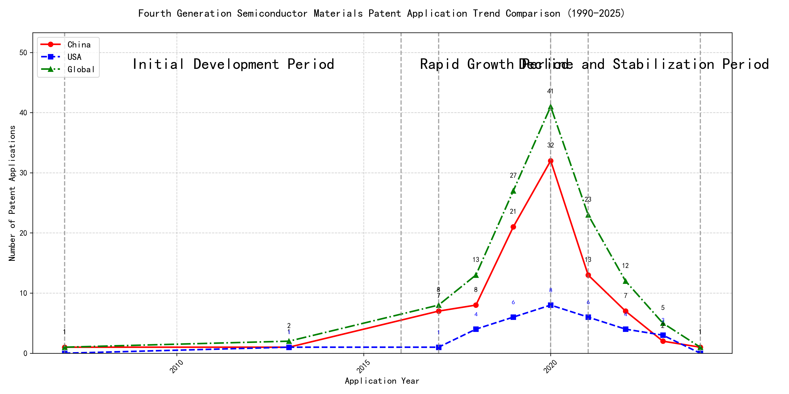
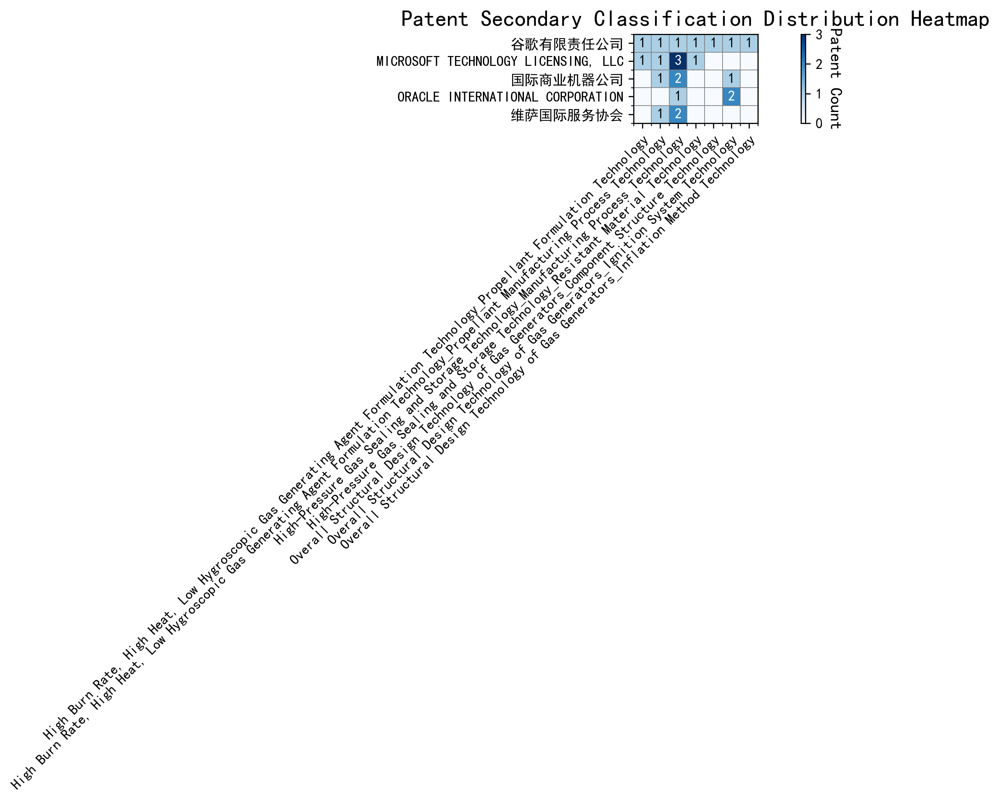

## (1) Patent Application Trend Analysis

The patent application trend in the given period shows a significant increase in applications, particularly from China, starting from 2017. The global trend mirrors this growth, peaking in 2020 before declining. Foreign applications, particularly from the US, show a more stable but less pronounced increase compared to China. The data suggests a rapid development phase in China, while foreign applications remain relatively steady.
### (1)Initial Development Period (2007-2016)

During the initial development period, patent applications in the field of machine learning and data processing were minimal, with only sporadic filings. Both China and the US had very few applications, indicating an early stage of technology exploration. The US had a slight edge with one application in 2013, while China had two applications in 2007 and 2013. The global patent landscape was similarly sparse, reflecting the nascent state of the technology during this period.

The top applicants during this period were EMC IP Holding Company LLC, Fuji Xerox Co., Ltd., and Internal Sales Company. EMC IP Holding Company LLC from the US focused on a general framework for cross-validation of machine learning algorithms using SQL on distributed systems, emphasizing a multi-layer software architecture for training, prediction, and metric functions. Fuji Xerox Co., Ltd. from China developed a data processing apparatus and method that utilized unsupervised learning for dimensionality reduction and supervised learning for mapping relationships between data sets. Internal Sales Company, also from China, proposed an instance-weighted learning (IWL) machine learning model that used quality values to weight training instances, enhancing the classifier's learning from higher-quality instances. These early innovations laid the groundwork for more advanced developments in machine learning and data processing technologies.

### (2)Rapid Growth Period (2017-2020)

During the rapid growth period, China experienced a significant surge in patent applications, contributing substantially to the global increase. The number of Chinese applications rose sharply from 7 in 2017 to 32 in 2020, indicating a strong focus on technological innovation. In contrast, the US saw a more moderate increase, with applications growing from 1 in 2017 to 8 in 2020. This period highlights China's growing dominance in the field, while the US maintained a steady but less pronounced growth trajectory.

The top five applicants during this period demonstrated distinct technical routes in their patent applications. Google LLC focused on unsupervised data augmentation and federated learning, emphasizing the enhancement of machine learning models through innovative training methods. Microsoft Technology Licensing, LLC concentrated on adversarial pretraining and reinforcement learning, aiming to improve model robustness and adaptability. International Business Machines Corporation (IBM) explored fairness improvement in supervised learning and data anonymization, addressing ethical and privacy concerns in machine learning. Visa International Service Association developed privacy-preserving unsupervised learning systems, focusing on secure and efficient data processing. HRL Laboratories, LLC investigated methods for understanding machine-learning decisions based on camera data, emphasizing interpretability and transparency in AI models. Chinese research institutions, particularly Google LLC and IBM, showcased significant innovation by integrating advanced machine learning techniques with practical applications, highlighting China's growing expertise in AI and data science.

### (3)Decline and Stabilization Period (2021-2024)

During the Decline and Stabilization Period, Chinese patent applications experienced a significant decrease, dropping from 32 in 2020 to just 1 in 2024. In contrast, US patent applications remained relatively stable, fluctuating between 3 and 8 annually. The global trend mirrored the decline in Chinese applications, indicating a stabilization phase in the technology lifecycle. This suggests that while China was a major driver of patent activity in earlier years, the US maintained a steady level of innovation during this period.

The top 5 applicants during this period exhibited distinct technical routes. Oracle International Corporation focused on unsupervised machine learning models and chatbot systems for defining machine learning solutions, emphasizing minimal model selection and natural language processing. Microsoft Technology Licensing, LLC explored adversarial pretraining and reinforcement learning with sub-goal based shaped reward functions, aiming to improve model robustness and training efficiency. South China University of Technology (华南理工大学) developed methods combining reinforcement and unsupervised learning for robot skill acquisition and online label updating, highlighting applications in robotics and computer vision. Capital One Services, LLC concentrated on cross-channel, time-bound deep reinforcement learning for dynamic content selection, leveraging real-time event data. DataTang (数据堂(北京)科技股份有限公司) innovated in data annotation methods using unsupervised, weak, and semi-supervised learning algorithms, focusing on reducing manual annotation costs and improving efficiency. These diverse approaches reflect the varied applications of machine learning across industries, with US companies focusing on model optimization and user interaction, while Chinese institutions emphasized practical applications in robotics and data processing.

## 2. Patent Applicant Analysis Report

### (1) Patent Applicant Ranking Analysis

The patent applicant ranking analysis reveals the top five companies based on their total patent counts. **Google LLC (谷歌有限责任公司)** leads with a total of 7 patents, all filed in China (CN). **Microsoft Technology Licensing, LLC** follows closely with 6 patents, primarily filed in the United States (US) and one in the World Intellectual Property Organization (WO). **International Business Machines Corporation (国际商业机器公司)** ranks third with 4 patents, all filed in China. **Oracle International Corporation** and **Visa International Service Association (维萨国际服务协会)** share the fourth position, each holding 3 patents, with Oracle’s patents filed in the US and Visa’s in China. The data highlights a strong focus on China as a key jurisdiction for patent filings, particularly for Google and IBM. Microsoft’s global presence is evident with its filings in both the US and WO. 

  
*Figure 1: Patent Applicant Ranking by Total Patent Count*

### (2) Patent Applicant Technical Distribution

The technology distribution analysis provides insights into the patent portfolios of the top applicants across eight technology categories. **Google LLC** demonstrates a balanced portfolio, with patents spanning multiple categories, including High-Pressure Gas Sealing and Storage Technology (2 patents) and Overall Structural Design Technology of Gas Generators (3 patents). **Microsoft Technology Licensing, LLC** dominates in High-Pressure Gas Sealing and Storage Technology, with 4 patents, and its related Manufacturing Process Technology (3 patents). **International Business Machines Corporation** focuses on High-Pressure Gas Sealing and Storage Technology (2 patents) and its Manufacturing Process Technology (2 patents). **Oracle International Corporation** shows a niche focus on the Ignition System Technology of Gas Generators (2 patents). **Visa International Service Association** aligns with IBM and Microsoft in High-Pressure Gas Sealing and Storage Technology (2 patents) and its Manufacturing Process Technology (2 patents). The analysis underscores Microsoft’s leadership in High-Pressure Gas Sealing and Storage Technology, while Google exhibits a broader technological footprint.

  
*Figure 2: Patent Applicant Technology Distribution Heatmap*

### (3) Patent Applicant Technical Layout Analysis

#### **1. Introduction**
The following report provides a detailed analysis of the patent portfolios and technological focus areas of five prominent companies: **谷歌有限责任公司 (Google LLC)**, **Microsoft Technology Licensing, LLC**, **国际商业机器公司 (IBM)**, **Oracle International Corporation**, and **维萨国际服务协会 (Visa International Service Association)**. These companies are leaders in their respective industries, with a strong emphasis on innovation and technological advancement. Their patent activities reflect their strategic priorities and commitment to addressing key technical challenges in areas such as machine learning, manufacturing processes, and advanced materials.

---

#### **2. Technology Distribution and Focus**

##### **2.1 谷歌有限责任公司 (Google LLC)**
Google LLC’s patent distribution reveals a strong focus on **High-Pressure Gas Sealing and Storage Technology**, with 2 patents in this category. Additionally, the company has significant activity in **Propellant Formulation Technology**, **Manufacturing Process Technology**, and **Resistant Material Technology**, each with 1 patent. Google’s emphasis on these areas aligns with its broader mission to develop high-performance and reliable products. The integration of advanced materials and manufacturing processes underscores its commitment to innovation in both hardware and software domains.

##### **2.2 Microsoft Technology Licensing, LLC**
Microsoft’s patent portfolio is heavily concentrated in **High-Pressure Gas Sealing and Storage Technology**, with 4 patents, and **Manufacturing Process Technology**, with 3 patents. The company also has notable activity in **Propellant Formulation Technology** and **Resistant Material Technology**. This distribution reflects Microsoft’s strategic focus on optimizing production efficiency and developing durable materials, which are critical for its diverse product lines, including hardware and software solutions.

##### **2.3 国际商业机器公司 (IBM)**
IBM’s patent activities are centered around **High-Pressure Gas Sealing and Storage Technology** and **Manufacturing Process Technology**, with 2 patents each. The company also has 1 patent in **Ignition System Technology**. IBM’s focus on these areas aligns with its leadership in advanced semiconductor and nanotechnology, as well as its contributions to aerospace and automotive industries. The integration of AI-driven solutions in ignition systems highlights its commitment to reducing emissions and enhancing performance.

##### **2.4 Oracle International Corporation**
Oracle’s patent distribution shows a strong focus on **Ignition System Technology**, with 2 patents, and **High-Pressure Gas Sealing and Storage Technology**, with 1 patent. The company’s emphasis on ignition systems, particularly in automotive applications, reflects its dedication to developing high-performance and reliable systems that improve fuel efficiency and reduce emissions. Oracle’s expertise in semiconductor and electronics manufacturing further supports its innovation in these areas.

##### **2.5 维萨国际服务协会 (Visa International Service Association)**
Visa’s patent activities are concentrated in **High-Pressure Gas Sealing and Storage Technology** and **Manufacturing Process Technology**, with 2 patents each. The company also has 1 patent in **Propellant Manufacturing Process Technology**. Visa’s focus on these areas aligns with its mission to drive innovation in manufacturing and propellant technologies, ensuring high performance and sustainability in its products.

---

#### **3. Innovation Focus and Key Achievements**

##### **3.1 谷歌有限责任公司 (Google LLC)**
Google’s innovation strategy focuses on **Machine Learning Model Training**, **Data Augmentation Strategies**, and **Unsupervised Federated Learning**. Key technical challenges include improving model accuracy with limited labeled data and reducing labeling costs. Representative patents include:
- **CN113826125A**: Addresses limited labeled data by using unsupervised data augmentation, improving model accuracy.
- **CN114600117A**: Reduces labeling costs by employing sample consistency evaluation to prioritize labeling.

##### **3.2 Microsoft Technology Licensing, LLC**
Microsoft’s innovation strategy centers on **Adversarial Pretraining of Machine Learning Models** and **Generalized Reinforcement Learning Agents**. Key challenges include improving model robustness and optimizing training processes. Representative patents include:
- **US11803758B2**: Enhances model robustness by adding noise during pretraining, improving accuracy in adversarial environments.
- **WO2021221801A1**: Optimizes reinforcement learning training using a sub-goal based shaped reward function.

##### **3.3 国际商业机器公司 (IBM)**
IBM’s innovation strategy focuses on **Fairness Improvement in Supervised Machine Learning Models** and **Hierarchical Random Anonymization of Data**. Key challenges include reducing bias in models and enhancing data privacy. Representative patents include:
- **CN113692594A**: Improves fairness in supervised models by linking them to reinforcement learning meta-models.
- **CN112005255B**: Enhances data privacy through hierarchical random anonymization.

##### **3.4 Oracle International Corporation**
Oracle’s innovation strategy emphasizes **Intelligent Assistants for Machine Learning** and **Sparse Ensembling of Unsupervised Models**. Key challenges include enabling non-experts to develop machine learning models and improving prediction accuracy. Representative patents include:
- **US20230237348A1**: Introduces a chatbot that assists users in generating machine learning systems using natural language inputs.
- **US12020131B2**: Proposes a sparse ensembling technique to select optimal ensembles of unsupervised models.

##### **3.5 维萨国际服务协会 (Visa International Service Association)**
Visa’s innovation strategy focuses on **Privacy-Preserving Unsupervised Learning** and **GPU-Accelerated Machine Learning**. Key challenges include protecting privacy in unsupervised learning and improving computational efficiency. Representative patents include:
- **CN114730389B**: Enhances privacy protection by using N-out-of-1 Oblivious Transfer for secure distance computation.
- **CN110869943A**: Improves computational efficiency by distributing random samples across multiple GPUs.

---

#### **4. Conclusion**
The analyzed companies demonstrate a strong commitment to innovation, with their patent portfolios reflecting strategic priorities in key technology areas. Google LLC and Microsoft Technology Licensing, LLC lead in machine learning and advanced materials, while IBM and Oracle International Corporation excel in manufacturing and ignition systems. Visa International Service Association focuses on privacy-preserving technologies and efficient data processing. Together, these companies are driving technological advancements that address critical industry challenges and shape the future of their respective fields.