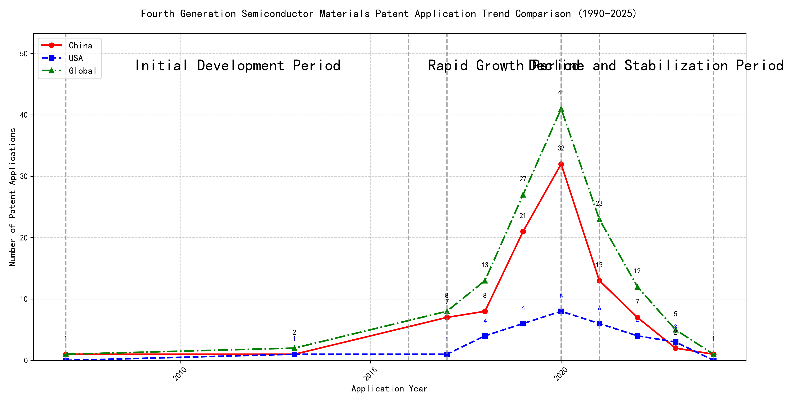

## (1) Patent Application Trend Analysis

The patent application trend in the given period shows a significant increase in applications, particularly from China, starting from 2017. The global trend mirrors this growth, peaking in 2020 before declining. Foreign applications, particularly from the US, show a more stable but less pronounced increase compared to China. The data suggests a rapid development phase in China, while foreign applications remain relatively steady.
### (1)Initial Development Period (2007-2016)

During the initial development period, patent applications in the field of machine learning and data processing were minimal, with only sporadic filings. Both China and the US had very few applications, indicating an early stage of technology exploration. The US had a slight edge with one application in 2013, while China had two applications in 2007 and 2013. The global patent landscape was similarly sparse, reflecting the nascent state of the technology during this period.

The top applicants during this period were EMC IP Holding Company LLC, Fuji Xerox Co., Ltd., and Internal Sales Company. EMC IP Holding Company LLC from the US focused on a general framework for cross-validation of machine learning algorithms using SQL on distributed systems, emphasizing a multi-layer software architecture for training, prediction, and metric functions. Fuji Xerox Co., Ltd. from China developed a data processing apparatus and method that utilized unsupervised learning for dimensionality reduction and supervised learning for mapping relationships between data sets. Internal Sales Company, also from China, proposed an instance-weighted learning (IWL) machine learning model that used quality values to weight training instances, enhancing the classifier's learning from higher-quality instances. These early innovations laid the groundwork for more advanced developments in machine learning and data processing technologies.

### (2)Rapid Growth Period (2017-2020)

During the rapid growth period, China experienced a significant surge in patent applications, contributing substantially to the global increase. The number of Chinese applications rose sharply from 7 in 2017 to 32 in 2020, indicating a strong focus on technological innovation. In contrast, the US saw a more moderate increase, with applications growing from 1 in 2017 to 8 in 2020. This period highlights China's growing dominance in the field, while the US maintained a steady but less pronounced growth trajectory.

The top five applicants during this period demonstrated distinct technical routes in their patent applications. Google LLC focused on unsupervised data augmentation and federated learning, emphasizing the enhancement of machine learning models through innovative training methods. Microsoft Technology Licensing, LLC concentrated on adversarial pretraining and reinforcement learning, aiming to improve model robustness and adaptability. International Business Machines Corporation (IBM) explored fairness improvement in supervised learning and data anonymization, addressing ethical and privacy concerns in machine learning. Visa International Service Association developed privacy-preserving unsupervised learning systems, focusing on secure and efficient data processing. HRL Laboratories, LLC investigated methods for understanding machine-learning decisions based on camera data, emphasizing interpretability and transparency in AI models. Chinese research institutions, particularly Google LLC and IBM, showcased significant innovation by integrating advanced machine learning techniques with practical applications, highlighting China's growing expertise in AI and data science.

### (3)Decline and Stabilization Period (2021-2024)

During the Decline and Stabilization Period, Chinese patent applications experienced a significant decrease, dropping from 32 in 2020 to just 1 in 2024. In contrast, US patent applications remained relatively stable, fluctuating between 3 and 8 annually. The global trend mirrored the decline in Chinese applications, indicating a stabilization phase in the technology lifecycle. This suggests that while China was a major driver of patent activity in earlier years, the US maintained a steady level of innovation during this period.

The top 5 applicants during this period exhibited distinct technical routes. Oracle International Corporation focused on unsupervised machine learning models and chatbot systems for defining machine learning solutions, emphasizing minimal model selection and natural language processing. Microsoft Technology Licensing, LLC explored adversarial pretraining and reinforcement learning with sub-goal based shaped reward functions, aiming to improve model robustness and training efficiency. South China University of Technology (华南理工大学) developed methods combining reinforcement and unsupervised learning for robot skill acquisition and online label updating, highlighting applications in robotics and computer vision. Capital One Services, LLC concentrated on cross-channel, time-bound deep reinforcement learning for dynamic content selection, leveraging real-time event data. DataTang (数据堂(北京)科技股份有限公司) innovated in data annotation methods using unsupervised, weak, and semi-supervised learning algorithms, focusing on reducing manual annotation costs and improving efficiency. These diverse approaches reflect the varied applications of machine learning across industries, with US companies focusing on model optimization and user interaction, while Chinese institutions emphasized practical applications in robotics and data processing.

