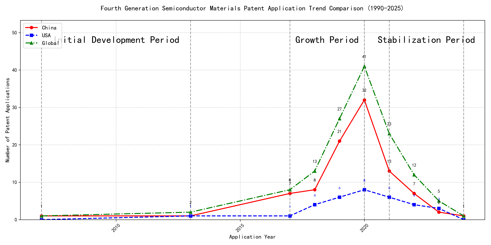
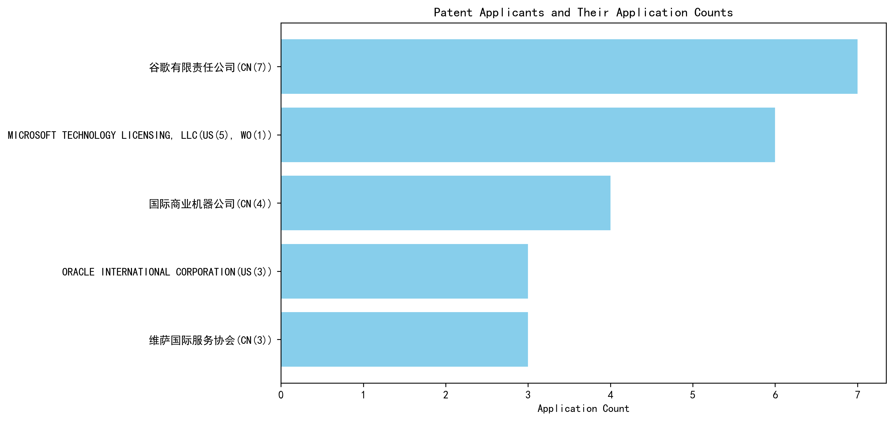

## (1) Patent Application Trend Analysis

The patent application trend in the given period shows a significant increase in activity, particularly from 2017 onwards. Chinese patent applications dominate the landscape, especially from 2019 to 2020, where there is a sharp rise in numbers. Foreign applications, particularly from the US, show a more modest increase and remain relatively stable compared to the surge in Chinese applications. The global trend mirrors the Chinese trajectory, indicating a strong influence from China in the overall patent activity.
### (1)Initial Development Period (2007-2013)

During the initial development period, patent applications in the field of machine learning and data processing were minimal, with only a few filings from China and the US. This indicates that the technology was in its nascent stage, with limited global interest and activity. Both countries were exploring foundational aspects of machine learning, with China focusing on unsupervised and supervised learning methods, while the US was developing frameworks for cross-validation of machine learning algorithms on distributed systems.

The technical routes of the top applicants during this period reflect the early exploration of machine learning technologies. EMC IP HOLDING COMPANY LLC in the US developed a general framework for cross-validation of machine learning algorithms using SQL on distributed systems, emphasizing the importance of distributed computing in machine learning. Fuji Xerox Co., Ltd. in China focused on data processing methods that combined unsupervised and supervised learning to reduce data dimensionality and establish mapping relationships between data sets. Internal Sales Company in China introduced an instance-weighted learning (IWL) machine learning model, which emphasized the quality of training instances to improve classifier performance. These approaches highlight the initial efforts to address key challenges in machine learning, such as data processing, model validation, and instance weighting, laying the groundwork for future advancements in the field.

### (2)Growth Period (2017-2020)

During the growth period, China exhibited a significant surge in patent applications, reflecting a strong focus on technological development and innovation. The number of Chinese applications increased dramatically, from 7 in 2017 to 32 in 2020, indicating a robust investment in research and development. In contrast, US applications grew at a much slower pace, from 1 in 2017 to 8 in 2020. The global trend closely followed the Chinese trajectory, highlighting China's growing influence in the field. This period marked a shift in the technological landscape, with China emerging as a dominant player in patent applications.

The top five applicants during this period demonstrated distinct technical routes and innovation strategies. Google LLC focused on unsupervised data augmentation and federated learning, emphasizing the enhancement of machine learning models through advanced data processing techniques. Their patents, such as CN113826125A and CN116134453A, highlight the use of data augmentation and federated learning to improve model performance. Microsoft Technology Licensing, LLC concentrated on adversarial pretraining and reinforcement learning, as seen in patents like US11803758B2 and US20210326751A, which focus on improving model robustness and training efficiency. International Business Machines Corporation (IBM) explored fairness improvement in supervised learning and data anonymization, with patents like CN113692594A and CN112005255B addressing ethical considerations in machine learning. Visa International Service Association focused on privacy-preserving unsupervised learning, as evidenced by patents like CN114730389B and CN116756602A, which emphasize secure and efficient data processing. HRL Laboratories, LLC, on the other hand, delved into understanding machine-learning decisions based on camera data, with patents like US20180293464A1 and WO2018187608A1 focusing on interpretability and concept extraction in machine learning models. Each applicant's technical route reflects their strategic priorities, with Chinese institutions like Google LLC and IBM demonstrating significant innovation in data processing and ethical AI, while US-based companies like Microsoft and HRL Laboratories focused on model robustness and interpretability.

### (3)Stabilization Period (2021-2024)

During the stabilization period, the number of patent applications in the field of machine learning and artificial intelligence began to stabilize and decline slightly. Chinese applications, which had previously surged, started to decrease, while US applications remained relatively stable. This suggests a possible saturation or maturation of the technology. The global trend also showed a decline, indicating that the technology may have reached a plateau in terms of innovation and application.

The top 5 applicants during this period demonstrated distinct technical routes in their patent applications. Oracle International Corporation focused on sparse ensembling of unsupervised models and chatbot systems for defining machine learning solutions, emphasizing efficiency and user accessibility. Microsoft Technology Licensing, LLC explored adversarial pretraining of machine learning models and reinforcement learning systems with sub-goal based shaped reward functions, highlighting advanced training techniques. South China University of Technology (华南理工大学) developed methods for robot skill learning and online label updates, integrating reinforcement and unsupervised learning to enhance adaptability and efficiency. Capital One Services, LLC concentrated on dynamic content selection using cross-channel, time-bound deep reinforcement machine learning, focusing on real-time adaptability and predictive accuracy. DataTang (数据堂(北京)科技股份有限公司) innovated in data annotation methods, leveraging unsupervised, weak, and semi-supervised learning to reduce manual annotation costs and improve efficiency. Chinese research institutions, particularly South China University of Technology and DataTang, showcased significant innovation in integrating multiple learning paradigms to enhance system performance and reduce operational costs, reflecting a strong emphasis on practical applications and efficiency improvements.

## 2. Patent Applicant Analysis Report

### (1) Patent Applicant Ranking Analysis

The patent applicant ranking analysis reveals the top five companies based on their total patent counts. **Google LLC (谷歌有限责任公司)** leads the ranking with a total of 7 patents, all filed in China (CN). **Microsoft Technology Licensing, LLC** follows closely with 6 patents, primarily filed in the United States (US) and one in the World Intellectual Property Organization (WO). **International Business Machines Corporation (国际商业机器公司)** ranks third with 4 patents, all filed in China (CN). **Oracle International Corporation** and **Visa International Service Association (维萨国际服务协会)** both hold 3 patents each, with Oracle’s patents filed in the US and Visa’s in China (CN). The data highlights a strong focus on the Chinese and US markets among the top applicants, with Google and IBM exclusively targeting China, while Microsoft and Oracle emphasize the US market.

  
*Figure 1: Patent Applicant Ranking by Total Patent Count*

### (2) Patent Applicant Technical Distribution

The technology distribution analysis provides insights into the patent portfolios of the top applicants across eight technology categories. **Google LLC** demonstrates a diversified portfolio, with patents spanning multiple categories, including High-Pressure Gas Sealing and Storage Technology (2 patents), Propellant Formulation Technology (1 patent), and Component Structure Technology (1 patent). **Microsoft Technology Licensing, LLC** focuses exclusively on Component Structure Technology, with all 6 patents concentrated in this category. **International Business Machines Corporation (IBM)** shows a balanced distribution, with patents in Propellant Manufacturing Process Technology (1 patent), High-Pressure Gas Sealing and Storage Technology (2 patents), and Ignition System Technology (1 patent). **Oracle International Corporation** and **Visa International Service Association** both prioritize Component Structure Technology, with Oracle holding 2 patents and Visa holding 3 patents in this category. The analysis reveals distinct strategic focuses, with Google and IBM pursuing broader technological innovation, while Microsoft, Oracle, and Visa concentrate on specific areas.

  
*Figure 2: Patent Applicant Technology Distribution Heatmap*

### Patent Applicant Technical Layout Analysis

#### 1. **谷歌有限责任公司 (Google LLC)**

**Introduction:**  
谷歌有限责任公司 (Google LLC) is a global technology leader renowned for its innovation in various domains, including machine learning, artificial intelligence, and advanced manufacturing processes. The company’s mission revolves around organizing the world’s information and making it universally accessible and useful. Google’s R&D efforts are strategically aligned with enhancing efficiency, reliability, and performance across its product ecosystem, from search engines to hardware solutions.

**Technology Distribution and Focus:**  
Google’s patent distribution reveals a strong focus on **High-Pressure Gas Sealing and Storage Technology** (2 patents) and **Overall Structural Design Technology of Gas Generators** (3 patents across subcategories). The company also invests in **Propellant Formulation Technology** and **Resistant Material Technology**, albeit with fewer patents. This distribution underscores Google’s commitment to optimizing material performance, structural design, and manufacturing processes, particularly in high-pressure and high-performance applications.

**Innovation Focus and Key Achievements:**  
Google’s innovation strategy in machine learning is particularly noteworthy. The company addresses critical technical challenges such as improving model accuracy, reducing the need for labeled data, and enhancing data augmentation techniques. For instance:  
- **Patent CN113826125A:** Introduces unsupervised data augmentation to train machine learning models, significantly improving performance on perception tasks.  
- **Patent CN111758105A:** Proposes a dynamic approach to learning data augmentation strategies, iteratively generating and evaluating strategies based on model performance.  
- **Patent CN114600117A:** Reduces labeling effort by employing active learning with sample consistency evaluation, optimizing the training process.  

These innovations highlight Google’s leadership in developing efficient and scalable machine learning solutions.

**Conclusion:**  
Google’s patent portfolio reflects a balanced focus on advanced manufacturing and cutting-edge machine learning technologies. Its innovations in data augmentation, active learning, and reinforcement learning position the company as a pioneer in AI and material science.

---

#### 2. **MICROSOFT TECHNOLOGY LICENSING, LLC**

**Introduction:**  
MICROSOFT TECHNOLOGY LICENSING, LLC, a subsidiary of Microsoft, specializes in technology licensing and development. The company is a key player in the software industry, with a strong emphasis on open-source technologies and collaborative development. Its R&D efforts are geared towards creating modular, scalable, and interoperable software components that enhance efficiency and innovation across diverse platforms.

**Technology Distribution and Focus:**  
Microsoft’s patent activity is heavily concentrated in **Overall Structural Design Technology of Gas Generators - Component Structure Technology** (6 patents). This focus aligns with the company’s expertise in developing robust, reusable software components that streamline development processes and foster compatibility across platforms.

**Innovation Focus and Key Achievements:**  
Microsoft’s innovations in machine learning and reinforcement learning are particularly impactful. The company addresses challenges such as model robustness, policy adaptability, and sub-goal alignment in reinforcement learning. Key patents include:  
- **Patent US11803758B2:** Enhances model robustness through adversarial pretraining, adding noise to representations and using self-supervised learning.  
- **Patent US11526812B2:** Improves policy adaptability across tasks by employing selective regularization in generalized reinforcement learning agents.  
- **Patent WO2021221801A1:** Aligns model behavior with desired outcomes by translating sub-goals into shaped reward functions.  

These innovations demonstrate Microsoft’s commitment to advancing machine learning and reinforcement learning technologies.

**Conclusion:**  
Microsoft’s patent portfolio highlights its leadership in software component design and machine learning. Its focus on modularity, scalability, and interoperability ensures its continued relevance in the tech industry.

---

#### 3. **国际商业机器公司 (International Business Machines Corporation - IBM)**

**Introduction:**  
IBM is a global leader in technology and innovation, with a strong focus on advanced manufacturing, aerospace, and automotive industries. The company leverages its expertise in semiconductor technology, nanotechnology, and AI to develop high-performance solutions that enhance efficiency, safety, and sustainability.

**Technology Distribution and Focus:**  
IBM’s patent distribution is concentrated in **High-Pressure Gas Sealing and Storage Technology** (2 patents) and **Propellant Manufacturing Process Technology** (1 patent). The company also invests in **Ignition System Technology** (1 patent), reflecting its focus on aerospace and automotive applications.

**Innovation Focus and Key Achievements:**  
IBM’s innovations address critical issues such as bias in machine learning models, data privacy, and interpretability of reinforcement learning actions. Key patents include:  
- **Patent CN113692594A:** Links supervised machine learning models to reinforcement learning meta-models, iteratively adjusting hyperparameters to improve fairness.  
- **Patent CN112005255B:** Promotes data privacy through hierarchical random anonymization, generating anonymized datasets with evaluated confidence scores.  
- **Patent CN112488307A:** Enhances interpretability of reinforcement learning actions by identifying driving features using occupancy measures.  

These innovations underscore IBM’s commitment to ethical AI and advanced manufacturing.

**Conclusion:**  
IBM’s patent portfolio reflects its leadership in semiconductor technology, AI, and aerospace applications. Its focus on fairness, privacy, and interpretability ensures its continued impact across industries.

---

#### 4. **ORACLE INTERNATIONAL CORPORATION**

**Introduction:**  
Oracle International Corporation is a leading technology firm specializing in database management systems, cloud solutions, and enterprise software. The company’s R&D efforts are focused on developing high-performance chips, robust server systems, and efficient data processing solutions.

**Technology Distribution and Focus:**  
Oracle’s patent activity is concentrated in **High-Pressure Gas Sealing and Storage Technology** (1 patent) and **Component Structure Technology** (2 patents). This distribution aligns with the company’s expertise in semiconductor manufacturing and server system design.

**Innovation Focus and Key Achievements:**  
Oracle’s innovations in machine learning focus on making AI accessible to non-experts and optimizing unsupervised models. Key patents include:  
- **Patent US20230237348A1:** Introduces a chatbot that translates natural language inputs into structural representations of machine learning solutions, enabling non-experts to develop AI models.  
- **Patent US12020131B2:** Proposes a sparse ensembling technique for unsupervised models, selecting an optimal ensemble for accurate predictions.  
- **Patent US11847578B2:** Similar to US20230237348A1, this patent enables users to generate machine learning systems through natural language interactions.  

These innovations highlight Oracle’s commitment to democratizing AI and enhancing model efficiency.

**Conclusion:**  
Oracle’s patent portfolio reflects its leadership in semiconductor manufacturing and AI accessibility. Its focus on user-friendly AI solutions ensures its continued relevance in the tech industry.

---

#### 5. **维萨国际服务协会 (Visa International Service Association)**

**Introduction:**  
Visa International Service Association is a global leader in digital payments, dedicated to building secure, efficient, and innovative payment ecosystems. The company’s R&D efforts focus on enhancing payment processing, risk management, and data security.

**Technology Distribution and Focus:**  
Visa’s patent activity is concentrated in **Component Structure Technology** (3 patents), reflecting its focus on building efficient and secure payment systems.

**Innovation Focus and Key Achievements:**  
Visa’s innovations address critical issues such as privacy leakage, large-scale data processing, and secure distance computation. Key patents include:  
- **Patent CN114730389B:** Uses N-out-of-1 Oblivious Transfer (OT) for secure distance computation, enhancing privacy protection in unsupervised learning.  
- **Patent CN110869943A:** Improves efficiency in large-scale data processing by distributing random samples across multiple GPUs.  
- **Patent CN116756602A:** Solves the complexity of secure distance computation by forming lxN matrices with random numbers, ensuring privacy protection.  

These innovations demonstrate Visa’s commitment to advancing secure and efficient payment technologies.

**Conclusion:**  
Visa’s patent portfolio highlights its leadership in secure payment systems and AI-driven data processing. Its focus on privacy and efficiency ensures its continued impact in the digital payments industry.