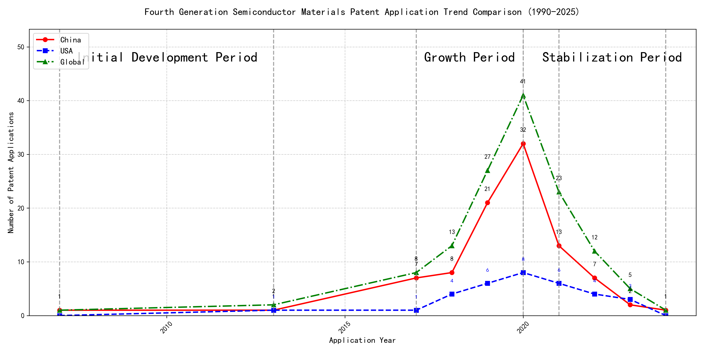

## (1) Patent Application Trend Analysis

The patent application trend in the given period shows a significant increase in activity, particularly from 2017 onwards. Chinese patent applications dominate the landscape, especially from 2019 to 2020, where there is a sharp rise in numbers. Foreign applications, particularly from the US, show a more modest increase and remain relatively stable compared to the surge in Chinese applications. The global trend mirrors the Chinese trajectory, indicating a strong influence from China in the overall patent activity.
### (1)Initial Development Period (2007-2013)

During the initial development period, patent applications in the field of machine learning and data processing were minimal, with only a few filings from China and the US. This indicates that the technology was in its nascent stage, with limited global interest and activity. Both countries were exploring foundational aspects of machine learning, with China focusing on unsupervised and supervised learning methods, while the US was developing frameworks for cross-validation of machine learning algorithms on distributed systems.

The technical routes of the top applicants during this period reflect the early exploration of machine learning technologies. EMC IP HOLDING COMPANY LLC in the US developed a general framework for cross-validation of machine learning algorithms using SQL on distributed systems, emphasizing the importance of distributed computing in machine learning. Fuji Xerox Co., Ltd. in China focused on data processing methods that combined unsupervised and supervised learning to reduce data dimensionality and establish mapping relationships between data sets. Internal Sales Company in China introduced an instance-weighted learning (IWL) machine learning model, which emphasized the quality of training instances to improve classifier performance. These approaches highlight the initial efforts to address key challenges in machine learning, such as data processing, model validation, and instance weighting, laying the groundwork for future advancements in the field.

### (2)Growth Period (2017-2020)

During the growth period, China exhibited a significant surge in patent applications, reflecting a strong focus on technological development and innovation. The number of Chinese applications increased dramatically, from 7 in 2017 to 32 in 2020, indicating a robust investment in research and development. In contrast, US applications grew at a much slower pace, from 1 in 2017 to 8 in 2020. The global trend closely followed the Chinese trajectory, highlighting China's growing influence in the field. This period marked a shift in the technological landscape, with China emerging as a dominant player in patent applications.

The top five applicants during this period demonstrated distinct technical routes and innovation strategies. Google LLC focused on unsupervised data augmentation and federated learning, emphasizing the enhancement of machine learning models through advanced data processing techniques. Their patents, such as CN113826125A and CN116134453A, highlight the use of data augmentation and federated learning to improve model performance. Microsoft Technology Licensing, LLC concentrated on adversarial pretraining and reinforcement learning, as seen in patents like US11803758B2 and US20210326751A, which focus on improving model robustness and training efficiency. International Business Machines Corporation (IBM) explored fairness improvement in supervised learning and data anonymization, with patents like CN113692594A and CN112005255B addressing ethical considerations in machine learning. Visa International Service Association focused on privacy-preserving unsupervised learning, as evidenced by patents like CN114730389B and CN116756602A, which emphasize secure and efficient data processing. HRL Laboratories, LLC, on the other hand, delved into understanding machine-learning decisions based on camera data, with patents like US20180293464A1 and WO2018187608A1 focusing on interpretability and concept extraction in machine learning models. Each applicant's technical route reflects their strategic priorities, with Chinese institutions like Google LLC and IBM demonstrating significant innovation in data processing and ethical AI, while US-based companies like Microsoft and HRL Laboratories focused on model robustness and interpretability.

### (3)Stabilization Period (2021-2024)

During the stabilization period, the number of patent applications in the field of machine learning and artificial intelligence began to stabilize and decline slightly. Chinese applications, which had previously surged, started to decrease, while US applications remained relatively stable. This suggests a possible saturation or maturation of the technology. The global trend also showed a decline, indicating that the technology may have reached a plateau in terms of innovation and application.

The top 5 applicants during this period demonstrated distinct technical routes in their patent applications. Oracle International Corporation focused on sparse ensembling of unsupervised models and chatbot systems for defining machine learning solutions, emphasizing efficiency and user accessibility. Microsoft Technology Licensing, LLC explored adversarial pretraining of machine learning models and reinforcement learning systems with sub-goal based shaped reward functions, highlighting advanced training techniques. South China University of Technology (华南理工大学) developed methods for robot skill learning and online label updates, integrating reinforcement and unsupervised learning to enhance adaptability and efficiency. Capital One Services, LLC concentrated on dynamic content selection using cross-channel, time-bound deep reinforcement machine learning, focusing on real-time adaptability and predictive accuracy. DataTang (数据堂(北京)科技股份有限公司) innovated in data annotation methods, leveraging unsupervised, weak, and semi-supervised learning to reduce manual annotation costs and improve efficiency. Chinese research institutions, particularly South China University of Technology and DataTang, showcased significant innovation in integrating multiple learning paradigms to enhance system performance and reduce operational costs, reflecting a strong emphasis on practical applications and efficiency improvements.

