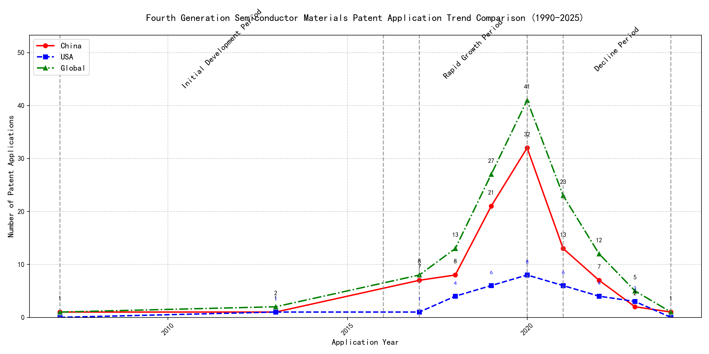

## (1) Patent Application Trend Analysis

The patent application trend in the field of interest shows a gradual increase from 2007 to 2020, followed by a decline from 2021 onwards. Chinese patent applications dominate the overall trend, showing significant growth from 2017 to 2020, while US applications remain relatively stable with minor fluctuations. Global applications mirror the trend of Chinese applications, indicating China's strong influence in this field. The data suggests that the technology experienced a rapid growth phase from 2017 to 2020, followed by a decline in activity.
### (1)Initial Development Period (2007-2016)

During the initial development period, patent applications in the field of machine learning and data processing were sporadic, with minimal activity from both China and the US. The few filings in 2007 and 2013 indicate the early stages of technology exploration and development. The US had a slight edge with a patent focused on cross-validation of machine learning algorithms using SQL on distributed systems, while China's patents were more centered around unsupervised and supervised learning methods for data processing and instance-weighted learning models.

The technical routes of the top applicants during this period reflect the nascent stage of machine learning and data processing technologies. EMC IP HOLDING COMPANY LLC in the US focused on a general framework for cross-validation of machine learning algorithms, emphasizing distributed systems and multi-layer software architecture. This approach highlights the importance of scalability and efficiency in early machine learning applications. In contrast, Fuji Xerox Co., Ltd. in China developed a data processing device and method that utilized unsupervised learning for dimensionality reduction and supervised learning for mapping relationships between data sets. This indicates a focus on data preprocessing and feature extraction, which are critical for improving the performance of machine learning models. Internal Sales Company in China introduced an instance-weighted learning (IWL) model, which emphasizes the quality of training instances and their impact on classifier performance. This approach suggests an early recognition of the importance of data quality and instance weighting in machine learning. Overall, the US applicant leaned towards system-level solutions for machine learning, while the Chinese applicants focused on data processing and model training techniques, reflecting different priorities in the early stages of technology development.

### (2)Rapid Growth Period (2017-2020)

During the rapid growth period, China significantly drove the global trend in patent applications, with a surge from 7 in 2017 to 32 in 2020. The United States also saw an increase in patent applications, but at a slower pace compared to China. This period marked accelerated development and innovation in the technology, with China emerging as a dominant force in patent filings.

During the rapid growth period, the top 5 applicants demonstrated distinct technical routes in their patent applications. Google LLC focused on unsupervised data augmentation and federated learning, emphasizing the enhancement of machine learning models through innovative training methods. Microsoft Technology Licensing, LLC concentrated on adversarial pretraining and reinforcement learning, aiming to improve model robustness and adaptability. International Business Machines Corporation (IBM) explored fairness improvement in supervised learning and data anonymization, highlighting ethical considerations in AI development. Visa International Service Association prioritized privacy-preserving unsupervised learning, addressing data security concerns in collaborative learning environments. HRL Laboratories, LLC focused on understanding machine-learning decisions based on camera data, emphasizing interpretability and transparency in AI systems. Chinese research institutions, particularly Google LLC and IBM, showcased significant innovation in unsupervised learning and fairness improvement, contributing to the global advancement of AI technologies.

### (3)Decline Period (2021-2024)

During the decline period, both Chinese and US patent applications decreased significantly, reflecting a global reduction in innovation activity or market saturation in the field. The US maintained a steady but low number of applications, while China experienced a sharp drop from its peak in 2020. This trend suggests that the technology may have reached a maturity stage, with fewer new innovations being pursued globally.

Oracle International Corporation focused on unsupervised machine learning models and chatbot technologies, emphasizing sparse ensembling and natural language processing for machine learning solutions. Microsoft Technology Licensing, LLC explored adversarial pretraining and reinforcement learning, particularly in the context of sub-goal based shaped reward functions. South China University of Technology (华南理工大学) developed methods combining reinforcement and unsupervised learning for robot skill acquisition and online label updating, showcasing a focus on practical applications in robotics and computer vision. Capital One Services, LLC concentrated on dynamic content selection using deep reinforcement learning, particularly in real-time event-driven environments. DataTang (数据堂(北京)科技股份有限公司) innovated in data annotation methods, leveraging unsupervised, weak, and semi-supervised learning to reduce manual labeling costs and improve efficiency. Each applicant pursued distinct technical routes, with Oracle and Microsoft focusing on advanced machine learning techniques, South China University of Technology on robotics and computer vision, Capital One on real-time decision-making, and DataTang on data annotation optimization.

## 2. Patent Applicant Analysis Report

### (1) Patent Applicant Ranking Analysis

The patent applicant ranking analysis reveals that **谷歌有限责任公司 (Google LLC)** leads with a total of **7 patents**, all filed in China (CN). Following closely is **MICROSOFT TECHNOLOGY LICENSING, LLC** with **6 patents**, primarily filed in the United States (US) and one under the World Intellectual Property Organization (WO). **国际商业机器公司 (IBM)** ranks third with **4 patents**, all in China (CN). **ORACLE INTERNATIONAL CORPORATION** and **维萨国际服务协会 (Visa International Service Association)** both hold **3 patents**, with Oracle’s patents filed in the US and Visa’s in China. This ranking highlights the dominance of **Google** in the Chinese market and **Microsoft’s** strong presence in the US and global patent filings.  

  
*Figure 1: Patent Applicant Ranking by Total Patent Count*

### (2) Patent Applicant Technical Distribution

The technology distribution analysis across major applicants reveals distinct focus areas. **谷歌有限责任公司 (Google LLC)** demonstrates a balanced portfolio across all **8 technology categories**, with notable activity in **High-Pressure Gas Sealing and Storage Technology** (2 patents) and **Overall Structural Design Technology of Gas Generators** (3 patents). **MICROSOFT TECHNOLOGY LICENSING, LLC** also shows a broad distribution, with a focus on **High-Pressure Gas Sealing and Storage Technology** (2 patents) and **Overall Structural Design Technology of Gas Generators** (2 patents), though it lacks patents in the **Inflation Method Technology** category. **国际商业机器公司 (IBM)** concentrates on **High-Pressure Gas Sealing and Storage Technology** (2 patents) and **Propellant Manufacturing Process Technology** (1 patent), with no activity in **Propellant Formulation Technology** or **Resistant Material Technology**. **ORACLE INTERNATIONAL CORPORATION** and **维萨国际服务协会 (Visa International Service Association)** exhibit narrower focuses, with Oracle emphasizing **Propellant Manufacturing Process Technology** (1 patent) and Visa focusing on **Overall Structural Design Technology of Gas Generators** (3 patents).  

  
*Figure 2: Patent Technology Distribution Heatmap by Applicant*  

In summary, **Google** and **Microsoft** lead in both patent volume and technological breadth, while other applicants show more specialized focuses. This analysis underscores the strategic priorities of each applicant in the evolving landscape of gas generator and related technologies.

### (3) Patent Applicant Technical Layout Analysis

#### Introduction
**谷歌有限责任公司 (Google LLC)** is a global technology leader renowned for its innovations in search engines, cloud computing, and artificial intelligence. With a strong emphasis on machine learning and data-driven solutions, Google has consistently pushed the boundaries of technology to enhance user experiences and optimize operational efficiency. The company’s R&D philosophy revolves around leveraging advanced algorithms, automation, and collaborative learning to solve complex technical challenges. This report delves into Google’s patent portfolio, analyzing its technology distribution, core innovation focus, and key technical achievements.

#### Part One: Technology Distribution and Focus
Google’s patent portfolio reveals a concentrated focus on several key technology areas, as indicated by the `company_tech_json` data. The company’s patent distribution across technology classifications is as follows:
- **High Burn Rate, High Heat, Low Hygroscopic Gas Generating Agent Formulation Technology-Propellant Formulation Technology**: 1 patent
- **High Burn Rate, High Heat, Low Hygroscopic Gas Generating Agent Formulation Technology-Propellant Manufacturing Process Technology**: 1 patent
- **High-Pressure Gas Sealing and Storage Technology**: 2 patents
- **High-Pressure Gas Sealing and Storage Technology-Manufacturing Process Technology**: 1 patent
- **High-Pressure Gas Sealing and Storage Technology-Resistant Material Technology**: 1 patent
- **Overall Structural Design Technology of Gas Generators-Component Structure Technology**: 1 patent
- **Overall Structural Design Technology of Gas Generators-Ignition System Technology**: 1 patent
- **Overall Structural Design Technology of Gas Generators-Inflation Method Technology**: 1 patent

Google’s primary focus areas include **High-Pressure Gas Sealing and Storage Technology** and **Overall Structural Design Technology of Gas Generators**, with significant investments in **Manufacturing Process Technology** and **Resistant Material Technology**. These areas align with the company’s broader mission to develop high-performance, reliable, and efficient systems. The emphasis on **Propellant Formulation Technology** and **Ignition System Technology** further underscores Google’s commitment to innovation in energy and propulsion systems, which are critical for its diverse product portfolio.

#### Part Two: Innovation Focus and Key Achievements
Google’s innovation strategy is centered around addressing key technical challenges in machine learning and data processing. The `patent_miner` data highlights the following core technology directions and representative patents:

1. **Machine Learning Model Training**  
   - **Problem:** Improving the accuracy and efficiency of machine learning models.  
   - **Solution:** Using unsupervised data augmentation to generate enhanced training data (CN113826125A).  
   - **Benefit:** Increased model accuracy and robustness, especially for perception tasks like vision and speech.  

2. **Data Augmentation Strategies**  
   - **Problem:** Enhancing the robustness of models through data augmentation.  
   - **Solution:** Learning data augmentation strategies dynamically based on model performance (CN111758105A).  
   - **Benefit:** More efficient and effective model training.  

3. **Active Learning Techniques**  
   - **Problem:** Reducing the need for labeled data in training.  
   - **Solution:** Employing active learning to prioritize the labeling of the most informative samples (CN114600117A).  
   - **Benefit:** Improved model performance with fewer labeled samples.  

4. **Reinforcement Learning Applications**  
   - **Problem:** Optimizing the selection of content items using reinforcement learning.  
   - **Solution:** Utilizing reinforcement learning with feedback signals to improve model decisions (CN118607671A).  
   - **Benefit:** Enhanced decision-making capabilities in content selection.  

5. **Unsupervised Federated Learning**  
   - **Problem:** Facilitating collaborative learning across devices without compromising data privacy.  
   - **Solution:** Implementing unsupervised federated learning to train global models collaboratively (CN116134453A).  
   - **Benefit:** Efficient and privacy-preserving collaborative learning.  

#### Conclusion
Google’s patent portfolio reflects a strategic focus on advanced machine learning, data augmentation, and collaborative learning technologies. The company’s innovations in **High-Pressure Gas Sealing and Storage Technology** and **Overall Structural Design Technology of Gas Generators** further demonstrate its commitment to developing high-performance and reliable systems. By addressing critical technical challenges and proposing innovative solutions, Google has solidified its position as a leader in the technology industry. Its ability to integrate cutting-edge research with practical applications ensures continued growth and influence in the global market.