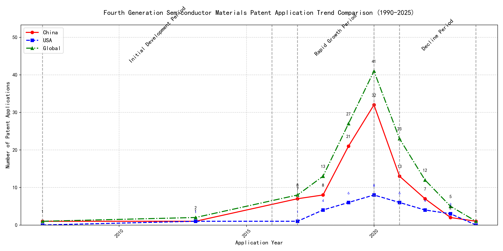

## (1) Patent Application Trend Analysis

The patent application trend in the field of interest shows a gradual increase from 2007 to 2020, followed by a decline from 2021 onwards. Chinese patent applications dominate the overall trend, showing significant growth from 2017 to 2020, while US applications remain relatively stable with minor fluctuations. Global applications mirror the trend of Chinese applications, indicating China's strong influence in this field. The data suggests that the technology experienced a rapid growth phase from 2017 to 2020, followed by a decline in activity.
### (1)Initial Development Period (2007-2016)

During the initial development period, patent applications in the field of machine learning and data processing were sporadic, with minimal activity from both China and the US. The few filings in 2007 and 2013 indicate the early stages of technology exploration and development. The US had a slight edge with a patent focused on cross-validation of machine learning algorithms using SQL on distributed systems, while China's patents were more centered around unsupervised and supervised learning methods for data processing and instance-weighted learning models.

The technical routes of the top applicants during this period reflect the nascent stage of machine learning and data processing technologies. EMC IP HOLDING COMPANY LLC in the US focused on a general framework for cross-validation of machine learning algorithms, emphasizing distributed systems and multi-layer software architecture. This approach highlights the importance of scalability and efficiency in early machine learning applications. In contrast, Fuji Xerox Co., Ltd. in China developed a data processing device and method that utilized unsupervised learning for dimensionality reduction and supervised learning for mapping relationships between data sets. This indicates a focus on data preprocessing and feature extraction, which are critical for improving the performance of machine learning models. Internal Sales Company in China introduced an instance-weighted learning (IWL) model, which emphasizes the quality of training instances and their impact on classifier performance. This approach suggests an early recognition of the importance of data quality and instance weighting in machine learning. Overall, the US applicant leaned towards system-level solutions for machine learning, while the Chinese applicants focused on data processing and model training techniques, reflecting different priorities in the early stages of technology development.

### (2)Rapid Growth Period (2017-2020)

During the rapid growth period, China significantly drove the global trend in patent applications, with a surge from 7 in 2017 to 32 in 2020. The United States also saw an increase in patent applications, but at a slower pace compared to China. This period marked accelerated development and innovation in the technology, with China emerging as a dominant force in patent filings.

During the rapid growth period, the top 5 applicants demonstrated distinct technical routes in their patent applications. Google LLC focused on unsupervised data augmentation and federated learning, emphasizing the enhancement of machine learning models through innovative training methods. Microsoft Technology Licensing, LLC concentrated on adversarial pretraining and reinforcement learning, aiming to improve model robustness and adaptability. International Business Machines Corporation (IBM) explored fairness improvement in supervised learning and data anonymization, highlighting ethical considerations in AI development. Visa International Service Association prioritized privacy-preserving unsupervised learning, addressing data security concerns in collaborative learning environments. HRL Laboratories, LLC focused on understanding machine-learning decisions based on camera data, emphasizing interpretability and transparency in AI systems. Chinese research institutions, particularly Google LLC and IBM, showcased significant innovation in unsupervised learning and fairness improvement, contributing to the global advancement of AI technologies.

### (3)Decline Period (2021-2024)

During the decline period, both Chinese and US patent applications decreased significantly, reflecting a global reduction in innovation activity or market saturation in the field. The US maintained a steady but low number of applications, while China experienced a sharp drop from its peak in 2020. This trend suggests that the technology may have reached a maturity stage, with fewer new innovations being pursued globally.

Oracle International Corporation focused on unsupervised machine learning models and chatbot technologies, emphasizing sparse ensembling and natural language processing for machine learning solutions. Microsoft Technology Licensing, LLC explored adversarial pretraining and reinforcement learning, particularly in the context of sub-goal based shaped reward functions. South China University of Technology (华南理工大学) developed methods combining reinforcement and unsupervised learning for robot skill acquisition and online label updating, showcasing a focus on practical applications in robotics and computer vision. Capital One Services, LLC concentrated on dynamic content selection using deep reinforcement learning, particularly in real-time event-driven environments. DataTang (数据堂(北京)科技股份有限公司) innovated in data annotation methods, leveraging unsupervised, weak, and semi-supervised learning to reduce manual labeling costs and improve efficiency. Each applicant pursued distinct technical routes, with Oracle and Microsoft focusing on advanced machine learning techniques, South China University of Technology on robotics and computer vision, Capital One on real-time decision-making, and DataTang on data annotation optimization.

