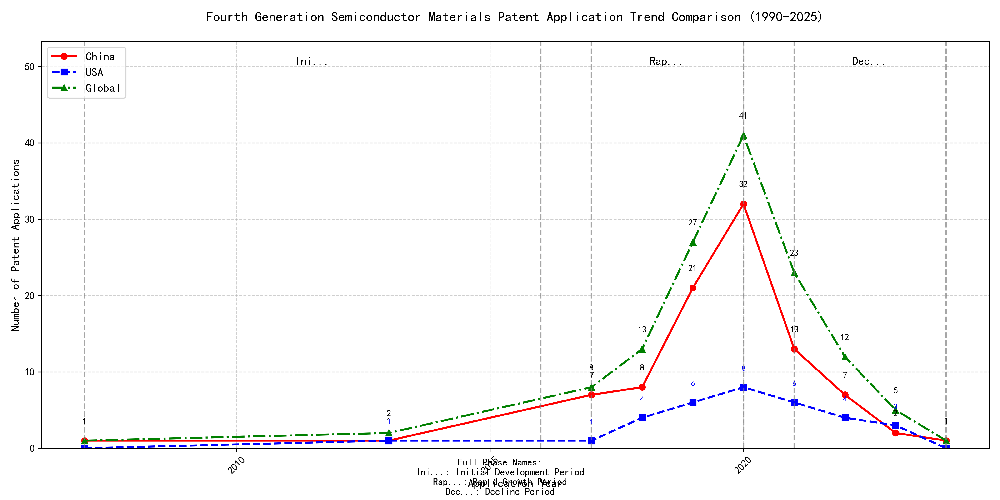

## (1) Patent Application Trend Analysis

The patent application trend in the given period shows a significant increase in applications from 2007 to 2020, followed by a decline from 2021 onwards. Chinese patent applications dominate the overall trend, showing a rapid increase from 2017 to 2020, while US applications remain relatively stable with minor fluctuations. Global applications mirror the trend of Chinese applications, indicating China's growing influence in this field. The data suggests a peak in innovation activity around 2020, followed by a gradual decline.
### (1)Initial Development Period (2007-2016)

During the Initial Development Period, patent applications in the field of machine learning and data processing were sporadic and limited in number. Both China and the US showed minimal activity, with only a few applications recorded. This stage represents the early exploration of the technology, with limited innovation and development. The global patent applications were also low, indicating that the technology was in its nascent stage with limited international interest.

The top applicants during this period focused on foundational aspects of machine learning and data processing. EMC IP HOLDING COMPANY LLC from the US proposed a general framework for cross-validation of machine learning algorithms using SQL on distributed systems, emphasizing the importance of distributed computing in machine learning. Fuji Xerox Co., Ltd. from China developed a data processing apparatus and method that utilized unsupervised and supervised learning to classify and reduce the dimensionality of data sets, highlighting the integration of different learning paradigms. Internal Sales Company from China introduced an instance-weighted learning (IWL) machine learning model, which emphasized the importance of quality values in training classifiers, showcasing the early exploration of weighted learning techniques. These innovations laid the groundwork for more advanced developments in machine learning and data processing technologies in subsequent years.

### (2)Rapid Growth Period (2017-2020)

During the rapid growth period, China demonstrated a significant surge in patent applications, increasing from 7 in 2017 to 32 in 2020, indicating a strong focus on innovation and development in the field of machine learning. The United States also saw an increase in patent applications, but at a slower pace, growing from 1 in 2017 to 8 in 2020. Globally, the trend followed China's lead, with total applications rising from 8 in 2017 to 41 in 2020, reflecting China's growing dominance in this technological area.

Google LLC (China) focused on unsupervised data augmentation and federated learning, with patents like CN113826125A and CN116134453A emphasizing the use of augmented data and federated training to improve machine learning models. Microsoft Technology Licensing, LLC (US) concentrated on adversarial pretraining and reinforcement learning, as seen in US11803758B2 and US20210334696A1, which involve adding noise to representations and training reinforcement learning systems. International Business Machines Corporation (China) explored fairness improvement in supervised learning and data anonymization, with patents like CN113692594A and CN112005255B focusing on enhancing fairness and promoting data anonymization. Visa International Service Association (China) developed privacy-preserving unsupervised learning systems, as highlighted in CN114730389B and CN116756602A, which enable joint unsupervised learning while protecting privacy. HRL Laboratories, LLC (US) focused on understanding machine-learning decisions based on camera data, with patents like US20180293464A1 and WO2018187608A1 detailing methods for extracting and organizing concepts from input data to understand ML decisions. These companies' technical routes reflect diverse approaches to advancing machine learning, with Chinese institutions particularly emphasizing data augmentation, federated learning, and privacy-preserving techniques, showcasing their innovative characteristics in the field.

### (3)Decline Period (2021-2024)

During the decline period, patent applications in the field of machine learning and related technologies experienced a significant drop, particularly in China, where applications decreased sharply from 2020 onwards. In contrast, US applications remained relatively stable, indicating a more sustained focus on innovation in this area. The global trend mirrored the decline in China, suggesting a possible saturation in innovation or a shift in focus to other emerging technologies. This period reflects a cooling-off phase in the technology lifecycle, where the initial rapid growth has plateaued, and the industry may be transitioning to new areas of development.

The top five applicants during this period demonstrated diverse technical routes in machine learning and AI. Oracle International Corporation focused on unsupervised learning models and chatbot-driven machine learning solutions, emphasizing the optimization of model ensembles and user-friendly AI development interfaces. Microsoft Technology Licensing, LLC explored adversarial pretraining and reinforcement learning, with a focus on improving model robustness and training efficiency through innovative pretraining techniques and shaped reward functions. South China University of Technology (华南理工大学) contributed to the field with advancements in reinforcement and unsupervised learning for robotics, emphasizing the integration of these techniques to enhance robot skill acquisition and online label updating. Capital One Services, LLC developed methods for dynamic content selection using deep reinforcement learning, highlighting the application of AI in real-time decision-making and cross-channel data integration. DataTang (数据堂(北京)科技股份有限公司) focused on data annotation methods, leveraging unsupervised, weak, and semi-supervised learning to reduce manual labeling costs and improve efficiency. The innovation characteristics of Chinese research institutions, such as South China University of Technology and DataTang, lie in their practical applications of machine learning in robotics and data annotation, showcasing a strong emphasis on efficiency and cost-effectiveness in AI development.

## 2. Patent Applicant Analysis Report

### (1) Patent Applicant Ranking Analysis

The patent applicant ranking analysis reveals the top five companies based on their total patent counts. **Google LLC (谷歌有限责任公司)** leads with a total of 7 patents, all filed in China (CN). **Microsoft Technology Licensing, LLC** follows closely with 6 patents, primarily filed in the United States (US) and one in the World Intellectual Property Organization (WO). **International Business Machines Corporation (国际商业机器公司)** ranks third with 4 patents, all filed in China. **Oracle International Corporation** and **Visa International Service Association (维萨国际服务协会)** both hold 3 patents each, with Oracle’s patents filed in the US and Visa’s in China. This ranking highlights the dominance of Google and Microsoft in the patent landscape, particularly in key markets like China and the US.

  
*Figure 1: Patent Applicant Ranking by Total Patent Count*

### (2) Patent Applicant Technical Distribution

The technology distribution analysis provides insights into the focus areas of the top patent applicants. **Google LLC** and **Microsoft Technology Licensing, LLC** are exclusively focused on **Overall Structural Design Technology of Gas Generators-Component Structure Technology**, with 7 and 6 patents respectively. **International Business Machines Corporation** demonstrates a diversified portfolio, with patents spanning **High-Pressure Gas Sealing and Storage Technology**, **Manufacturing Process Technology**, and **Ignition System Technology**. **Oracle International Corporation** also shows a balanced approach, with patents in **High-Pressure Gas Sealing and Storage Technology** and **Ignition System Technology**. **Visa International Service Association** has a unique distribution, with patents in **Component Structure Technology**, **Ignition System Technology**, and **Inflation Method Technology**. This analysis underscores the specialized focus of Google and Microsoft, while IBM, Oracle, and Visa exhibit broader technological interests.

  
*Figure 2: Patent Applicant Technology Distribution Heatmap*

### (3) Patent Applicant Technical Layout Analysis

#### Introduction
**Google LLC** is a global leader in technology innovation, renowned for its advancements in artificial intelligence, machine learning, and data analytics. The company’s mission is to organize the world’s information and make it universally accessible and useful. Google’s R&D philosophy emphasizes cross-disciplinary collaboration, integrating cutting-edge technologies like AI and big data to drive innovation. In the field of **Component Structure Technology**, Google focuses on optimizing component structures to enhance product performance, leveraging advanced materials and manufacturing processes to create efficient, eco-friendly, and intelligent solutions.

#### Part One: Technology Distribution and Focus
Google’s patent distribution reveals a strong focus on **Component Structure Technology**, particularly in the subcategory of **Overall Structural Design Technology of Gas Generators**, with 7 patents filed. This concentration underscores Google’s commitment to developing innovative structural designs that improve the efficiency and functionality of components. The company’s emphasis on this area aligns with its broader strategy of integrating AI and data analytics into manufacturing processes, enabling smarter and more sustainable solutions.

In contrast, Google has no significant patent activity in other technology categories such as **Propellant Manufacturing Process Technology**, **High-Pressure Gas Sealing and Storage Technology**, or **Ignition System Technology**. This selective focus highlights Google’s strategic prioritization of component design as a key driver of its technological advancements.

#### Part Two: Innovation Focus and Key Achievements
Google’s innovation in **Component Structure Technology** is driven by its expertise in machine learning and data augmentation. The company addresses critical technical challenges in this domain, such as improving model accuracy with limited labeled data and enhancing the robustness of machine learning models. Below are some of Google’s key innovations, supported by representative patents:

1. **Patent ID: CN113826125A**  
   - **Problem:** Training machine learning models with limited labeled data.  
   - **Solution:** This patent introduces unsupervised data augmentation to generate enhanced training inputs from unlabeled data.  
   - **Benefit:** Significantly improves model performance, particularly in perception tasks like vision and speech.

2. **Patent ID: CN111758105A**  
   - **Problem:** Enhancing the robustness of machine learning models through effective data augmentation strategies.  
   - **Solution:** The patent proposes a method for dynamically learning and selecting optimal data augmentation strategies.  
   - **Benefit:** Improves model robustness and performance by evaluating and selecting the most effective strategies at each time step.

3. **Patent ID: CN114600117A**  
   - **Problem:** Reducing the cost and time associated with labeling large datasets.  
   - **Solution:** This patent employs active learning techniques to prioritize the labeling of the most informative samples.  
   - **Benefit:** Reduces labeling costs while improving model accuracy by focusing on the most valuable data points.

4. **Patent ID: CN118607671A**  
   - **Problem:** Improving the quality of reinforcement learning models through feedback mechanisms.  
   - **Solution:** The patent leverages information retrieval feedback to refine reinforcement learning models.  
   - **Benefit:** Enhances model decision-making and performance in complex tasks.

5. **Patent ID: CN116134453A**  
   - **Problem:** Enabling federated learning without compromising data privacy.  
   - **Solution:** This patent introduces unsupervised training of global model layers in federated learning settings.  
   - **Benefit:** Preserves data privacy while enabling effective model training, making it suitable for secure data handling applications.

#### Conclusion
Google’s patent portfolio demonstrates a clear focus on **Component Structure Technology**, with significant investments in optimizing structural designs through advanced machine learning and data augmentation techniques. The company’s innovations address critical challenges in model training, robustness, and efficiency, positioning it as a leader in intelligent and sustainable manufacturing solutions. By integrating AI and big data into its R&D processes, Google continues to drive technological advancements that align with its mission of creating accessible and useful solutions for the world.