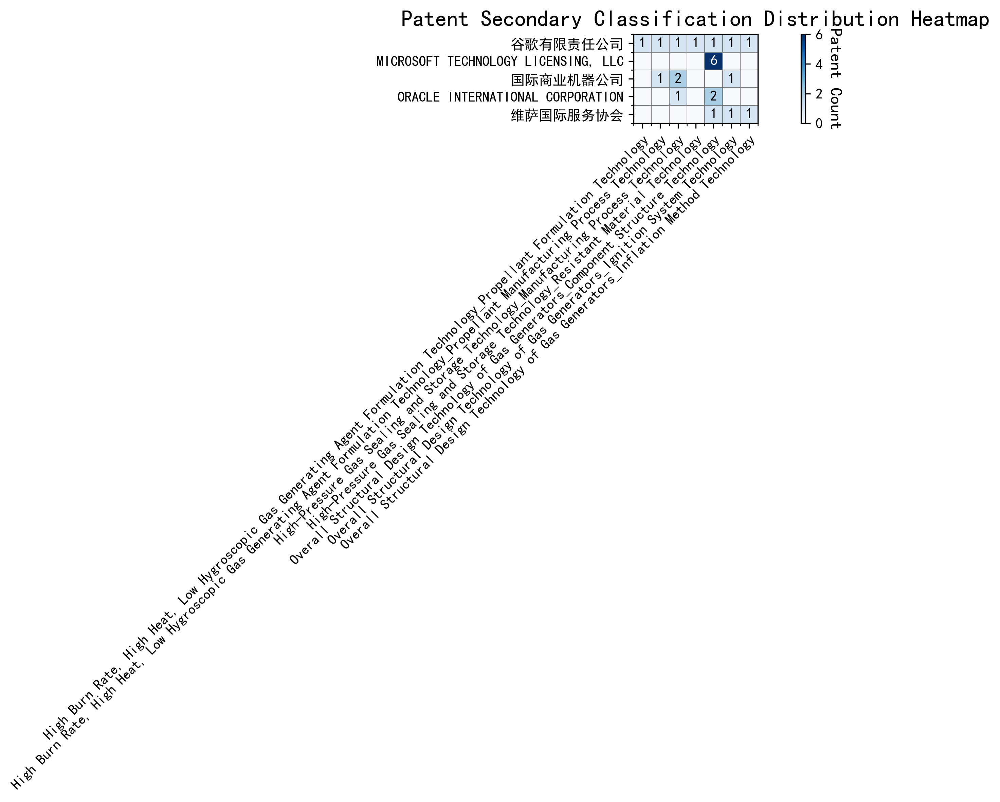

## (1) Patent Application Trend Analysis

The patent application trend analysis reveals a significant increase in patent applications globally, particularly from China, starting from 2017. Foreign applications, primarily from the US, show a more stable but less pronounced growth pattern. Chinese applications dominate the global trend, especially from 2019 to 2020, indicating a rapid development phase in technology. The overall trend suggests a shift from a period of low activity to a phase of rapid growth and subsequent stabilization.
### (1)Initial Development Period (2007-2016)

During the initial development period, patent activity in the field of machine learning and data processing was very low, with only sporadic applications from China and the US. This indicates that the technology was in its nascent stage with minimal global interest. The US had a slight edge in terms of innovation, with EMC IP HOLDING COMPANY LLC filing a patent on cross-validation of machine learning algorithms using SQL on distributed systems. China, represented by Fuji Xerox and Internal Sales Company, focused on unsupervised and supervised learning techniques, as well as instance-weighted learning models, showing a growing interest in foundational machine learning methodologies.

EMC IP HOLDING COMPANY LLC from the US focused on developing a general framework for cross-validation of machine learning algorithms using SQL on distributed systems, emphasizing the importance of distributed computing in machine learning. Fuji Xerox from China introduced a data processing device and method that combined unsupervised and supervised learning to reduce data dimensionality and establish mapping relationships between classified data groups. Internal Sales Company, also from China, developed an instance-weighted learning (IWL) machine learning model, which used quality values to weight training instances differently, allowing classifiers to learn more from higher-quality instances. These innovations highlight the early-stage exploration of machine learning techniques, with the US focusing on distributed systems and China emphasizing foundational learning methodologies and data processing techniques.

### (2)Rapid Growth Period (2017-2020)

During the rapid growth period, China experienced a dramatic increase in patent applications, rising from 7 in 2017 to 32 in 2020, indicating a significant surge in technological development and innovation. The US also saw an increase in patent applications, but at a slower rate. This period highlights China's growing dominance in technological advancements, particularly in the field of machine learning and artificial intelligence, while the US maintained a steady but less pronounced growth.

During the rapid growth period, the top 5 applicants demonstrated distinct technical routes in machine learning and AI. Google LLC focused on unsupervised data augmentation and federated learning, emphasizing the enhancement of model training through data manipulation and distributed learning. Microsoft Technology Licensing, LLC explored adversarial pretraining and reinforcement learning, aiming to improve model robustness and adaptability through noise injection and reward shaping. International Business Machines Corporation (IBM) concentrated on fairness improvement in supervised learning and data anonymization, leveraging reinforcement learning to enhance model fairness and privacy. Visa International Service Association prioritized privacy-preserving unsupervised learning, developing systems for secure, collaborative learning without data leakage. HRL Laboratories, LLC focused on understanding machine-learning decisions based on camera data, using unsupervised learning to extract and organize concepts from latent variables. These diverse approaches reflect the applicants' unique contributions to advancing machine learning technologies, with Chinese institutions like Google LLC and IBM leading in innovation and application diversity.

### (3)Stabilization Period (2021-2024)

During the stabilization period, the number of patent applications in the field of machine learning and artificial intelligence began to stabilize and slightly decline. Chinese applications, which peaked in 2020, decreased significantly, while US applications remained relatively stable. This suggests a maturing technology landscape with reduced innovation activity. The decline in Chinese applications may indicate a shift in focus or a saturation of certain technological areas, whereas the stability in US applications reflects continued, albeit slower, innovation in established areas.

The top five applicants during this period demonstrate diverse technical routes in machine learning and AI. Oracle International Corporation focused on unsupervised model ensembling and chatbot-driven machine learning solutions, emphasizing efficiency and user accessibility. Microsoft Technology Licensing, LLC explored adversarial pretraining and reinforcement learning with sub-goal based shaped reward functions, highlighting advanced training methodologies. South China University of Technology in China developed systems combining reinforcement and unsupervised learning for robotic skill acquisition, showcasing innovation in robotics and automation. Capital One Services, LLC leveraged deep reinforcement learning for dynamic content selection in real-time environments, emphasizing real-time adaptability. DataTang (Beijing) Technology Co., Ltd. focused on data annotation methods using unsupervised, weakly supervised, and semi-supervised learning, aiming to reduce manual annotation costs and improve efficiency. Chinese institutions, particularly South China University of Technology and DataTang, demonstrated significant innovation in integrating multiple learning paradigms and optimizing data processing workflows, reflecting a strong focus on practical applications and efficiency improvements.

## 2. Patent Applicant Analysis Report

### (1) Patent Applicant Ranking Analysis

The patent applicant ranking analysis reveals the top five companies based on their total patent counts. **Google LLC (谷歌有限责任公司)** leads with a total of 7 patents, all filed in China (CN). **Microsoft Technology Licensing, LLC** follows closely with 6 patents, primarily filed in the United States (US) and one in the World Intellectual Property Organization (WO). **International Business Machines Corporation (国际商业机器公司)** ranks third with 4 patents, all filed in China. **Oracle International Corporation** and **Visa International Service Association (维萨国际服务协会)** share the fourth position, each with 3 patents, filed in the US and China, respectively. This ranking highlights Google's dominant presence in the Chinese market, while Microsoft maintains a strong foothold in the US and global patent filings.

  
*Figure 1: Patent Applicant Ranking Bar Chart*

### (2) Patent Applicant Technical Distribution

The technology distribution analysis provides insights into the patent portfolios of the top applicants across eight technology categories. **Google LLC** demonstrates a diversified focus, with patents spanning multiple categories, including High-Pressure Gas Sealing and Storage Technology (2 patents) and Overall Structural Design Technology of Gas Generators (3 patents). **Microsoft Technology Licensing, LLC** exhibits a concentrated focus on Component Structure Technology within the Overall Structural Design Technology category, accounting for all 6 of its patents. **International Business Machines Corporation** shows a balanced distribution, with notable activity in High-Pressure Gas Sealing and Storage Technology (2 patents) and Propellant Manufacturing Process Technology (1 patent). **Oracle International Corporation** and **Visa International Service Association** have limited but strategic patent holdings, primarily in Component Structure Technology and Inflation Method Technology, respectively. This analysis underscores the varying strategic priorities of these companies in their technological innovations.

  
*Figure 2: Patent Applicant Technology Distribution Heatmap*

### Patent Applicant Technical Layout Analysis

#### 1. Introduction
**Google LLC** is a global technology leader renowned for its innovations in search engines, advertising technologies, and artificial intelligence. The company has a strong focus on machine learning, data processing, and AI-driven solutions, which are integral to its product ecosystem. Google’s R&D philosophy emphasizes improving the efficiency, accuracy, and scalability of machine learning models, enabling advancements in areas such as natural language processing, computer vision, and federated learning. This focus aligns with its mission to organize the world’s information and make it universally accessible and useful.

#### 2. Technology Distribution and Focus
Google’s patent portfolio reflects a concentrated effort in **machine learning and AI technologies**, particularly in areas such as **data augmentation, active learning, reinforcement learning, and federated learning**. The company’s patent distribution highlights its commitment to addressing key challenges in model training, such as reducing the need for labeled data, enhancing model robustness, and improving privacy in distributed learning environments. 

Key technology areas include:
- **Data Augmentation Strategies**: Google has developed innovative methods to generate enhanced training inputs from unlabeled data, improving model accuracy and robustness.
- **Active Learning Techniques**: The company focuses on prioritizing the most informative samples for labeling, reducing labeling costs and improving sample efficiency.
- **Reinforcement Learning Applications**: Google leverages information retrieval feedback to optimize reinforcement learning models, ensuring better alignment with desired outcomes.
- **Unsupervised Federated Learning**: The company has pioneered methods to update global model layers without centralized data, enhancing privacy and scalability.

These technologies are strategically aligned with Google’s broader goals of advancing AI capabilities while addressing industry pain points such as data scarcity, privacy concerns, and computational efficiency.

#### 3. Innovation Focus and Key Achievements
Google’s patents demonstrate a clear focus on solving critical technical challenges in machine learning. Below are some representative patents that highlight the company’s innovative solutions:

1. **Patent ID: CN113826125A**  
   - **Problem**: Improving machine learning model accuracy and robustness, especially for perception tasks like vision and speech.  
   - **Solution**: The patent introduces a method for unsupervised data augmentation, generating enhanced training inputs from unlabeled data.  
   - **Benefit**: This approach leads to more robust models, reducing the dependency on labeled data and improving generalization capabilities.  

2. **Patent ID: CN111758105A**  
   - **Problem**: Ensuring the effectiveness of data augmentation strategies during model training.  
   - **Solution**: The patent proposes a dynamic learning method that evaluates and selects the most effective data augmentation strategies at each time step.  
   - **Benefit**: This results in improved model performance and efficiency by optimizing the augmentation process.  

3. **Patent ID: CN114600117A**  
   - **Problem**: Reducing the need for extensive labeled data in model training.  
   - **Solution**: The patent introduces an active learning technique that prioritizes the most informative unlabeled samples for labeling.  
   - **Benefit**: This method significantly reduces labeling costs and improves sample efficiency, making the training process more efficient.  

4. **Patent ID: CN118607671A**  
   - **Problem**: Aligning reinforcement learning model outputs with desired outcomes.  
   - **Solution**: The patent leverages information retrieval feedback to generate quality indicators, guiding the reinforcement learning process.  
   - **Benefit**: This ensures better alignment of model outputs with desired outcomes, improving the effectiveness of reinforcement learning models.  

5. **Patent ID: CN116134453A**  
   - **Problem**: Enhancing privacy and scalability in federated learning environments.  
   - **Solution**: The patent presents an unsupervised federated learning approach that updates global model layers without requiring centralized data.  
   - **Benefit**: This method enhances privacy and scalability, making it suitable for large-scale applications.  

#### 4. Conclusion
Google LLC’s patent portfolio underscores its leadership in machine learning and AI technologies. The company’s focus on data augmentation, active learning, reinforcement learning, and federated learning demonstrates its commitment to addressing key industry challenges such as data scarcity, model robustness, and privacy concerns. Through its innovative solutions, Google continues to push the boundaries of AI, solidifying its position as a global technology leader. The strategic alignment of its R&D efforts with its mission ensures that its innovations have a significant impact on both its products and the broader AI ecosystem.