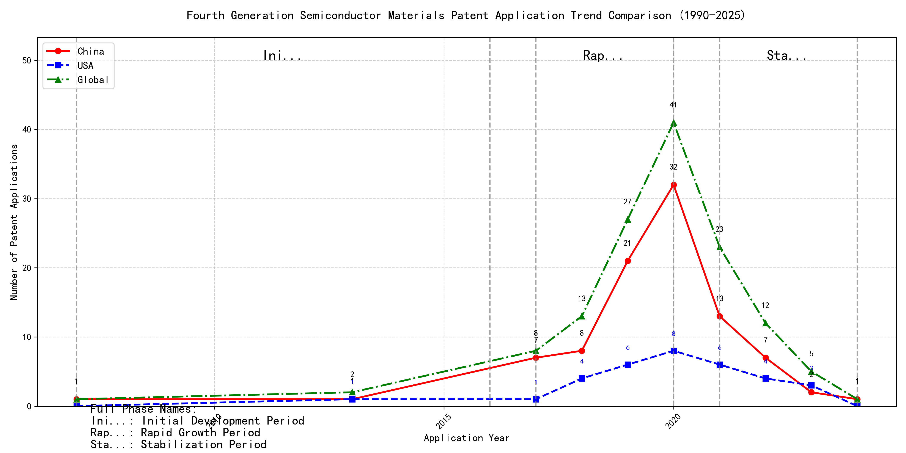

## (1) Patent Application Trend Analysis

The patent application trend analysis reveals a significant increase in patent applications globally, particularly from China, starting from 2017. Foreign applications, primarily from the US, show a more stable but less pronounced growth pattern. Chinese applications dominate the global trend, especially from 2019 to 2020, indicating a rapid development phase in technology. The overall trend suggests a shift from a period of low activity to a phase of rapid growth and subsequent stabilization.
### (1)Initial Development Period (2007-2016)

During the initial development period, patent activity in the field of machine learning and data processing was very low, with only sporadic applications from China and the US. This indicates that the technology was in its nascent stage with minimal global interest. The US had a slight edge in terms of innovation, with EMC IP HOLDING COMPANY LLC filing a patent on cross-validation of machine learning algorithms using SQL on distributed systems. China, represented by Fuji Xerox and Internal Sales Company, focused on unsupervised and supervised learning techniques, as well as instance-weighted learning models, showing a growing interest in foundational machine learning methodologies.

EMC IP HOLDING COMPANY LLC from the US focused on developing a general framework for cross-validation of machine learning algorithms using SQL on distributed systems, emphasizing the importance of distributed computing in machine learning. Fuji Xerox from China introduced a data processing device and method that combined unsupervised and supervised learning to reduce data dimensionality and establish mapping relationships between classified data groups. Internal Sales Company, also from China, developed an instance-weighted learning (IWL) machine learning model, which used quality values to weight training instances differently, allowing classifiers to learn more from higher-quality instances. These innovations highlight the early-stage exploration of machine learning techniques, with the US focusing on distributed systems and China emphasizing foundational learning methodologies and data processing techniques.

### (2)Rapid Growth Period (2017-2020)

During the rapid growth period, China experienced a dramatic increase in patent applications, rising from 7 in 2017 to 32 in 2020, indicating a significant surge in technological development and innovation. The US also saw an increase in patent applications, but at a slower rate. This period highlights China's growing dominance in technological advancements, particularly in the field of machine learning and artificial intelligence, while the US maintained a steady but less pronounced growth.

During the rapid growth period, the top 5 applicants demonstrated distinct technical routes in machine learning and AI. Google LLC focused on unsupervised data augmentation and federated learning, emphasizing the enhancement of model training through data manipulation and distributed learning. Microsoft Technology Licensing, LLC explored adversarial pretraining and reinforcement learning, aiming to improve model robustness and adaptability through noise injection and reward shaping. International Business Machines Corporation (IBM) concentrated on fairness improvement in supervised learning and data anonymization, leveraging reinforcement learning to enhance model fairness and privacy. Visa International Service Association prioritized privacy-preserving unsupervised learning, developing systems for secure, collaborative learning without data leakage. HRL Laboratories, LLC focused on understanding machine-learning decisions based on camera data, using unsupervised learning to extract and organize concepts from latent variables. These diverse approaches reflect the applicants' unique contributions to advancing machine learning technologies, with Chinese institutions like Google LLC and IBM leading in innovation and application diversity.

### (3)Stabilization Period (2021-2024)

During the stabilization period, the number of patent applications in the field of machine learning and artificial intelligence began to stabilize and slightly decline. Chinese applications, which peaked in 2020, decreased significantly, while US applications remained relatively stable. This suggests a maturing technology landscape with reduced innovation activity. The decline in Chinese applications may indicate a shift in focus or a saturation of certain technological areas, whereas the stability in US applications reflects continued, albeit slower, innovation in established areas.

The top five applicants during this period demonstrate diverse technical routes in machine learning and AI. Oracle International Corporation focused on unsupervised model ensembling and chatbot-driven machine learning solutions, emphasizing efficiency and user accessibility. Microsoft Technology Licensing, LLC explored adversarial pretraining and reinforcement learning with sub-goal based shaped reward functions, highlighting advanced training methodologies. South China University of Technology in China developed systems combining reinforcement and unsupervised learning for robotic skill acquisition, showcasing innovation in robotics and automation. Capital One Services, LLC leveraged deep reinforcement learning for dynamic content selection in real-time environments, emphasizing real-time adaptability. DataTang (Beijing) Technology Co., Ltd. focused on data annotation methods using unsupervised, weakly supervised, and semi-supervised learning, aiming to reduce manual annotation costs and improve efficiency. Chinese institutions, particularly South China University of Technology and DataTang, demonstrated significant innovation in integrating multiple learning paradigms and optimizing data processing workflows, reflecting a strong focus on practical applications and efficiency improvements.

