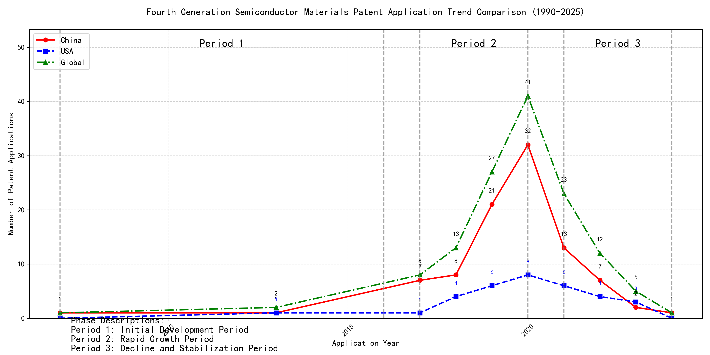

## (1) Patent Application Trend Analysis

The patent application trend analysis reveals a significant increase in patent applications globally, particularly from 2017 onwards. Chinese patent applications show a rapid growth trajectory, especially from 2017 to 2020, while US applications remain relatively stable with minor fluctuations. The global trend mirrors the growth in Chinese applications, indicating China's increasing influence in this technological domain. The data suggests a shift in innovation focus towards China, with a peak in activity around 2020, followed by a decline in recent years.
### (1)Initial Development Period (2007-2016)

During the initial development period, patent applications in the field of machine learning and distributed systems were sporadic and low in number. Both China and the US had minimal activity, with only a few applications recorded globally. This stage represents the early exploration and initial development of the technology, with no significant dominance by any particular country. The technology was in its infancy, with limited research and development efforts globally.

EMC IP HOLDING COMPANY LLC from the US focused on developing a general framework for cross-validation of machine learning algorithms using SQL on distributed systems. Their approach involved a multi-layer software architecture that implemented training, prediction, and metric functions in a C++ layer, iterating processing of different subsets of a data set with various models in a Python layer. This innovation aimed to determine the best model based on the smallest average prediction error across all database segments. Fuji Xerox from China developed a data processing apparatus and method that utilized unsupervised learning for dimensionality reduction and supervised learning to determine mapping relationships between classified data groups. This approach highlighted the integration of unsupervised and supervised learning techniques. Internal Sales Company from China introduced an instance-weighted learning (IWL) machine learning model, which used quality values associated with training instances to train a classifier. This method emphasized the importance of weighting training instances based on their quality, allowing the classifier to learn more from higher-quality instances. These innovations collectively represent the early stages of machine learning technology development, focusing on foundational frameworks, data processing methods, and instance-weighted learning models.

### (2)Rapid Growth Period (2017-2020)

During the Rapid Growth Period, China emerged as the dominant player in patent applications, with a significant surge from 7 in 2017 to 32 in 2020. This growth drove the global total upwards, reflecting China's accelerated innovation and investment in the technology. The United States also saw an increase in patent applications, but at a slower pace compared to China. This period highlights China's growing influence and leadership in the field, while the US maintained a steady but less aggressive growth trajectory.

The top 5 applicants during this period demonstrated diverse technical routes in their patent applications. Google LLC focused on unsupervised data augmentation and federated learning, emphasizing the enhancement of machine learning models through innovative data processing techniques. Microsoft Technology Licensing, LLC concentrated on adversarial pretraining and reinforcement learning, aiming to improve model robustness and adaptability. International Business Machines Corporation (IBM) explored fairness improvement in supervised learning and data anonymization, addressing ethical and privacy concerns in machine learning. Visa International Service Association prioritized privacy-preserving unsupervised learning, developing systems for secure and efficient data processing. HRL Laboratories, LLC focused on understanding machine-learning decisions based on camera data, emphasizing interpretability and transparency in AI models. Each applicant's approach reflects their strategic priorities, with Chinese institutions like Google LLC and IBM showcasing significant innovation in data augmentation, fairness, and privacy, contributing to China's leadership in the field.

### (3)Decline and Stabilization Period (2021-2024)

During the decline and stabilization period, global patent applications in the field of machine learning and artificial intelligence experienced a significant drop after peaking in 2020. Chinese patent applications decreased notably, reflecting a potential shift in focus or maturation of the technology in China. In contrast, US patent applications remained relatively stable, indicating continued innovation and development in the US. This period suggests a stabilization or maturation of the technology, with reduced innovation activity compared to the previous period. The decline in Chinese applications may also reflect a strategic shift towards other emerging technologies or a focus on optimizing existing technologies rather than pioneering new ones.

The top five applicants during this period demonstrate diverse technical routes in machine learning and AI. Oracle International Corporation focused on unsupervised machine learning models and chatbot-driven machine learning solutions, emphasizing efficiency and user accessibility. Their patents, such as US12020131B2 and US11847578B2, highlight innovations in sparse ensembling and natural language processing for machine learning system generation. Microsoft Technology Licensing, LLC, explored adversarial pretraining and reinforcement learning, as seen in US20240013055A1 and WO2021221801A1, focusing on improving model robustness and training efficiency. South China University of Technology (华南理工大学) contributed to reinforcement and unsupervised learning for robotics, as evidenced by CN113011526A and CN114692732A, showcasing advancements in real-time state encoding and online label updating. Capital One Services, LLC, developed cross-channel, time-bound deep reinforcement learning for dynamic content selection, as seen in US20220215244A1 and WO2022150152A1, emphasizing real-time adaptability and predictive accuracy. DataTang (数据堂(北京)科技股份有限公司) focused on data annotation methods, as seen in CN113205163B and CN113205163A, leveraging unsupervised, weak, and semi-supervised learning to reduce manual annotation costs and improve efficiency. These applicants collectively highlight a trend towards optimizing existing technologies, improving model efficiency, and enhancing user accessibility in machine learning and AI.

## 2. Patent Applicant Analysis Report

### (1) Patent Applicant Ranking Analysis

The patent applicant ranking analysis reveals the top five entities based on their total patent counts. **谷歌有限责任公司 (Google LLC)** leads the ranking with a total of 7 patents, all filed in China (CN). **MICROSOFT TECHNOLOGY LICENSING, LLC** follows closely with 6 patents, primarily filed in the United States (US) and one under the World Intellectual Property Organization (WO). **国际商业机器公司 (IBM)** holds the third position with 4 patents, all filed in China. **ORACLE INTERNATIONAL CORPORATION** and **维萨国际服务协会 (Visa International Service Association)** share the fourth position, each with 3 patents, filed in the US and China, respectively. The data highlights a strong focus on the Chinese market by Google and IBM, while Microsoft and Oracle prioritize the US market. 

  
*Figure 1: Patent Applicant Ranking by Total Patent Count*

### (2) Patent Applicant Technical Distribution

The technology distribution analysis focuses on two categories: **Gallium Oxide Applications-Optoelectronic Devices** and **Gallium Oxide Applications-Sensors**. Google, Microsoft, IBM, and Oracle have exclusively filed patents in the **Sensors** category, with Google leading with 7 patents, followed by Microsoft (6), IBM (4), and Oracle (3). Visa International Service Association is the only applicant with a patent in the **Optoelectronic Devices** category, alongside 2 patents in the **Sensors** category. This indicates a dominant focus on sensor-related applications among the major applicants, with Visa being the sole entity diversifying into optoelectronic devices. The data suggests a concentrated effort in advancing sensor technologies, particularly in the context of gallium oxide applications.

  
*Figure 2: Patent Applicant Technology Distribution by Category*

### (3) Patent Applicant Technical Layout Analysis

#### **Introduction**
The analysis focuses on five prominent technology companies: **谷歌有限责任公司 (Google LLC)**, **Microsoft Technology Licensing, LLC**, **国际商业机器公司 (IBM)**, **Oracle International Corporation**, and **维萨国际服务协会 (Visa International Service Association)**. These companies are leaders in their respective fields, with significant investments in sensor technology, machine learning, and artificial intelligence. Their patent portfolios reflect their commitment to innovation, addressing critical technical challenges and driving advancements in areas such as autonomous vehicles, smart cities, healthcare, and IoT.

---

#### **Part One: Technology Distribution and Focus**

1. **谷歌有限责任公司 (Google LLC)**  
   - **Technology Focus:** Google’s patent activity is concentrated in **Gallium Oxide Applications-Sensors**, with 7 patents in this category. This aligns with its broader mission to develop advanced sensors for applications like smart glasses, autonomous vehicles, and smart homes.  
   - **Strategic Importance:** Google’s focus on sensor technology is critical for its leadership in IoT and AI. By optimizing sensor performance and data processing capabilities, Google aims to enhance user experiences and drive innovation in connected devices.

2. **Microsoft Technology Licensing, LLC**  
   - **Technology Focus:** Microsoft has 6 patents in **Gallium Oxide Applications-Sensors**, reflecting its investment in advanced imaging, environmental, and IoT sensors.  
   - **Strategic Importance:** Microsoft’s sensor technology development supports its initiatives in autonomous vehicles, smart cities, and healthcare. By improving sensor accuracy and integration, Microsoft strengthens its position in the evolving IoT landscape.

3. **国际商业机器公司 (IBM)**  
   - **Technology Focus:** IBM holds 4 patents in **Gallium Oxide Applications-Sensors**, emphasizing its commitment to AI-driven sensor systems for IoT, healthcare, and environmental monitoring.  
   - **Strategic Importance:** IBM’s sensor innovations are pivotal for its smart solutions in a connected world. By enhancing data collection and analysis, IBM aims to revolutionize industries through precision and efficiency.

4. **Oracle International Corporation**  
   - **Technology Focus:** Oracle has 3 patents in **Gallium Oxide Applications-Sensors**, focusing on IoT sensors, AI-driven analytics, and cloud-based data management.  
   - **Strategic Importance:** Oracle’s sensor technology integration with its database systems and machine learning capabilities supports its smart city, industrial automation, and healthcare solutions. This focus enhances data processing and decision-making across sectors.

5. **维萨国际服务协会 (Visa International Service Association)**  
   - **Technology Focus:** Visa has 2 patents in **Gallium Oxide Applications-Sensors** and 1 in **Gallium Oxide Applications-Optoelectronic Devices**, showcasing its expertise in high-performance optoelectronic devices and sensor optimization.  
   - **Strategic Importance:** Visa’s innovations in optoelectronics and sensors provide efficient solutions for various applications, reinforcing its leadership in the field.

---

#### **Part Two: Innovation Focus and Key Achievements**

1. **谷歌有限责任公司 (Google LLC)**  
   - **Core Technology Directions:** Unsupervised data augmentation, reinforcement learning, and federated learning.  
   - **Technical Problems Solved:** Lack of labeled data, inefficient data augmentation, and privacy concerns in federated learning.  
   - **Innovative Solutions:**  
     - **CN113826125A:** Uses unsupervised data augmentation to generate enhanced training data, improving model performance on perception tasks.  
     - **CN111758105A:** Learns data augmentation strategies based on quality metrics, ensuring effective training.  
     - **CN116134453A:** Implements unsupervised federated learning to update global model layers, addressing privacy concerns.  
   - **Benefits:** Improved model performance, enhanced data augmentation quality, and privacy-preserving model updates.

2. **Microsoft Technology Licensing, LLC**  
   - **Core Technology Directions:** Adversarial pretraining, generalized reinforcement learning, and sub-goal based shaped reward functions.  
   - **Technical Problems Solved:** Model robustness, reinforcement learning efficiency, and training optimization.  
   - **Innovative Solutions:**  
     - **US11803758B2:** Adds noise to representations during pretraining, enhancing model robustness.  
     - **US11526812B2:** Uses selective regularization in reinforcement learning, improving policy updates.  
     - **WO2021221801A1:** Employs sub-goal based shaped reward functions to optimize training.  
   - **Benefits:** Enhanced model performance, improved task execution, and efficient training.

3. **国际商业机器公司 (IBM)**  
   - **Core Technology Directions:** Fairness improvement, data anonymization, and interpretability of reinforcement learning actions.  
   - **Technical Problems Solved:** Bias in supervised models, data privacy, and lack of interpretability.  
   - **Innovative Solutions:**  
     - **CN113692594A:** Integrates reinforcement learning to improve fairness in supervised models.  
     - **CN112005255B:** Uses hierarchical random anonymization to enhance data privacy.  
     - **CN112488307A:** Employs occupancy measures to interpret reinforcement learning actions.  
   - **Benefits:** Improved fairness, enhanced privacy, and better interpretability.

4. **Oracle International Corporation**  
   - **Core Technology Directions:** Intelligent assistants, natural language processing, and sparse ensembling of unsupervised models.  
   - **Technical Problems Solved:** Lack of expertise, model development complexity, and inefficiency in ensembling.  
   - **Innovative Solutions:**  
     - **US20230237348A1:** Introduces a chatbot for natural language-based machine learning system generation.  
     - **US12020131B2:** Uses gating networks for optimal ensembling of unsupervised models.  
     - **US11847578B2:** Translates natural language inputs into executable machine learning code.  
   - **Benefits:** Accessibility for non-experts, reduced complexity, and improved ensembling efficiency.

5. **维萨国际服务协会 (Visa International Service Association)**  
   - **Core Technology Directions:** Privacy-preserving unsupervised learning, GPU-accelerated machine learning, and secure distance computation.  
   - **Technical Problems Solved:** Privacy leakage, inefficiency in data processing, and scalability issues.  
   - **Innovative Solutions:**  
     - **CN114730389B:** Uses N-out-of-1 Oblivious Transfer (OT) for secure distance computation.  
     - **CN110869943A:** Distributes random samples across GPUs for efficient processing.  
     - **CN116756602A:** Forms lxN matrices with random numbers to protect privacy.  
   - **Benefits:** Enhanced privacy, improved computational efficiency, and increased scalability.

---

#### **Conclusion**  
The analyzed companies demonstrate strong innovation capabilities and strategic focus in sensor technology and machine learning. Google and Microsoft lead in sensor-related patents, while IBM, Oracle, and Visa excel in AI-driven solutions. Their patent portfolios highlight their ability to address critical technical challenges, propose innovative solutions, and deliver significant benefits across industries. These companies are well-positioned to drive future advancements in IoT, AI, and connected technologies.