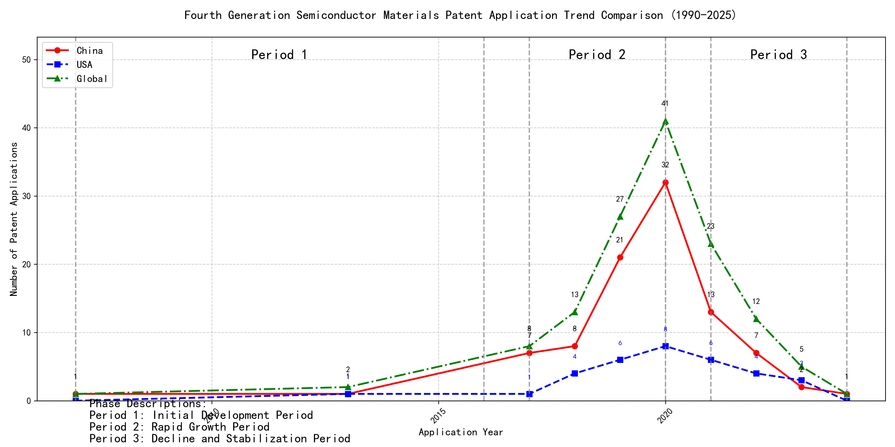

## (1) Patent Application Trend Analysis

The patent application trend analysis reveals a significant increase in patent applications globally, particularly from 2017 onwards. Chinese patent applications show a rapid growth trajectory, especially from 2017 to 2020, while US applications remain relatively stable with minor fluctuations. The global trend mirrors the growth in Chinese applications, indicating China's increasing influence in this technological domain. The data suggests a shift in innovation focus towards China, with a peak in activity around 2020, followed by a decline in recent years.
### (1)Initial Development Period (2007-2016)

During the initial development period, patent applications in the field of machine learning and distributed systems were sporadic and low in number. Both China and the US had minimal activity, with only a few applications recorded globally. This stage represents the early exploration and initial development of the technology, with no significant dominance by any particular country. The technology was in its infancy, with limited research and development efforts globally.

EMC IP HOLDING COMPANY LLC from the US focused on developing a general framework for cross-validation of machine learning algorithms using SQL on distributed systems. Their approach involved a multi-layer software architecture that implemented training, prediction, and metric functions in a C++ layer, iterating processing of different subsets of a data set with various models in a Python layer. This innovation aimed to determine the best model based on the smallest average prediction error across all database segments. Fuji Xerox from China developed a data processing apparatus and method that utilized unsupervised learning for dimensionality reduction and supervised learning to determine mapping relationships between classified data groups. This approach highlighted the integration of unsupervised and supervised learning techniques. Internal Sales Company from China introduced an instance-weighted learning (IWL) machine learning model, which used quality values associated with training instances to train a classifier. This method emphasized the importance of weighting training instances based on their quality, allowing the classifier to learn more from higher-quality instances. These innovations collectively represent the early stages of machine learning technology development, focusing on foundational frameworks, data processing methods, and instance-weighted learning models.

### (2)Rapid Growth Period (2017-2020)

During the Rapid Growth Period, China emerged as the dominant player in patent applications, with a significant surge from 7 in 2017 to 32 in 2020. This growth drove the global total upwards, reflecting China's accelerated innovation and investment in the technology. The United States also saw an increase in patent applications, but at a slower pace compared to China. This period highlights China's growing influence and leadership in the field, while the US maintained a steady but less aggressive growth trajectory.

The top 5 applicants during this period demonstrated diverse technical routes in their patent applications. Google LLC focused on unsupervised data augmentation and federated learning, emphasizing the enhancement of machine learning models through innovative data processing techniques. Microsoft Technology Licensing, LLC concentrated on adversarial pretraining and reinforcement learning, aiming to improve model robustness and adaptability. International Business Machines Corporation (IBM) explored fairness improvement in supervised learning and data anonymization, addressing ethical and privacy concerns in machine learning. Visa International Service Association prioritized privacy-preserving unsupervised learning, developing systems for secure and efficient data processing. HRL Laboratories, LLC focused on understanding machine-learning decisions based on camera data, emphasizing interpretability and transparency in AI models. Each applicant's approach reflects their strategic priorities, with Chinese institutions like Google LLC and IBM showcasing significant innovation in data augmentation, fairness, and privacy, contributing to China's leadership in the field.

### (3)Decline and Stabilization Period (2021-2024)

During the decline and stabilization period, global patent applications in the field of machine learning and artificial intelligence experienced a significant drop after peaking in 2020. Chinese patent applications decreased notably, reflecting a potential shift in focus or maturation of the technology in China. In contrast, US patent applications remained relatively stable, indicating continued innovation and development in the US. This period suggests a stabilization or maturation of the technology, with reduced innovation activity compared to the previous period. The decline in Chinese applications may also reflect a strategic shift towards other emerging technologies or a focus on optimizing existing technologies rather than pioneering new ones.

The top five applicants during this period demonstrate diverse technical routes in machine learning and AI. Oracle International Corporation focused on unsupervised machine learning models and chatbot-driven machine learning solutions, emphasizing efficiency and user accessibility. Their patents, such as US12020131B2 and US11847578B2, highlight innovations in sparse ensembling and natural language processing for machine learning system generation. Microsoft Technology Licensing, LLC, explored adversarial pretraining and reinforcement learning, as seen in US20240013055A1 and WO2021221801A1, focusing on improving model robustness and training efficiency. South China University of Technology (华南理工大学) contributed to reinforcement and unsupervised learning for robotics, as evidenced by CN113011526A and CN114692732A, showcasing advancements in real-time state encoding and online label updating. Capital One Services, LLC, developed cross-channel, time-bound deep reinforcement learning for dynamic content selection, as seen in US20220215244A1 and WO2022150152A1, emphasizing real-time adaptability and predictive accuracy. DataTang (数据堂(北京)科技股份有限公司) focused on data annotation methods, as seen in CN113205163B and CN113205163A, leveraging unsupervised, weak, and semi-supervised learning to reduce manual annotation costs and improve efficiency. These applicants collectively highlight a trend towards optimizing existing technologies, improving model efficiency, and enhancing user accessibility in machine learning and AI.

