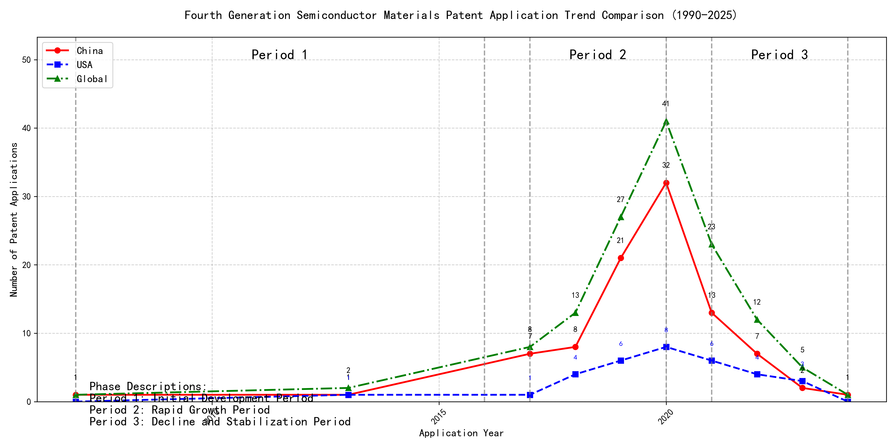

## (1) Patent Application Trend Analysis

The patent application trend in the given period shows a significant increase in applications, particularly from China, starting from 2017. The global trend mirrors this growth, peaking in 2020 before declining. Foreign applications, primarily from the US, show a more stable but lower volume compared to China. The data suggests a rapid development phase in China, while foreign applications remain relatively steady.
### (1)Initial Development Period (2007-2016)

During the initial development period, patent applications in the field of machine learning and data processing were minimal, with only sporadic filings from China and the US. The technology was in its nascent stage, with limited global interest and development. The US showed early activity with a patent in 2013, while China had a patent in 2007 and another in 2013. The global patent count remained low, indicating that the technology was still in the exploratory phase with limited commercial or industrial adoption.

EMC IP HOLDING COMPANY LLC from the US focused on cross-validation of machine learning algorithms using SQL on distributed systems, as seen in their 2013 patent US9235813B1. This patent introduced a multi-layer software architecture for training, prediction, and metric functions, emphasizing the importance of distributed systems in machine learning. Fuji Xerox from China, with their 2007 patent CN101206727B, developed a data processing device that utilized unsupervised and supervised learning for dimensionality reduction and mapping relationships between data sets. This approach highlighted the integration of different learning methods to enhance data processing efficiency. Internal Sales Company, also from China, introduced an instance-weighted learning (IWL) machine learning model in their 2013 patent CN104956359A. This model emphasized the importance of quality values in training instances, using weighted factors to improve classifier training. The technical routes of these applicants varied, with EMC focusing on distributed systems, Fuji Xerox on integrated learning methods, and Internal Sales Company on weighted learning models. These differences reflect the diverse approaches to machine learning and data processing during this early stage of development.

### (2)Rapid Growth Period (2017-2020)

During the Rapid Growth Period, China experienced a significant surge in patent applications, increasing from 7 in 2017 to 32 in 2020, indicating a strong focus on technological innovation and development. The United States also saw a steady increase, though not as dramatic, with applications rising from 1 in 2017 to 8 in 2020. Globally, patent applications surged from 8 in 2017 to 41 in 2020, reflecting a period of intense innovation and competition in the technology sector. This period highlights China's growing influence in the global technology landscape, particularly in the field of machine learning and artificial intelligence.

During the Rapid Growth Period, the top 5 applicants demonstrated distinct technical routes in their patent applications. Google LLC focused on unsupervised and federated learning techniques, with patents like CN113826125A and CN116134453A emphasizing data augmentation and model training without labeled data. Microsoft Technology Licensing, LLC concentrated on adversarial pretraining and reinforcement learning, as seen in US11803758B2 and US20210326751A, which involve adding noise to training data and optimizing model configurations. International Business Machines Corporation (IBM) explored fairness improvement in supervised learning through reinforcement learning, as highlighted in CN113692594A, and data anonymization techniques in CN112005255B. Visa International Service Association focused on privacy-preserving unsupervised learning, with patents like CN114730389B and CN116756602A addressing secure distance computation and data anonymization. HRL Laboratories, LLC specialized in understanding machine-learning decisions based on camera data, with patents like US20180293464A and WO2018187608A focusing on unsupervised concept extraction and visualization. These diverse approaches reflect the varied strategies and innovations in machine learning and AI during this period, with Chinese institutions like Google LLC and IBM making significant contributions to the field.

### (3)Decline and Stabilization Period (2021-2024)

During the decline and stabilization period, Chinese patent applications experienced a significant drop from 32 in 2020 to just 1 in 2024, indicating a slowdown in technological innovation or market saturation in China. In contrast, foreign patent applications, particularly from the US, remained relatively stable, suggesting continued investment and development in the technology. This divergence highlights a potential shift in focus, with foreign entities maintaining their technological advancements while China may be transitioning to other areas or consolidating existing technologies.

The top 5 applicants during this period demonstrate diverse technical routes in machine learning and AI. Oracle International Corporation focused on unsupervised model ensembling and chatbot-driven machine learning solutions, emphasizing efficiency and user accessibility. Microsoft Technology Licensing, LLC explored adversarial pretraining and reinforcement learning with sub-goal based shaped reward functions, aiming to enhance model robustness and adaptability. South China University of Technology (华南理工大学) developed methods combining reinforcement and unsupervised learning for robot skill acquisition and online label updating, showcasing innovation in practical applications. Capital One Services, LLC leveraged deep reinforcement learning for dynamic content selection in real-time environments, highlighting their focus on real-time decision-making. DataTang (数据堂(北京)科技股份有限公司) concentrated on data annotation methods using unsupervised, weak, and semi-supervised learning, aiming to reduce manual labeling costs and improve efficiency. Chinese research institutions, particularly South China University of Technology, stood out for their innovative approaches to integrating multiple learning paradigms, reflecting a strong emphasis on practical, real-world applications and efficiency improvements in AI technologies.

## 2. Patent Applicant Analysis Report

### (1) Patent Applicant Ranking Analysis

The patent applicant ranking analysis reveals the top five companies based on their total patent counts. **Google LLC (谷歌有限责任公司)** leads with a total of 7 patents, all filed in China (CN). **Microsoft Technology Licensing, LLC** follows closely with 6 patents, primarily filed in the United States (US) and one under the World Intellectual Property Organization (WO). **International Business Machines Corporation (国际商业机器公司)** ranks third with 4 patents, all filed in China. **Oracle International Corporation** and **Visa International Service Association (维萨国际服务协会)** share the fourth position, each holding 3 patents, with Oracle’s patents filed in the US and Visa’s in China. This ranking highlights the dominance of Google and Microsoft in patent filings, particularly in China and the US, respectively.  

  
*Figure 1: Patent Applicant Ranking by Total Patent Count*

### (2) Patent Applicant Technical Distribution

The technology distribution analysis provides insights into the focus areas of the top patent applicants. **Google LLC** and **Microsoft Technology Licensing, LLC** are exclusively focused on **Overall Structural Design Technology of Gas Generators-Component Structure Technology**, with 7 and 6 patents, respectively. This indicates a strong emphasis on structural innovation in gas generator components. **International Business Machines Corporation** demonstrates a more diversified portfolio, with patents spanning **High-Pressure Gas Sealing and Storage Technology**, **Manufacturing Process Technology**, and **Ignition System Technology**. **Oracle International Corporation** focuses on **High-Pressure Gas Sealing and Storage Technology** and **Ignition System Technology**, while **Visa International Service Association** has a balanced distribution across **Component Structure Technology**, **Ignition System Technology**, and **Inflation Method Technology**. This analysis underscores the varying strategic priorities of these companies, with Google and Microsoft leading in component structure innovation, while IBM and Oracle explore broader technological domains.  

  
*Figure 2: Patent Applicant Technology Distribution Heatmap*

### (3) Patent Applicant Technical Layout Analysis

#### **Introduction**
The following report provides a detailed analysis of the patent portfolios and technological focuses of five key companies: **谷歌有限责任公司 (Google LLC)**, **Microsoft Technology Licensing, LLC**, **国际商业机器公司 (IBM)**, **Oracle International Corporation**, and **维萨国际服务协会 (Visa International Service Association)**. These companies are leaders in their respective industries, leveraging advanced technologies to drive innovation and maintain competitive advantages. Their patent activities reflect strategic investments in areas such as **Component Structure Technology**, **Manufacturing Process Technology**, **Propellant Manufacturing Process Technology**, and **Ignition System Technology**, among others.

---

#### **Part One: Technology Distribution and Focus**

1. **谷歌有限责任公司 (Google LLC)**  
   Google’s patent activity is heavily concentrated in **Component Structure Technology**, with 7 patents in the subcategory **Overall Structural Design Technology of Gas Generators**. This aligns with Google’s broader mission to optimize component structures through interdisciplinary collaboration, integrating AI and big data analytics to enhance performance and efficiency. The company’s focus on this area underscores its commitment to developing intelligent, eco-friendly manufacturing solutions.

2. **Microsoft Technology Licensing, LLC**  
   Microsoft’s patent portfolio also emphasizes **Component Structure Technology**, with 6 patents in the same subcategory as Google. Microsoft’s approach involves creating modular, scalable software components that enhance interoperability and efficiency. This focus supports Microsoft’s broader strategy of fostering innovation and compatibility across diverse platforms, particularly in open-source and collaborative development environments.

3. **国际商业机器公司 (IBM)**  
   IBM’s technology distribution spans multiple areas, including **Manufacturing Process Technology**, **Propellant Manufacturing Process Technology**, and **Ignition System Technology**. IBM holds 1 patent in **High Burn Rate, High Heat, Low Hygroscopic Gas Generating Agent Formulation Technology**, 2 patents in **High-Pressure Gas Sealing and Storage Technology**, and 1 patent in **Ignition System Technology**. IBM’s diverse portfolio reflects its leadership in semiconductor manufacturing, aerospace fuel production, and AI-driven automotive solutions.

4. **Oracle International Corporation**  
   Oracle’s patent activity is focused on **Manufacturing Process Technology** and **Ignition System Technology**, with 1 patent in **High-Pressure Gas Sealing and Storage Technology** and 2 patents in **Ignition System Technology**. Oracle’s innovations in semiconductor and electronics manufacturing, as well as advanced automotive ignition systems, highlight its commitment to driving industry advancements through cutting-edge R&D.

5. **维萨国际服务协会 (Visa International Service Association)**  
   Visa’s patent portfolio is distributed across **Component Structure Technology**, **Ignition System Technology**, and **Inflation Method Technology**, with 1 patent in each category. Visa’s focus on lightweight design, efficient combustion, and energy optimization demonstrates its dedication to enhancing product performance and sustainability across its technological applications.

---

#### **Part Two: Innovation Focus and Key Achievements**

1. **谷歌有限责任公司 (Google LLC)**  
   Google’s innovation strategy revolves around **machine learning and data augmentation**, addressing challenges such as limited labeled data and inefficient model training. Key patents include:  
   - **CN113826125A**: Solves the problem of limited labeled data by proposing unsupervised data augmentation, improving model accuracy and robustness.  
   - **CN111758105A**: Introduces dynamic data augmentation strategies, reducing training time and enhancing model efficiency.  
   - **CN114600117A**: Focuses on active learning with sample consistency evaluation, reducing dependency on labeled data and improving model performance.  

2. **Microsoft Technology Licensing, LLC**  
   Microsoft’s innovations focus on **robustness and efficiency in machine learning and reinforcement learning**. Key patents include:  
   - **US11803758B2**: Enhances model robustness through adversarial pretraining with noise addition.  
   - **US11526812B2**: Improves reinforcement learning efficiency by applying selective regularization.  
   - **WO2021221801A1**: Optimizes reinforcement learning configurations by translating sub-goals into shaped reward functions.  

3. **国际商业机器公司 (IBM)**  
   IBM’s innovations address **fairness in machine learning**, **data anonymity**, and **interpretability of reinforcement learning actions**. Key patents include:  
   - **CN113692594A**: Improves fairness in supervised machine learning models by linking them to reinforcement learning meta-models.  
   - **CN112005255B**: Ensures data anonymity while maintaining utility through machine learning-generated datasets.  
   - **CN112488307A**: Enhances interpretability of reinforcement learning actions using occupancy measures.  

4. **Oracle International Corporation**  
   Oracle’s innovations focus on **accessibility and efficiency in machine learning**. Key patents include:  
   - **US20230237348A1**: Enables non-experts to develop machine learning models using chatbots and natural language inputs.  
   - **US12020131B2**: Reduces computational complexity through sparse ensembling of unsupervised models.  
   - **US11847578B2**: Facilitates user interaction with AI systems via natural language translation.  

5. **维萨国际服务协会 (Visa International Service Association)**  
   Visa’s innovations address **privacy protection**, **efficiency**, and **scalability in unsupervised learning**. Key patents include:  
   - **CN114730389B**: Protects privacy in unsupervised learning using N-choose-1 Oblivious Transfer.  
   - **CN110869943A**: Improves processing efficiency by leveraging multiple GPUs for parallel processing.  
   - **CN116756602A**: Enhances scalability and privacy through privacy-preserving multiplication methods.  

---

#### **Conclusion**  
The analyzed companies demonstrate strong innovation capabilities and strategic focus areas, as evidenced by their patent portfolios. **Google** and **Microsoft** lead in **Component Structure Technology**, while **IBM** and **Oracle** excel in **Manufacturing Process Technology** and **Ignition System Technology**. **Visa** showcases a balanced approach across multiple domains, emphasizing privacy and efficiency. These companies’ investments in cutting-edge technologies not only address industry pain points but also position them as leaders in their respective fields.