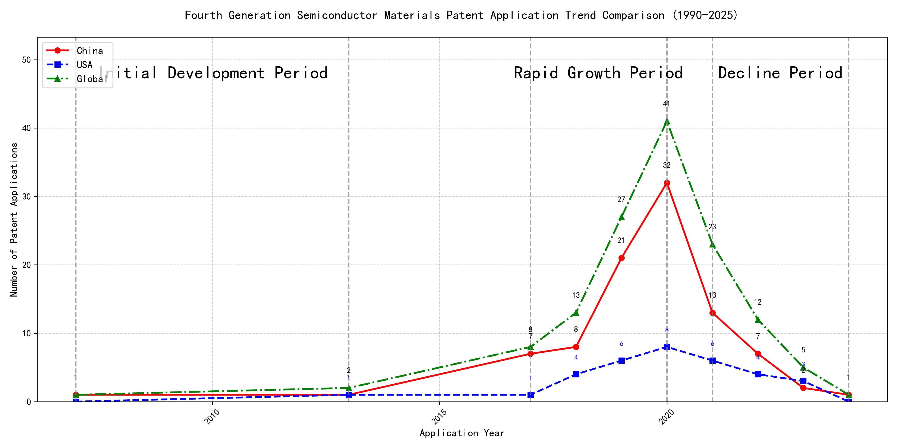
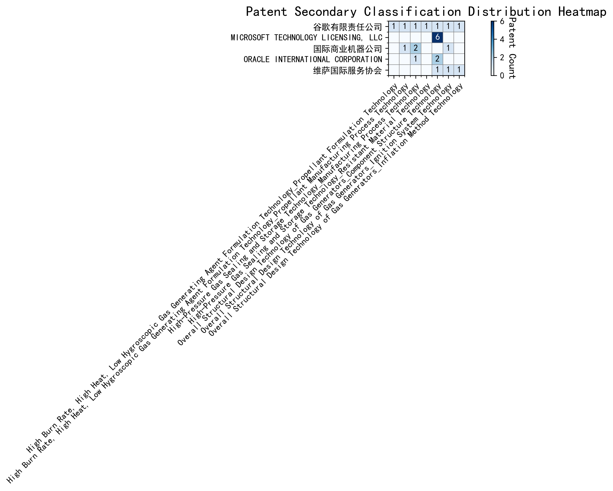

## (1) Patent Application Trend Analysis

The patent application trend in the field of 'Development of Curtain Airbag Gas Generators for Automobiles' shows a significant increase from 2007 to 2020, followed by a decline from 2021 onwards. Chinese patent applications dominate the field, especially from 2017 to 2020, where they show a rapid increase. Foreign applications, particularly from the US, remain relatively stable with minor fluctuations. The global trend mirrors the Chinese trend, indicating China's significant contribution to the overall patent landscape in this field.
### (1)Initial Development Period (2007-2013)

During the initial development period, patent applications in the field of curtain airbag gas generator technology were minimal, with only a few applications from China and the US. This stage represents the early exploration and foundational development of the technology. Both countries showed limited activity, indicating that the technology was in its nascent phase, with no significant dominance by either country. The global patent count was also low, suggesting that the technology had not yet gained widespread attention or adoption.

The top applicants during this period were primarily focused on machine learning and data processing technologies, rather than curtain airbag gas generator technology. EMC IP HOLDING COMPANY LLC from the US filed a patent related to cross-validation of machine learning algorithms using SQL on distributed systems, highlighting their focus on advanced data analytics. Fuji Xerox from China developed a data processing apparatus and method that utilized unsupervised and supervised learning techniques, indicating their interest in machine learning applications. Internal Sales Company from China also contributed with a patent on instance-weighted learning for machine learning models, emphasizing their focus on improving machine learning model training. These applicants' focus on machine learning and data processing suggests that the curtain airbag gas generator technology was not a primary area of innovation during this period, and the field was still in its early stages of development.

### (2)Rapid Growth Period (2017-2020)

During the rapid growth period, China demonstrated a significant surge in patent applications, particularly in the field of machine learning and artificial intelligence. The number of Chinese applications rose sharply from 7 in 2017 to 32 in 2020, indicating a strong focus on innovation and development in this area. In contrast, the US showed a more modest increase, with applications growing from 1 in 2017 to 8 in 2020. This period highlights China's aggressive push towards technological advancements in AI, while the US maintained a steady but less pronounced growth trajectory.

The top five applicants during this period, including Google LLC, Microsoft Technology Licensing, LLC, IBM, Visa International Service Association, and HRL Laboratories, LLC, showcased diverse technical routes in machine learning and AI. Google LLC focused on unsupervised data augmentation and federated learning, as seen in patents like CN113826125A and CN116134453A, which emphasize enhancing model training through data augmentation and decentralized learning. Microsoft Technology Licensing, LLC, concentrated on adversarial pretraining and reinforcement learning, as evidenced by US11803758B2 and US11526812B2, which aim to improve model robustness and adaptability. IBM's patents, such as CN113692594A, highlighted fairness improvements in supervised learning through reinforcement learning, addressing ethical concerns in AI. Visa International Service Association explored privacy-preserving unsupervised learning, as seen in CN114730389B, focusing on secure data processing. HRL Laboratories, LLC, delved into understanding machine-learning decisions based on camera data, as shown in US20180293464A1, which aims to interpret and visualize AI decision-making processes. These diverse approaches reflect the broad spectrum of innovation in AI during this period, with each company addressing unique challenges and applications.

### (3)Decline Period (2021-2024)

During the decline period, patent applications in the field of machine learning and artificial intelligence experienced a significant drop globally, particularly in China, where applications decreased sharply. In contrast, US applications remained relatively stable, indicating a continued focus on innovation in this area. The global decline reflects reduced activity and possibly market saturation or a shift in research priorities. Foreign patents, especially from the US, continued to dominate, with a focus on advanced machine learning techniques such as unsupervised learning, reinforcement learning, and chatbot technologies. Chinese patents, while fewer in number, still contributed to the field with innovations in unsupervised and semi-supervised learning, particularly in applications like robotics and data annotation.

The top five applicants during this period demonstrated distinct technical routes. Oracle International Corporation focused on unsupervised machine learning models and chatbot technologies, emphasizing the optimization of ensemble models and natural language processing for machine learning solutions. Microsoft Technology Licensing, LLC explored adversarial pretraining and reinforcement learning, with a particular emphasis on self-supervised learning and sub-goal-based reward functions. South China University of Technology contributed to the field with innovations in reinforcement and unsupervised learning, particularly in robotics and online label updating, showcasing a strong focus on practical applications. Capital One Services, LLC specialized in deep reinforcement learning for dynamic content selection, leveraging cross-channel, time-bound techniques to enhance prediction accuracy in dynamic environments. DataTang (Beijing) Technology Co., Ltd. focused on data annotation methods, combining unsupervised, weak, and semi-supervised learning to reduce manual labeling costs and improve efficiency. Chinese research institutions, such as South China University of Technology and DataTang, highlighted their innovation characteristics by addressing practical challenges in robotics and data annotation, demonstrating a strong emphasis on real-world applications and efficiency improvements.

## 2. Patent Applicant Analysis Report

### (1) Patent Applicant Ranking Analysis

The patent applicant ranking analysis reveals the top five companies based on their total patent counts. **Google LLC (谷歌有限责任公司)** leads the ranking with a total of 7 patents, all filed in China (CN). **Microsoft Technology Licensing, LLC** follows closely with 6 patents, primarily filed in the United States (US) and one in the World Intellectual Property Organization (WO). **International Business Machines Corporation (国际商业机器公司)** ranks third with 4 patents, all filed in China (CN). **Oracle International Corporation** and **Visa International Service Association (维萨国际服务协会)** share the fourth position, each with 3 patents, filed in the US and China (CN), respectively. The data highlights Google's strong focus on the Chinese market, while Microsoft maintains a more diversified filing strategy across multiple jurisdictions.

  
*Figure 1: Patent Applicant Ranking Bar Chart*

### (2) Patent Applicant Technical Distribution

The technology distribution analysis provides insights into the patent portfolios of the top applicants across eight technology categories. **Google LLC** demonstrates a balanced focus, with patents spanning multiple categories, including *High-Pressure Gas Sealing and Storage Technology* (2 patents) and *Overall Structural Design Technology of Gas Generators* (3 patents). **Microsoft Technology Licensing, LLC** exhibits a concentrated focus on *Overall Structural Design Technology of Gas Generators-Component Structure Technology*, accounting for all 6 of its patents. **International Business Machines Corporation** shows a strong presence in *High-Pressure Gas Sealing and Storage Technology* and its related manufacturing processes, with 4 patents in these areas. **Oracle International Corporation** and **Visa International Service Association** have relatively smaller portfolios, with Oracle focusing on *Component Structure Technology* and Visa distributing its patents across *Component Structure Technology*, *Ignition System Technology*, and *Inflation Method Technology*. The heatmap visualization further illustrates these distribution patterns.

  
*Figure 2: Patent Applicant Technology Distribution Heatmap*

In summary, the analysis reveals distinct strategic focuses among the top applicants, with Google and IBM emphasizing diverse technological advancements, Microsoft concentrating on a specific niche, and Oracle and Visa maintaining smaller, more varied portfolios.

### Patent Applicant Technical Layout Analysis

#### Introduction
**Google LLC** is a global technology leader renowned for its innovative contributions across various domains, including search engines, artificial intelligence, and cloud computing. The company’s mission to organize the world’s information and make it universally accessible has driven its focus on cutting-edge technologies. Google’s R&D philosophy emphasizes scalability, efficiency, and user-centric solutions, which is reflected in its diverse patent portfolio. This report delves into Google’s technology distribution, core innovation focus, and key technical achievements based on its patent activities.

---

#### Part One: Technology Distribution and Focus
Google’s patent distribution reveals a strategic focus on multiple technology areas, as highlighted in the `company_tech_json` data. The company’s patent counts across various categories are as follows:
- **High Burn Rate, High Heat, Low Hygroscopic Gas Generating Agent Formulation Technology-Propellant Formulation Technology**: 1 patent
- **High Burn Rate, High Heat, Low Hygroscopic Gas Generating Agent Formulation Technology-Propellant Manufacturing Process Technology**: 1 patent
- **High-Pressure Gas Sealing and Storage Technology**: 2 patents
- **High-Pressure Gas Sealing and Storage Technology-Manufacturing Process Technology**: 1 patent
- **High-Pressure Gas Sealing and Storage Technology-Resistant Material Technology**: 1 patent
- **Overall Structural Design Technology of Gas Generators-Component Structure Technology**: 1 patent
- **Overall Structural Design Technology of Gas Generators-Ignition System Technology**: 1 patent
- **Overall Structural Design Technology of Gas Generators-Inflation Method Technology**: 1 patent

Google’s patent activities are most concentrated in **High-Pressure Gas Sealing and Storage Technology**, with 2 patents, followed by **Propellant Formulation Technology** and **Component Structure Technology**, each with 1 patent. This distribution underscores Google’s commitment to advancing technologies that enhance efficiency, reliability, and performance in high-pressure systems and material innovation. The focus on **Component Structure Technology** aligns with the company’s broader mission to optimize system designs for scalability and user-centric applications.

---

#### Part Two: Innovation Focus and Key Achievements
Google’s innovation strategy is centered around solving critical technical challenges in machine learning and data processing. The `patent_miner` data highlights the following core technology directions and representative patents:

1. **Machine Learning Model Training**
   - **Problem:** Limited labeled data for training machine learning models.
   - **Solution:** Patent **CN113826125A** proposes unsupervised data augmentation to generate more training data.
   - **Benefit:** Increased model accuracy with augmented data.

2. **Data Augmentation Strategies**
   - **Problem:** Inefficient data augmentation strategies for model generalization.
   - **Solution:** Patent **CN111758105A** introduces a dynamic approach to learning data augmentation strategies based on model performance.
   - **Benefit:** Improved model generalization with optimized augmentation strategies.

3. **Active Learning Techniques**
   - **Problem:** High cost of labeling data in active learning.
   - **Solution:** Patent **CN114600117A** uses sample consistency to prioritize which samples to label.
   - **Benefit:** Reduced labeling costs with prioritized sample selection.

4. **Reinforcement Learning Applications**
   - **Problem:** Inefficient feedback loops in reinforcement learning.
   - **Solution:** Patent **CN118607671A** utilizes information retrieval feedback to improve reinforcement learning models.
   - **Benefit:** Enhanced model performance with better feedback mechanisms.

5. **Unsupervised Federated Learning**
   - **Problem:** Privacy and efficiency concerns in federated learning.
   - **Solution:** Patent **CN116134453A** implements unsupervised federated learning to train global models without sharing raw data.
   - **Benefit:** Maintained privacy and efficiency in distributed learning environments.

---

#### Conclusion
Google’s patent portfolio reflects its strategic focus on advancing machine learning, data processing, and high-pressure system technologies. The company’s innovations address critical industry challenges, such as limited labeled data, inefficient feedback loops, and privacy concerns, through cutting-edge solutions like unsupervised data augmentation and federated learning. Google’s strong patent activity in **High-Pressure Gas Sealing and Storage Technology** and **Component Structure Technology** further highlights its commitment to optimizing system designs and material innovation. Overall, Google’s robust patent layout and innovation capabilities solidify its position as a leader in the technology industry.