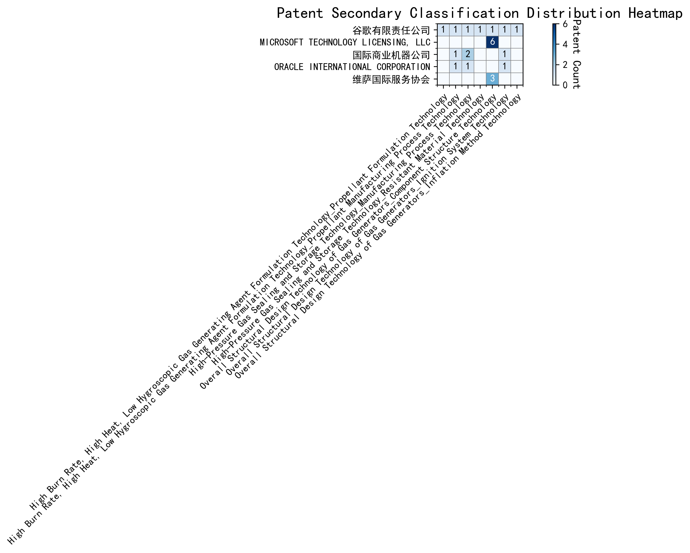

## (1) Patent Application Trend Analysis

The patent application trend in the field shows a significant increase from 2007 to 2020, followed by a decline from 2021 onwards. Chinese patent applications dominate the overall trend, with a sharp rise starting in 2017 and peaking in 2020. Foreign applications, particularly from the US, remain relatively low but show some fluctuations. The global trend mirrors the Chinese trend, indicating China's growing influence in this technology area.
### (1)Initial Development Period (2007-2016)

During the initial development period, patent applications in the field of machine learning and data processing were minimal and sporadic. Both China and the United States had a few applications, indicating early-stage exploration in this technology domain. The US applications focused on distributed systems and cross-validation frameworks, while Chinese applications emphasized unsupervised and supervised learning techniques. This period reflects the foundational phase of technological development, with limited but significant contributions from both countries.

EMC IP Holding Company LLC from the US proposed a general framework for cross-validation of machine learning algorithms using SQL on distributed systems, highlighting the importance of distributed computing in machine learning. Fuji Xerox Co., Ltd. from China introduced a data processing device and method that combined unsupervised and supervised learning, focusing on dimensionality reduction and mapping relationships between data sets. Internal Sales Company from China developed an instance-weighted learning (IWL) machine learning model, which emphasized the quality of training instances and their impact on classifier training. These innovations represent the early technical routes in machine learning, with EMC focusing on distributed validation, Fuji Xerox on data processing and learning techniques, and Internal Sales Company on weighted learning models. The Chinese applicants demonstrated a strong emphasis on learning methodologies and data processing, while the US applicant focused on system-level frameworks for machine learning validation.

### (2)Rapid Growth Period (2017-2020)

During the rapid growth period, China emerged as the dominant force in patent applications, significantly driving the global trend. The number of Chinese patent applications surged from 7 in 2017 to 32 in 2020, indicating a strong focus on technological development and innovation. In contrast, the United States showed a more modest increase, with patent applications rising from 1 in 2017 to 8 in 2020. This period marked a clear shift in technological leadership, with China taking the lead in innovation, particularly in the field of machine learning and artificial intelligence.

The top five applicants during this period demonstrated distinct technical routes in their patent applications. Google LLC (China) focused heavily on unsupervised and semi-supervised learning techniques, with patents like CN113826125A and CN116134453A emphasizing data augmentation and federated learning. Microsoft Technology Licensing, LLC (US) concentrated on adversarial pretraining and reinforcement learning, as seen in patents US11803758B2 and US20210326751A, which introduced noise-adjusted representations and self-supervised learning processes. IBM (China) explored fairness improvement in supervised learning through reinforcement learning, as highlighted in CN113692594A, and data anonymization techniques in CN112005255B. Visa International Service Association (China) prioritized privacy-preserving unsupervised learning, with patents like CN114730389B and CN116756602A focusing on secure distance computation and cluster identification. HRL Laboratories, LLC (US) developed methods for understanding machine-learning decisions based on camera data, as evidenced by US20180293464A1, which involved clustering latent variables and organizing concepts into networks. Overall, Chinese applicants like Google LLC and IBM showcased significant innovation in unsupervised learning and fairness improvement, while US applicants like Microsoft and HRL Laboratories focused on adversarial training and decision understanding, respectively.

### (3)Decline and Stabilization Period (2021-2024)

During the decline and stabilization period, both Chinese and global patent applications decreased significantly after peaking in 2020. The US maintained a low but steady number of applications, indicating a stabilization or saturation in the technology's development. This trend suggests that the technology may have reached a mature stage, with fewer new innovations being introduced. The decline in Chinese applications could reflect a shift in focus or resource allocation, while the US's steady numbers indicate continued, albeit limited, interest in refining existing technologies.

The top 5 applicants during this period demonstrate diverse technical routes in machine learning and AI. Oracle International Corporation focused on unsupervised machine learning models and chatbot systems for defining machine learning solutions, emphasizing efficiency and user accessibility. Microsoft Technology Licensing, LLC explored adversarial pretraining and reinforcement learning with sub-goal based shaped reward functions, aiming to enhance model robustness and training efficiency. South China University of Technology (华南理工大学) developed methods combining reinforcement and unsupervised learning for robot skill acquisition and online label updating, highlighting innovation in practical applications. Capital One Services, LLC utilized deep reinforcement learning for dynamic content selection based on real-time events, showcasing advanced predictive capabilities. DataTang (数据堂(北京)科技股份有限公司) concentrated on data annotation methods using unsupervised, weak, and semi-supervised learning, significantly reducing manual annotation costs and improving efficiency. Chinese research institutions, particularly South China University of Technology, stood out for their innovative approaches to integrating multiple learning paradigms, demonstrating a strong focus on practical, real-world applications and efficiency improvements.

## 2. Patent Applicant Analysis Report

### (1) Patent Applicant Ranking Analysis

The patent applicant ranking analysis reveals that **谷歌有限责任公司 (Google LLC)** leads with a total of 7 patents, all filed in China (CN). Following closely is **MICROSOFT TECHNOLOGY LICENSING, LLC**, with 6 patents distributed across the United States (US) and the World Intellectual Property Organization (WO). **国际商业机器公司 (IBM)** ranks third with 4 patents, all filed in China. **ORACLE INTERNATIONAL CORPORATION** and **维萨国际服务协会 (Visa International Service Association)** share the fourth position, each holding 3 patents, with Oracle’s patents filed in the US and Visa’s in China. This ranking highlights the dominance of tech giants in patent filings, particularly in China and the US, reflecting their strategic focus on these key markets.

  
*Figure 1: Patent Applicant Ranking Bar Chart*

### (2) Patent Applicant Technical Distribution

The technology distribution analysis uncovers distinct focus areas among the major applicants. **谷歌有限责任公司 (Google LLC)** demonstrates a diversified portfolio, with patents spanning multiple categories, including **High-Pressure Gas Sealing and Storage Technology** and **Overall Structural Design Technology of Gas Generators**. Notably, **MICROSOFT TECHNOLOGY LICENSING, LLC** concentrates exclusively on **Overall Structural Design Technology of Gas Generators-Component Structure Technology**, accounting for all 6 of its patents. **国际商业机器公司 (IBM)** shows a balanced approach, with significant contributions to **High-Pressure Gas Sealing and Storage Technology** and **Propellant Manufacturing Process Technology**. **ORACLE INTERNATIONAL CORPORATION** and **维萨国际服务协会 (Visa International Service Association)** exhibit narrower focuses, with Oracle emphasizing **High-Pressure Gas Sealing and Storage Technology** and Visa solely targeting **Component Structure Technology**. This analysis underscores the varying strategic priorities and technological specializations of these companies.

  
*Figure 2: Patent Applicant Technology Distribution Heatmap*

### (3) Patent Applicant Technical Layout Analysis

#### **1. 谷歌有限责任公司 (Google LLC)**

**Introduction:**
谷歌有限责任公司 (Google LLC) is a global technology leader renowned for its innovations in search engines, cloud computing, and artificial intelligence. With a mission to organize the world's information and make it universally accessible, Google has consistently invested in cutting-edge technologies across multiple domains. Its R&D philosophy emphasizes scalability, efficiency, and user-centric solutions, driving advancements in machine learning, data processing, and automation.

**Technology Distribution and Focus:**
Google's patent portfolio reflects a diverse yet focused technology distribution. Key areas include:
- **High-Pressure Gas Sealing and Storage Technology:** With 2 patents, this area highlights Google's focus on advanced storage solutions, likely supporting its data center infrastructure.
- **Propellant Formulation and Manufacturing Process Technology:** Google holds 1 patent each in these areas, indicating a strategic interest in materials science and manufacturing efficiency.
- **Component Structure Technology and Ignition System Technology:** Each with 1 patent, these areas suggest innovations in structural design and energy-efficient systems.

Google's technology focus aligns with its broader goals of enhancing operational efficiency and sustainability, particularly in its data center and hardware divisions.

**Innovation Focus and Key Achievements:**
Google's innovations in machine learning and data augmentation are particularly noteworthy. Key technical achievements include:
- **Problem:** Improving machine learning model accuracy with limited labeled data.  
  **Solution:** Unsupervised data augmentation techniques (CN113826125A).  
  **Benefit:** Enhanced model performance on perception tasks like vision and speech.  
- **Problem:** Reducing the cost of labeling large datasets.  
  **Solution:** Active learning through sample consistency evaluation (CN114600117A).  
  **Benefit:** Efficient use of labeled data, minimizing manual labeling efforts.  
- **Problem:** Training machine learning models in federated settings without labeled data.  
  **Solution:** Unsupervised federated learning (CN116134453A).  
  **Benefit:** Effective combination of global and local model layers for improved predictions.  

**Conclusion:**
Google's patent portfolio underscores its leadership in machine learning and data processing. By addressing critical challenges in model training and data efficiency, Google continues to drive innovation in AI and related technologies, solidifying its position as a global technology pioneer.

---

#### **2. Microsoft Technology Licensing, LLC**

**Introduction:**
Microsoft Technology Licensing, LLC, a subsidiary of Microsoft, specializes in technology licensing and development. With a focus on open-source technologies and collaborative development, Microsoft has established itself as a leader in software innovation. Its R&D efforts emphasize modularity, scalability, and interoperability, enabling seamless integration across diverse platforms.

**Technology Distribution and Focus:**
Microsoft's patent activity is heavily concentrated in **Component Structure Technology**, with 6 patents. This focus aligns with its commitment to developing modular, scalable software components that enhance interoperability and efficiency. Other areas, such as Propellant Formulation and Ignition System Technology, show minimal activity, reflecting Microsoft's primary focus on software and systems integration.

**Innovation Focus and Key Achievements:**
Microsoft's innovations in machine learning and reinforcement learning are particularly impactful. Key achievements include:
- **Problem:** Improving robustness and generalization of machine learning models.  
  **Solution:** Adversarial pretraining by adding noise to representations (US11803758B2).  
  **Benefit:** Enhanced model performance in adversarial conditions.  
- **Problem:** Optimizing reinforcement learning model configurations.  
  **Solution:** Sub-goal based shaped reward functions (WO2021221801A1).  
  **Benefit:** Better alignment of model configurations with training objectives.  
- **Problem:** Enhancing efficiency of reinforcement learning processes.  
  **Solution:** Selective regularization in reinforcement learning policies (US11526812B2).  
  **Benefit:** Improved policy updates and task execution.  

**Conclusion:**
Microsoft's patent portfolio highlights its leadership in software and machine learning innovation. By focusing on modularity and efficiency, Microsoft continues to drive advancements in AI and software development, reinforcing its position as a global technology leader.

---

#### **3. International Business Machines Corporation (IBM)**

**Introduction:**
International Business Machines Corporation (IBM) is a pioneer in computing and technology, with a strong focus on AI, cloud computing, and semiconductor technologies. IBM's R&D efforts are driven by a commitment to solving complex global challenges through innovation, particularly in high-performance computing and advanced manufacturing.

**Technology Distribution and Focus:**
IBM's patent portfolio is concentrated in:
- **High-Pressure Gas Sealing and Storage Technology:** With 2 patents, this area reflects IBM's expertise in advanced storage solutions.
- **Manufacturing Process Technology:** Also with 2 patents, this area highlights IBM's focus on optimizing production processes, particularly in semiconductor manufacturing.
- **Propellant Manufacturing Process Technology and Ignition System Technology:** Each with 1 patent, these areas suggest strategic investments in aerospace and automotive technologies.

**Innovation Focus and Key Achievements:**
IBM's innovations in AI and data anonymization are particularly notable. Key achievements include:
- **Problem:** Bias in supervised machine learning models.  
  **Solution:** Linking supervised models to reinforcement learning meta-models (CN113692594A).  
  **Benefit:** Improved fairness values in model predictions.  
- **Problem:** Privacy concerns in data sharing.  
  **Solution:** Hierarchical random anonymization using machine learning (CN112005255B).  
  **Benefit:** Enhanced confidence in data anonymization effectiveness.  
- **Problem:** Lack of interpretability in reinforcement learning actions.  
  **Solution:** Using occupancy measures to identify relevant features (CN112488307A).  
  **Benefit:** Improved interpretability of model decisions.  

**Conclusion:**
IBM's patent portfolio demonstrates its leadership in AI and advanced manufacturing. By addressing critical challenges in fairness, privacy, and interpretability, IBM continues to drive innovation in high-performance computing and AI, maintaining its position as a global technology leader.

---

#### **4. Oracle International Corporation**

**Introduction:**
Oracle International Corporation is a global leader in enterprise software and cloud solutions. With a focus on innovation and efficiency, Oracle has developed a robust portfolio of technologies that optimize production processes, enhance data management, and drive advancements in AI and machine learning.

**Technology Distribution and Focus:**
Oracle's patent activity is concentrated in:
- **Manufacturing Process Technology and Propellant Manufacturing Process Technology:** Each with 1 patent, reflecting Oracle's focus on optimizing production processes.
- **Ignition System Technology:** Also with 1 patent, this area suggests strategic investments in energy-efficient systems.

**Innovation Focus and Key Achievements:**
Oracle's innovations in AI and natural language processing are particularly impactful. Key achievements include:
- **Problem:** Lack of expertise in machine learning among users.  
  **Solution:** Chatbots for generating machine learning systems (US20230237348A1).  
  **Benefit:** Enables non-experts to develop and train machine learning models.  
- **Problem:** Inefficiency in selecting optimal machine learning models.  
  **Solution:** Sparse ensembling of unsupervised models (US12020131B2).  
  **Benefit:** Reduces computational resources without compromising accuracy.  
- **Problem:** Complexity in translating natural language inputs into machine learning solutions.  
  **Solution:** Ontology-based translation of natural language inputs (US11847578B2).  
  **Benefit:** Simplifies the creation of machine learning solutions.  

**Conclusion:**
Oracle's patent portfolio highlights its leadership in AI and enterprise software. By focusing on accessibility and efficiency, Oracle continues to drive innovation in machine learning and data management, reinforcing its position as a global technology leader.

---

#### **5. 维萨国际服务协会 (Visa International Service Association)**

**Introduction:**
维萨国际服务协会 (Visa International Service Association) is a global leader in digital payments, dedicated to building secure, efficient, and scalable payment ecosystems. Visa's R&D efforts focus on enhancing transaction security, improving data processing efficiency, and driving innovation in financial technologies.

**Technology Distribution and Focus:**
Visa's patent activity is concentrated in **Component Structure Technology**, with 3 patents. This focus reflects Visa's commitment to developing secure and efficient payment processing systems. Other areas, such as Propellant Formulation and Ignition System Technology, show minimal activity, aligning with Visa's primary focus on financial technologies.

**Innovation Focus and Key Achievements:**
Visa's innovations in privacy-preserving machine learning and GPU-accelerated processing are particularly noteworthy. Key achievements include:
- **Problem:** Privacy leakage in unsupervised learning.  
  **Solution:** N-out-of-1 Oblivious Transfer for secure distance computation (CN114730389B).  
  **Benefit:** Enhanced privacy protection and scalability.  
- **Problem:** Inefficiency in large-scale data processing.  
  **Solution:** GPU-accelerated unsupervised learning (CN110869943A).  
  **Benefit:** Improved computational efficiency.  
- **Problem:** Scalability issues in machine learning models.  
  **Solution:** Privacy-preserving unsupervised learning with lxN matrices (CN116756602A).  
  **Benefit:** Increased scalability and efficiency.  

**Conclusion:**
Visa's patent portfolio underscores its leadership in secure and efficient payment technologies. By addressing critical challenges in privacy and scalability, Visa continues to drive innovation in financial technologies, maintaining its position as a global leader in digital payments.