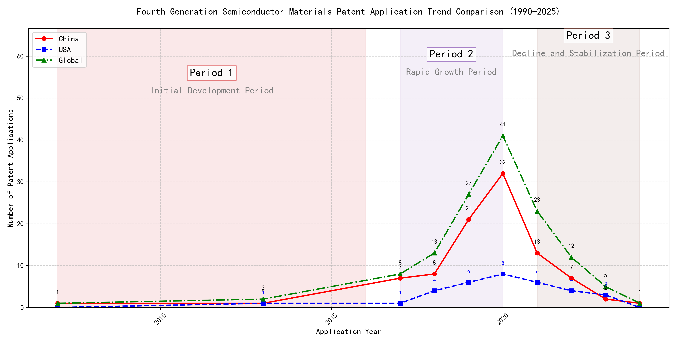

## (1) Patent Application Trend Analysis

The patent application trend in the field shows a significant increase from 2007 to 2020, followed by a decline from 2021 onwards. Chinese patent applications dominate the overall trend, with a sharp rise starting in 2017 and peaking in 2020. Foreign applications, particularly from the US, remain relatively low but show some fluctuations. The global trend mirrors the Chinese trend, indicating China's growing influence in this technology area.
### (1)Initial Development Period (2007-2016)

During the initial development period, patent applications in the field of machine learning and data processing were minimal and sporadic. Both China and the United States had a few applications, indicating early-stage exploration in this technology domain. The US applications focused on distributed systems and cross-validation frameworks, while Chinese applications emphasized unsupervised and supervised learning techniques. This period reflects the foundational phase of technological development, with limited but significant contributions from both countries.

EMC IP Holding Company LLC from the US proposed a general framework for cross-validation of machine learning algorithms using SQL on distributed systems, highlighting the importance of distributed computing in machine learning. Fuji Xerox Co., Ltd. from China introduced a data processing device and method that combined unsupervised and supervised learning, focusing on dimensionality reduction and mapping relationships between data sets. Internal Sales Company from China developed an instance-weighted learning (IWL) machine learning model, which emphasized the quality of training instances and their impact on classifier training. These innovations represent the early technical routes in machine learning, with EMC focusing on distributed validation, Fuji Xerox on data processing and learning techniques, and Internal Sales Company on weighted learning models. The Chinese applicants demonstrated a strong emphasis on learning methodologies and data processing, while the US applicant focused on system-level frameworks for machine learning validation.

### (2)Rapid Growth Period (2017-2020)

During the rapid growth period, China emerged as the dominant force in patent applications, significantly driving the global trend. The number of Chinese patent applications surged from 7 in 2017 to 32 in 2020, indicating a strong focus on technological development and innovation. In contrast, the United States showed a more modest increase, with patent applications rising from 1 in 2017 to 8 in 2020. This period marked a clear shift in technological leadership, with China taking the lead in innovation, particularly in the field of machine learning and artificial intelligence.

The top five applicants during this period demonstrated distinct technical routes in their patent applications. Google LLC (China) focused heavily on unsupervised and semi-supervised learning techniques, with patents like CN113826125A and CN116134453A emphasizing data augmentation and federated learning. Microsoft Technology Licensing, LLC (US) concentrated on adversarial pretraining and reinforcement learning, as seen in patents US11803758B2 and US20210326751A, which introduced noise-adjusted representations and self-supervised learning processes. IBM (China) explored fairness improvement in supervised learning through reinforcement learning, as highlighted in CN113692594A, and data anonymization techniques in CN112005255B. Visa International Service Association (China) prioritized privacy-preserving unsupervised learning, with patents like CN114730389B and CN116756602A focusing on secure distance computation and cluster identification. HRL Laboratories, LLC (US) developed methods for understanding machine-learning decisions based on camera data, as evidenced by US20180293464A1, which involved clustering latent variables and organizing concepts into networks. Overall, Chinese applicants like Google LLC and IBM showcased significant innovation in unsupervised learning and fairness improvement, while US applicants like Microsoft and HRL Laboratories focused on adversarial training and decision understanding, respectively.

### (3)Decline and Stabilization Period (2021-2024)

During the decline and stabilization period, both Chinese and global patent applications decreased significantly after peaking in 2020. The US maintained a low but steady number of applications, indicating a stabilization or saturation in the technology's development. This trend suggests that the technology may have reached a mature stage, with fewer new innovations being introduced. The decline in Chinese applications could reflect a shift in focus or resource allocation, while the US's steady numbers indicate continued, albeit limited, interest in refining existing technologies.

The top 5 applicants during this period demonstrate diverse technical routes in machine learning and AI. Oracle International Corporation focused on unsupervised machine learning models and chatbot systems for defining machine learning solutions, emphasizing efficiency and user accessibility. Microsoft Technology Licensing, LLC explored adversarial pretraining and reinforcement learning with sub-goal based shaped reward functions, aiming to enhance model robustness and training efficiency. South China University of Technology (华南理工大学) developed methods combining reinforcement and unsupervised learning for robot skill acquisition and online label updating, highlighting innovation in practical applications. Capital One Services, LLC utilized deep reinforcement learning for dynamic content selection based on real-time events, showcasing advanced predictive capabilities. DataTang (数据堂(北京)科技股份有限公司) concentrated on data annotation methods using unsupervised, weak, and semi-supervised learning, significantly reducing manual annotation costs and improving efficiency. Chinese research institutions, particularly South China University of Technology, stood out for their innovative approaches to integrating multiple learning paradigms, demonstrating a strong focus on practical, real-world applications and efficiency improvements.

