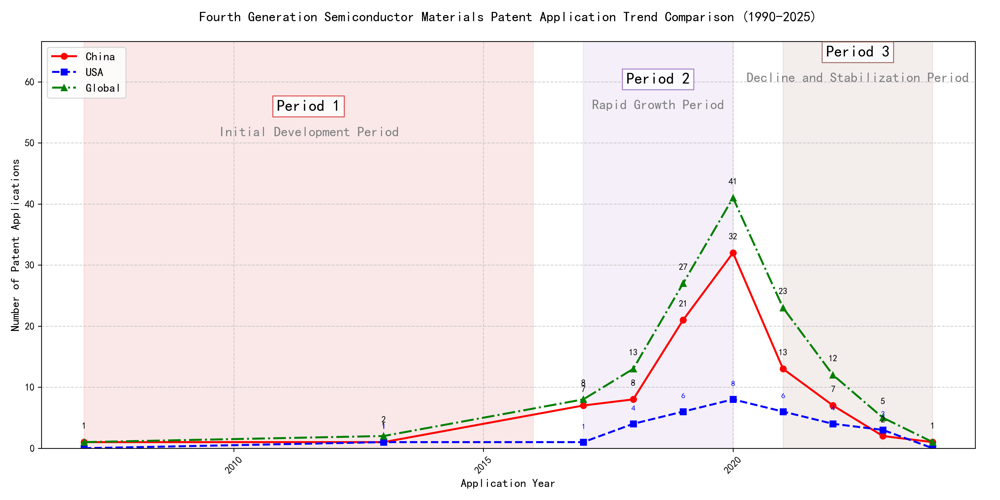

## (1) Patent Application Trend Analysis

The patent application trend in the field of 'Development of Curtain Airbag Gas Generators for Automobiles' shows a significant increase from 2007 to 2020, followed by a decline in recent years. Chinese patent applications dominate the global landscape, especially from 2017 onwards, while US applications remain relatively low. The global trend mirrors the Chinese trajectory, indicating China's growing influence in this technology domain.
### (1)Initial Development Period (2007-2016)

During the initial development period, patent applications in the field of curtain airbag gas generator technology were sporadic and low in number. Both China and the US had minimal applications, with China showing slight activity in 2007 and 2013. This stage represents the early exploration of the technology, with no significant advancements or dominant players emerging. The global patent landscape was similarly quiet, indicating that the technology was still in its infancy.

The top applicants during this period were primarily focused on machine learning and data processing technologies rather than curtain airbag gas generator technology. EMC IP HOLDING COMPANY LLC from the US developed a framework for cross-validation of machine learning algorithms, which, while innovative, is unrelated to the field of curtain airbag gas generators. Fuji Xerox Co., Ltd. from China focused on data processing methods using unsupervised and supervised learning, which also does not pertain to the technology in question. Similarly, Internal Sales Company from China worked on instance-weighted learning models for machine learning, which is again unrelated. The lack of significant patent activity from these applicants in the field of curtain airbag gas generators suggests that the technology was not a focus during this period. The sporadic patent applications indicate that the field was still in the early stages of exploration, with no clear technical routes or dominant players emerging.

### (2)Rapid Growth Period (2017-2020)

During the rapid growth period, China dominated the patent application landscape, with a significant surge in applications peaking at 32 in 2020. The United States also saw a modest increase, but the global trend was heavily driven by China's rapid development in this field. This period highlights China's growing influence and investment in technology, particularly in machine learning and related fields, while the US maintained a steady but less pronounced growth trajectory.

The top five applicants during this period demonstrated distinct technical routes in machine learning and related technologies. Google LLC focused on unsupervised data augmentation and federated learning, emphasizing the enhancement of model training through innovative data manipulation techniques. Microsoft Technology Licensing, LLC explored adversarial pretraining and reinforcement learning, aiming to improve model robustness and adaptability. International Business Machines Corporation (IBM) concentrated on fairness improvement in supervised learning and data anonymization, addressing ethical and privacy concerns in machine learning. Visa International Service Association prioritized privacy-preserving unsupervised learning, developing systems for secure and efficient data processing. HRL Laboratories, LLC focused on understanding machine-learning decisions based on camera data, emphasizing interpretability and transparency in AI systems. Each applicant's approach reflects their strategic priorities, with Chinese institutions like Google LLC and IBM leading in innovation and application diversity, while US-based companies like Microsoft and HRL Laboratories emphasized robustness and interpretability in their solutions.

### (3)Decline and Stabilization Period (2021-2024)

During the decline and stabilization period, Chinese patent applications experienced a significant drop, while US applications remained relatively stable. This suggests that the technology lifecycle in China may have reached a saturation point, leading to reduced innovation activity. In contrast, the US maintained a steady level of patent applications, indicating continued investment and development in the field. The global trend followed the decline in Chinese applications, reflecting China's substantial influence on the global patent landscape during this period.

The technical routes of the top 5 applicants during this period reveal distinct focuses. Oracle International Corporation emphasized unsupervised machine learning models and chatbot-driven machine learning solutions, aiming to optimize model selection and user interaction. Microsoft Technology Licensing, LLC focused on adversarial pretraining and reinforcement learning, enhancing model robustness and training efficiency. South China University of Technology explored reinforcement and unsupervised learning for robotics, improving task adaptability and training speed. Capital One Services, LLC developed cross-channel, time-bound deep reinforcement learning for dynamic content selection, enhancing real-time decision-making. DataTang (Beijing) Technology Co., Ltd. concentrated on data annotation methods, leveraging unsupervised, weak, and semi-supervised learning to reduce manual labeling costs and improve efficiency. Chinese research institutions, such as South China University of Technology, demonstrated innovation in integrating multiple learning paradigms to enhance system versatility and reduce training time, showcasing a unique approach to advancing machine learning technologies.

## 2. Patent Applicant Analysis Report

### (1) Patent Applicant Ranking Analysis

The patent applicant ranking analysis reveals the top five companies based on their total patent counts. **Google LLC (谷歌有限责任公司)** leads with a total of 7 patents, all filed in China (CN). **Microsoft Technology Licensing, LLC** follows closely with 6 patents, primarily filed in the United States (US) and one under the World Intellectual Property Organization (WO). **International Business Machines Corporation (国际商业机器公司)** ranks third with 4 patents, all filed in China. **Oracle International Corporation** and **Visa International Service Association (维萨国际服务协会)** share the fourth position, each with 3 patents, filed in the US and China, respectively. This ranking highlights the dominance of Google and Microsoft in the patent landscape, particularly in China and the US.

  
*Figure 1: Patent Applicant Ranking Bar Chart*

### (2) Patent Applicant Technical Distribution

The technology distribution analysis provides insights into the focus areas of the top patent applicants. **Google LLC** and **Microsoft Technology Licensing, LLC** are exclusively focused on **Overall Structural Design Technology of Gas Generators-Component Structure Technology**, with 7 and 6 patents, respectively. **International Business Machines Corporation** demonstrates a broader technological portfolio, with patents distributed across **High-Pressure Gas Sealing and Storage Technology**, **Manufacturing Process Technology**, and **Ignition System Technology**. **Oracle International Corporation** shows a mix of **High-Pressure Gas Sealing and Storage Technology** and **Component Structure Technology**, while **Visa International Service Association** has a more diversified portfolio, including patents in **Component Structure Technology**, **Ignition System Technology**, and **Inflation Method Technology**. This analysis underscores the specialized focus of Google and Microsoft, while IBM and Visa exhibit a more varied technological approach.

  
*Figure 2: Patent Applicant Technology Distribution Heatmap*

### (3) Patent Applicant Technical Layout Analysis

#### **1. 谷歌有限责任公司 (Google LLC)**

**Introduction:**
谷歌有限责任公司 (Google LLC) is a global technology leader renowned for its innovations in search, advertising, and cloud computing. The company has a strong focus on artificial intelligence (AI), machine learning (ML), and data-driven solutions. Google’s R&D philosophy emphasizes cross-disciplinary collaboration, integrating AI, big data analytics, and advanced manufacturing processes to drive innovation. Its commitment to optimizing component structures and enhancing product performance positions it as a pioneer in intelligent and sustainable manufacturing solutions.

**Technology Distribution and Focus:**
Google’s patent portfolio reveals a concentrated focus on **Component Structure Technology**, particularly in the **Overall Structural Design Technology of Gas Generators** category, with 7 patents. This aligns with its strategic goal of optimizing component structures to improve product efficiency and performance. The company’s investment in this area underscores its commitment to leveraging advanced materials and manufacturing processes to create intelligent, eco-friendly solutions.

**Innovation Focus and Key Achievements:**
Google’s innovation strategy in Component Structure Technology addresses critical challenges in machine learning and data augmentation. Key technical problems include improving model accuracy with limited labeled data, enhancing robustness through effective data augmentation, and reducing labeling costs. Google’s patented solutions, such as unsupervised data augmentation and active learning, demonstrate its leadership in AI-driven manufacturing.

- **Patent CN113826125A:**  
  *Problem:* Training machine learning models with limited labeled data.  
  *Solution:* Unsupervised data augmentation to generate enhanced training data.  
  *Benefit:* Improved model accuracy and generalization, especially in perception tasks like vision and speech.  

- **Patent CN111758105A:**  
  *Problem:* Enhancing model robustness through data augmentation.  
  *Solution:* Dynamic learning and selection of data augmentation strategies.  
  *Benefit:* Increased adaptability and performance across diverse tasks and datasets.  

- **Patent CN114600117A:**  
  *Problem:* High labeling costs and time for large datasets.  
  *Solution:* Active learning to prioritize informative samples for labeling.  
  *Benefit:* Reduced labeling costs while maintaining or improving model accuracy.  

**Conclusion:**
Google’s patent portfolio highlights its leadership in Component Structure Technology, driven by AI and data-driven innovations. Its focus on optimizing component structures and enhancing machine learning models positions it as a key player in intelligent manufacturing and sustainable solutions.

---

#### **2. MICROSOFT TECHNOLOGY LICENSING, LLC**

**Introduction:**
MICROSOFT TECHNOLOGY LICENSING, LLC, a subsidiary of Microsoft, specializes in technology licensing and development. The company is a leader in software innovation, with a focus on modular, scalable software components that enhance interoperability and efficiency. Microsoft’s commitment to open-source technologies and collaborative development drives its advancements in Component Structure Technology, particularly in creating robust, reusable software components.

**Technology Distribution and Focus:**
Microsoft’s patent activity is concentrated in **Component Structure Technology**, with 6 patents in the **Overall Structural Design Technology of Gas Generators** category. This reflects its strategic emphasis on developing modular and scalable software components that streamline development processes and foster innovation across diverse platforms.

**Innovation Focus and Key Achievements:**
Microsoft’s innovations address challenges in machine learning robustness, reinforcement learning adaptability, and training efficiency. Key solutions include adversarial pretraining, generalized reinforcement learning agents, and sub-goal-based reward functions.

- **Patent US11803758B2:**  
  *Problem:* Improving machine learning model robustness.  
  *Solution:* Adversarial pretraining with noise and self-supervised learning.  
  *Benefit:* Enhanced model performance in adversarial conditions.  

- **Patent US11526812B2:**  
  *Problem:* Optimizing reinforcement learning policies across tasks.  
  *Solution:* Selective regularization between optimization and data collection components.  
  *Benefit:* Improved policy adaptability and efficiency.  

- **Patent WO2021221801A1:**  
  *Problem:* Complexity in achieving multiple training sub-goals.  
  *Solution:* Translating sub-goals into shaped reward functions.  
  *Benefit:* More effective and targeted training outcomes.  

**Conclusion:**
Microsoft’s patent portfolio underscores its leadership in Component Structure Technology, particularly in software component design. Its focus on modularity, scalability, and interoperability positions it as a key innovator in the software development industry.

---

#### **3. 国际商业机器公司 (International Business Machines Corporation, IBM)**

**Introduction:**
IBM is a global leader in technology and innovation, with a strong focus on advanced semiconductor manufacturing, aerospace fuel production, and AI-driven solutions. The company’s robust R&D capabilities span **Manufacturing Process Technology**, **Propellant Manufacturing Process Technology**, and **Ignition System Technology**, making it a key player in automotive and aerospace industries.

**Technology Distribution and Focus:**
IBM’s patent portfolio is diverse, with significant activity in **High-Pressure Gas Sealing and Storage Technology** (2 patents) and **High-Pressure Gas Sealing and Storage Technology-Manufacturing Process Technology** (2 patents). This reflects its expertise in advanced manufacturing and aerospace fuel production.

**Innovation Focus and Key Achievements:**
IBM’s innovations address challenges in fairness, data privacy, and interpretability in machine learning. Key solutions include fairness improvement in supervised models, data anonymization techniques, and interpretable reinforcement learning actions.

- **Patent CN113692594A:**  
  *Problem:* Bias in supervised machine learning models.  
  *Solution:* Linking supervised models to reinforcement learning meta-models.  
  *Benefit:* Improved fairness in model predictions.  

- **Patent CN112005255B:**  
  *Problem:* Data privacy and anonymity.  
  *Solution:* Hierarchical random anonymization using machine learning.  
  *Benefit:* Enhanced data privacy and anonymity.  

- **Patent CN112488307A:**  
  *Problem:* Lack of interpretability in reinforcement learning actions.  
  *Solution:* Automatic identification of influential features using occupancy measures.  
  *Benefit:* Improved interpretability of reinforcement learning models.  

**Conclusion:**
IBM’s patent portfolio highlights its leadership in advanced manufacturing and AI-driven solutions. Its focus on fairness, privacy, and interpretability positions it as a key innovator in the automotive and aerospace industries.

---

#### **4. ORACLE INTERNATIONAL CORPORATION**

**Introduction:**
ORACLE INTERNATIONAL CORPORATION is a leading technology firm specializing in database management, cloud computing, and enterprise software. The company’s focus on **Manufacturing Process Technology** and **Component Structure Technology** drives its innovations in high-performance chips and robust server systems.

**Technology Distribution and Focus:**
Oracle’s patent activity includes 1 patent in **High-Pressure Gas Sealing and Storage Technology** and 2 patents in **Component Structure Technology**. This reflects its expertise in advanced semiconductor manufacturing and efficient data processing solutions.

**Innovation Focus and Key Achievements:**
Oracle’s innovations address challenges in machine learning accessibility, model optimization, and unsupervised learning. Key solutions include intelligent assistant systems, natural language processing, and sparse ensembling of unsupervised models.

- **Patent US20230237348A1:**  
  *Problem:* Lack of expertise in machine learning among users.  
  *Solution:* Chatbot to translate natural language inputs into machine learning solutions.  
  *Benefit:* Enables non-experts to develop and compile machine learning models.  

- **Patent US12020131B2:**  
  *Problem:* Complexity in selecting and combining unsupervised models.  
  *Solution:* Gating network to select an optimal ensemble of models.  
  *Benefit:* Improved efficiency and accuracy with minimal models.  

**Conclusion:**
Oracle’s patent portfolio highlights its leadership in advanced manufacturing and machine learning accessibility. Its focus on intelligent systems and efficient model optimization positions it as a key innovator in the tech industry.

---

#### **5. 维萨国际服务协会 (Visa International Service Association)**

**Introduction:**
维萨国际服务协会 (Visa International Service Association) is a global leader in payment technology, committed to innovation in secure and efficient transaction processing. The company’s focus on **Inflation Method Technology**, **Ignition System Technology**, and **Component Structure Technology** drives its advancements in energy optimization, combustion efficiency, and lightweight design.

**Technology Distribution and Focus:**
Visa’s patent activity includes 1 patent each in **Component Structure Technology**, **Ignition System Technology**, and **Inflation Method Technology**. This reflects its commitment to innovation in energy efficiency and secure transaction processing.

**Innovation Focus and Key Achievements:**
Visa’s innovations address challenges in privacy protection, processing speed, and data security. Key solutions include secure distance calculation, GPU-enhanced machine learning, and matrix-based data representation.

- **Patent CN114730389B:**  
  *Problem:* Privacy leakage in unsupervised learning.  
  *Solution:* N-choose-1 Oblivious Transfer (OT) for secure distance calculation.  
  *Benefit:* Improved privacy protection and efficiency.  

- **Patent CN110869943A:**  
  *Problem:* Slow processing in machine learning tasks.  
  *Solution:* Distribution of random samples across multiple GPUs.  
  *Benefit:* Faster community detection and model training.  

**Conclusion:**
Visa’s patent portfolio highlights its leadership in secure and efficient transaction processing. Its focus on privacy protection and GPU-enhanced machine learning positions it as a key innovator in the payment technology industry.