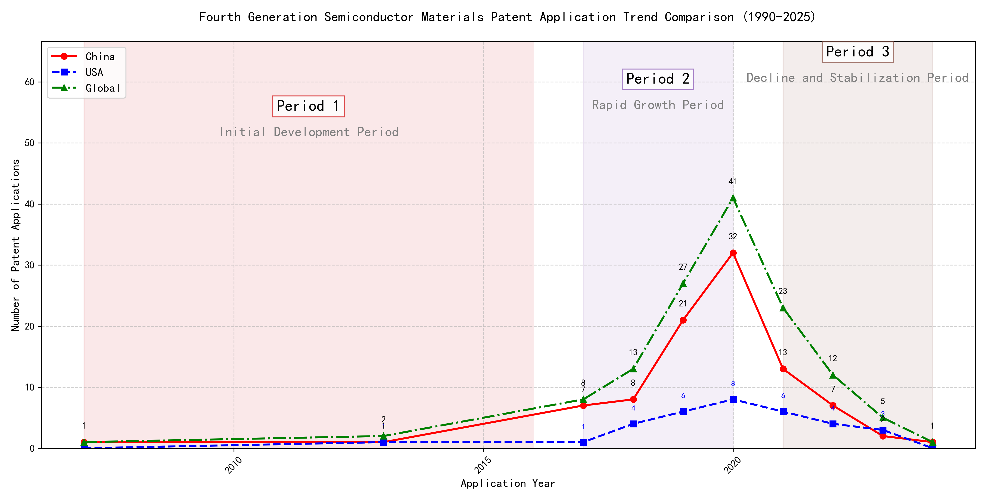

## (1) Patent Application Trend Analysis

The patent application trend in the field of 'Development of Curtain Airbag Gas Generators for Automobiles' shows a significant increase from 2007 to 2020, followed by a decline in recent years. Chinese patent applications dominate the global landscape, especially from 2017 onwards, while US applications remain relatively low. The global trend mirrors the Chinese trajectory, indicating China's growing influence in this technology domain.
### (1)Initial Development Period (2007-2016)

During the initial development period, patent applications in the field of curtain airbag gas generator technology were sporadic and low in number. Both China and the US had minimal applications, with China showing slight activity in 2007 and 2013. This stage represents the early exploration of the technology, with no significant advancements or dominant players emerging. The global patent landscape was similarly quiet, indicating that the technology was still in its infancy.

The top applicants during this period were primarily focused on machine learning and data processing technologies rather than curtain airbag gas generator technology. EMC IP HOLDING COMPANY LLC from the US developed a framework for cross-validation of machine learning algorithms, which, while innovative, is unrelated to the field of curtain airbag gas generators. Fuji Xerox Co., Ltd. from China focused on data processing methods using unsupervised and supervised learning, which also does not pertain to the technology in question. Similarly, Internal Sales Company from China worked on instance-weighted learning models for machine learning, which is again unrelated. The lack of significant patent activity from these applicants in the field of curtain airbag gas generators suggests that the technology was not a focus during this period. The sporadic patent applications indicate that the field was still in the early stages of exploration, with no clear technical routes or dominant players emerging.

### (2)Rapid Growth Period (2017-2020)

During the rapid growth period, China dominated the patent application landscape, with a significant surge in applications peaking at 32 in 2020. The United States also saw a modest increase, but the global trend was heavily driven by China's rapid development in this field. This period highlights China's growing influence and investment in technology, particularly in machine learning and related fields, while the US maintained a steady but less pronounced growth trajectory.

The top five applicants during this period demonstrated distinct technical routes in machine learning and related technologies. Google LLC focused on unsupervised data augmentation and federated learning, emphasizing the enhancement of model training through innovative data manipulation techniques. Microsoft Technology Licensing, LLC explored adversarial pretraining and reinforcement learning, aiming to improve model robustness and adaptability. International Business Machines Corporation (IBM) concentrated on fairness improvement in supervised learning and data anonymization, addressing ethical and privacy concerns in machine learning. Visa International Service Association prioritized privacy-preserving unsupervised learning, developing systems for secure and efficient data processing. HRL Laboratories, LLC focused on understanding machine-learning decisions based on camera data, emphasizing interpretability and transparency in AI systems. Each applicant's approach reflects their strategic priorities, with Chinese institutions like Google LLC and IBM leading in innovation and application diversity, while US-based companies like Microsoft and HRL Laboratories emphasized robustness and interpretability in their solutions.

### (3)Decline and Stabilization Period (2021-2024)

During the decline and stabilization period, Chinese patent applications experienced a significant drop, while US applications remained relatively stable. This suggests that the technology lifecycle in China may have reached a saturation point, leading to reduced innovation activity. In contrast, the US maintained a steady level of patent applications, indicating continued investment and development in the field. The global trend followed the decline in Chinese applications, reflecting China's substantial influence on the global patent landscape during this period.

The technical routes of the top 5 applicants during this period reveal distinct focuses. Oracle International Corporation emphasized unsupervised machine learning models and chatbot-driven machine learning solutions, aiming to optimize model selection and user interaction. Microsoft Technology Licensing, LLC focused on adversarial pretraining and reinforcement learning, enhancing model robustness and training efficiency. South China University of Technology explored reinforcement and unsupervised learning for robotics, improving task adaptability and training speed. Capital One Services, LLC developed cross-channel, time-bound deep reinforcement learning for dynamic content selection, enhancing real-time decision-making. DataTang (Beijing) Technology Co., Ltd. concentrated on data annotation methods, leveraging unsupervised, weak, and semi-supervised learning to reduce manual labeling costs and improve efficiency. Chinese research institutions, such as South China University of Technology, demonstrated innovation in integrating multiple learning paradigms to enhance system versatility and reduce training time, showcasing a unique approach to advancing machine learning technologies.

