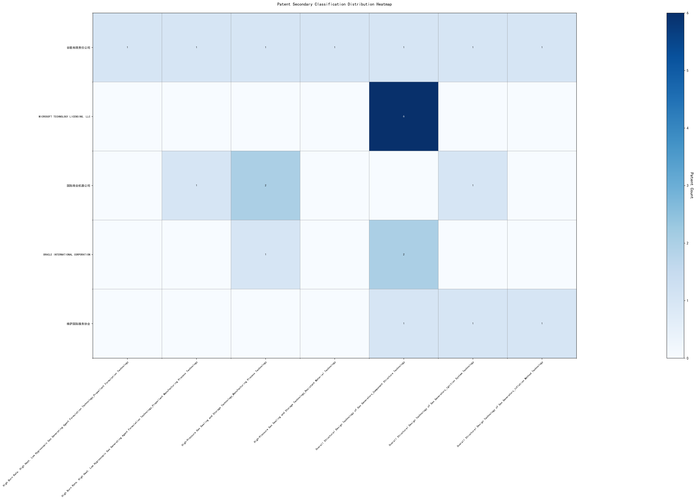

## (1) Patent Application Trend Analysis

The patent application trend analysis reveals a significant increase in patent applications globally, particularly from 2017 onwards. Chinese patent applications show a rapid growth trajectory, especially from 2017 to 2020, while US applications remain relatively stable with minor fluctuations. The global trend mirrors the growth in Chinese applications, indicating China's increasing influence in this technological field. The data suggests that the technology has entered a phase of rapid development and scaling, particularly in China.
### (1)Initial Development Period (2007-2013)

During the initial development period, patent applications in the field of machine learning and data processing were minimal globally, with only a few applications recorded. Both China and the US had very low application numbers, indicating the early stages of technological exploration and development. The US had one application in 2013, while China had one application in 2007 and another in 2013. This suggests that both countries were beginning to explore machine learning technologies, but the field was still in its infancy with limited innovation and application.

The top applicants during this period included EMC IP HOLDING COMPANY LLC, Fuji Xerox Co., Ltd., and Internal Sales Company. EMC IP HOLDING COMPANY LLC from the US focused on developing a general framework for cross-validation of machine learning algorithms using SQL on distributed systems, as seen in patent US9235813B1. This innovation aimed to improve the efficiency and accuracy of machine learning models by leveraging distributed database systems. Fuji Xerox Co., Ltd. from China proposed a data processing device and method in patent CN101206727B, which utilized unsupervised and supervised learning techniques to classify and map data sets, demonstrating an early exploration of machine learning applications in data processing. Internal Sales Company from China introduced an instance-weighted learning (IWL) machine learning model in patent CN104956359A, which emphasized the importance of quality values in training classifiers, showcasing a focus on enhancing the learning process through weighted instances. These innovations highlight the initial steps in machine learning technology development, with a focus on improving model accuracy, data processing efficiency, and learning methodologies.

### (2)Growth Period (2013-2017)

During the growth period, China began to show a significant increase in patent applications, indicating a shift towards more active research and development in the field of machine learning. The US also saw a steady number of applications, but the growth rate was not as pronounced as in China. This period marks the beginning of China's emergence as a key player in machine learning technology, with domestic institutions and companies driving innovation and development.

The top five applicants during this period demonstrate diverse technical routes in machine learning. Central South University focused on incremental machine learning methods based on transparent computing, emphasizing efficiency and accuracy through data splitting and feedback learning. Yuanhui Technology developed methods for training machine learning models across multiple tasks, ensuring performance across different tasks while maintaining efficiency. Tsinghua University introduced an automatic selection method for machine learning algorithms, leveraging historical data and preset coefficients to optimize algorithm performance. Xiamen Kuai Shang Tong Technology proposed an active learning method that combines supervised and unsupervised learning, reducing manual annotation workload while maintaining learning effectiveness. EMC IP Holding Company LLC in the US focused on a general framework for cross-validation of machine learning algorithms using SQL on distributed systems, emphasizing scalability and error minimization. Chinese institutions, particularly Central South University and Tsinghua University, highlighted innovation in efficiency and automation, while EMC focused on distributed system integration and cross-validation.

### (3)Rapid Development Period (2017-2020)

During the Rapid Development Period, China dominated the patent application landscape, with a significant surge in applications peaking in 2020. This period marked a phase of rapid technological advancement and scaling in China, particularly in the field of machine learning and artificial intelligence. In contrast, the United States also saw an increase in patent applications, but at a slower rate, indicating a more gradual development pace. The global trend reflects China's growing influence in technological innovation, with Chinese applications far outnumbering those from other countries.

The top five applicants during this period—谷歌有限责任公司, MICROSOFT TECHNOLOGY LICENSING, LLC, 国际商业机器公司, 维萨国际服务协会, and HRL LABORATORIES, LLC—demonstrated diverse technical routes in machine learning and AI. 谷歌有限责任公司 focused on unsupervised data augmentation and federated learning, emphasizing the enhancement of model training through data manipulation and distributed learning. MICROSOFT TECHNOLOGY LICENSING, LLC explored adversarial pretraining and reinforcement learning, aiming to improve model robustness and adaptability. 国际商业机器公司 concentrated on fairness improvement in supervised learning and data anonymization, addressing ethical and privacy concerns in AI. 维萨国际服务协会 developed privacy-preserving unsupervised learning systems, highlighting the importance of data security in collaborative learning environments. HRL LABORATORIES, LLC investigated methods for understanding machine-learning decisions based on camera data, focusing on interpretability and transparency in AI models. Chinese research institutions, particularly 谷歌有限责任公司 and 国际商业机器公司, showcased innovation in integrating advanced data processing techniques with ethical considerations, setting a benchmark for responsible AI development.

### (4)Stabilization Period (2020-2024)

During the stabilization period, both Chinese and US patent applications in the field of machine learning technologies experienced a decline, indicating a maturing phase of the technology. China maintained a higher number of applications compared to the US, reflecting its continued focus on innovation in this area. The global trend also showed a reduction in patent filings, suggesting a saturation point in the development of machine learning technologies. This period highlights a shift from rapid innovation to refinement and optimization of existing technologies.

The top five applicants during this period—谷歌有限责任公司, MICROSOFT TECHNOLOGY LICENSING, LLC, ORACLE INTERNATIONAL CORPORATION, 维萨国际服务协会, and 华为技术有限公司—demonstrated distinct technical routes in machine learning. 谷歌有限责任公司 focused on unsupervised and federated learning, emphasizing data augmentation and model training efficiency. Their patents, such as CN113826125A, highlighted methods for enhancing model performance through augmented training data. MICROSOFT TECHNOLOGY LICENSING, LLC concentrated on adversarial pretraining and reinforcement learning, as seen in US11803758B2, which introduced noise-adjusted representations to improve model robustness. ORACLE INTERNATIONAL CORPORATION explored sparse ensembling and chatbot-driven ML solutions, with US12020131B2 proposing a gating network to optimize model ensembles. 维萨国际服务协会 prioritized privacy-preserving unsupervised learning, as evidenced by CN114730389B, which introduced secure distance computation for joint learning. 华为技术有限公司 focused on semi-supervised and reinforcement learning, with CN112183577A proposing a one-bit labeling method to reduce annotation pressure. These diverse approaches reflect the applicants' unique contributions to advancing machine learning technologies during the stabilization period.

## 2. Patent Applicant Analysis Report

### (1) Patent Applicant Ranking Analysis

The patent applicant ranking analysis reveals the top five companies based on their total patent counts. **Google LLC (谷歌有限责任公司)** leads with a total of 7 patents, all filed in China (CN). **Microsoft Technology Licensing, LLC** follows closely with 6 patents, primarily filed in the United States (US) and one in the World Intellectual Property Organization (WO). **International Business Machines Corporation (国际商业机器公司)** ranks third with 4 patents, all filed in China (CN). **Oracle International Corporation** and **Visa International Service Association (维萨国际服务协会)** share the fourth position, each with 3 patents, filed in the US and China (CN), respectively. The data highlights Google's dominant presence in the Chinese market, while Microsoft maintains a strong foothold in the US and international patent offices.

  
*Figure 1: Patent Applicant Ranking by Total Patent Count*

### (2) Patent Applicant Technical Distribution

The technology distribution analysis provides insights into the patent portfolios of the top applicants across eight technology categories. **Google LLC** demonstrates a diversified portfolio, with patents spanning multiple categories, including High-Pressure Gas Sealing and Storage Technology (2 patents) and Overall Structural Design Technology of Gas Generators (3 patents). **Microsoft Technology Licensing, LLC** focuses exclusively on the Component Structure Technology subcategory, with all 6 patents concentrated in this area. **International Business Machines Corporation** shows a balanced distribution, with significant activity in High-Pressure Gas Sealing and Storage Technology (2 patents) and its Manufacturing Process Technology (2 patents). **Oracle International Corporation** and **Visa International Service Association** exhibit narrower focuses, with Oracle primarily active in Component Structure Technology (2 patents) and Visa in Overall Structural Design Technology (3 patents). The analysis underscores the varying strategic priorities of these companies, with Google and IBM leading in technological diversity, while Microsoft and Oracle concentrate on specific subcategories.

  
*Figure 2: Patent Applicant Technology Distribution Heatmap*

### Patent Applicant Technical Layout Analysis

#### Introduction
**Google LLC** is a global technology leader renowned for its innovation in various domains, including machine learning, artificial intelligence, and data processing. The company’s strategic focus on advanced technologies has positioned it as a pioneer in developing cutting-edge solutions that enhance performance, efficiency, and reliability across its product portfolio. Google’s R&D philosophy emphasizes solving complex technical challenges through innovative approaches, as evidenced by its extensive patent portfolio.

#### Part One: Technology Distribution and Focus
Google’s patent distribution reveals a strong focus on **Machine Learning Model Training**, **Data Augmentation Strategies**, **Active Learning Techniques**, **Reinforcement Learning Applications**, and **Unsupervised Federated Learning**. The company’s patent activity is particularly concentrated in areas such as **High-Pressure Gas Sealing and Storage Technology** and **Overall Structural Design Technology of Gas Generators**, with notable investments in **Component Structure Technology** and **Ignition System Technology**. This aligns with Google’s broader mission to develop high-performance and reliable systems through advanced engineering and material innovations.

The data indicates that Google’s technology strategy is driven by the need to address challenges in **efficient data processing**, **model training with limited labeled data**, and **optimizing machine learning workflows**. These focus areas are critical for maintaining Google’s leadership in AI and machine learning, enabling the company to deliver scalable and robust solutions across its product ecosystem.

#### Part Two: Innovation Focus and Key Achievements
Google’s patents demonstrate a clear focus on solving specific technical problems in machine learning and AI. Below are some representative patents that highlight the company’s innovative solutions and their benefits:

1. **Patent ID: CN113826125A**  
   - **Problem:** Training machine learning models with limited labeled data.  
   - **Solution:** Use of unsupervised data augmentation to generate enhanced training data.  
   - **Benefit:** Improved model performance on perception tasks such as vision and speech.  

2. **Patent ID: CN111758105A**  
   - **Problem:** Determining effective data augmentation strategies for model training.  
   - **Solution:** Learning data augmentation strategies through iterative quality assessment.  
   - **Benefit:** Enhanced model accuracy through optimized data augmentation.  

3. **Patent ID: CN114600117A**  
   - **Problem:** Efficiently labeling large datasets for model training.  
   - **Solution:** Active learning through sample consistency evaluation.  
   - **Benefit:** Reduced labeling effort with maintained model performance.  

4. **Patent ID: CN118607671A**  
   - **Problem:** Generating quality feedback for reinforcement learning models.  
   - **Solution:** Using information retrieval feedback to train reward models.  
   - **Benefit:** Improved model decision-making through better feedback signals.  

5. **Patent ID: CN116134453A**  
   - **Problem:** Training machine learning models in a federated setting without labeled data.  
   - **Solution:** Unsupervised federated learning of global model layers.  
   - **Benefit:** Enhanced model performance in distributed environments.  

These patents underscore Google’s commitment to advancing machine learning technologies by addressing critical challenges in data efficiency, model robustness, and scalability. The innovative solutions proposed in these patents not only improve technical performance but also contribute to the broader adoption of AI technologies across industries.

#### Conclusion
Google LLC’s patent portfolio reflects its strategic focus on machine learning and AI, with a strong emphasis on solving complex technical problems through innovative approaches. The company’s investments in **data augmentation**, **active learning**, and **federated learning** demonstrate its commitment to enhancing model performance and efficiency. By leveraging its expertise in advanced technologies, Google continues to solidify its position as a leader in the AI and machine learning landscape, driving innovation and delivering high-impact solutions to its users.