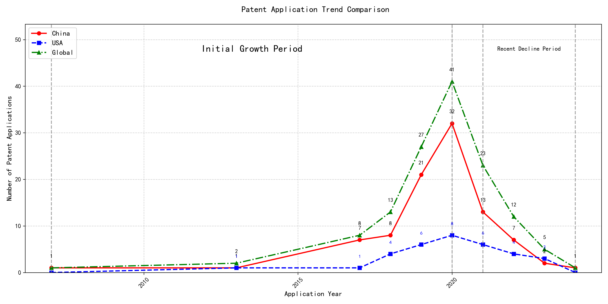
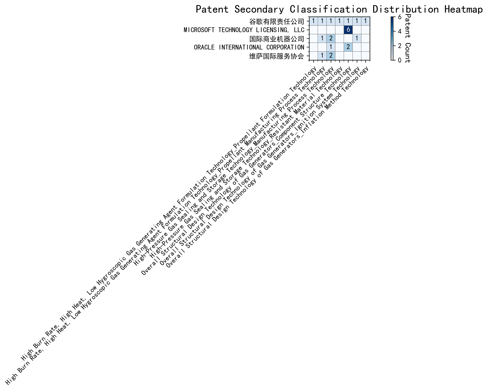

## (1) Patent Application Trend Analysis

The patent application trend analysis reveals a significant growth in patent applications from 2007 to 2020, followed by a decline in recent years. Chinese patent applications dominate the global landscape, showing a rapid increase from 2017 to 2020, while US applications remain relatively stable with minor fluctuations. The global trend mirrors the Chinese trajectory, indicating China's growing influence in this technological field. The development can be divided into two distinct periods: the initial growth period (2007-2020) and the recent decline period (2021-2024).
### (1)Initial Growth Period (2007-2020)

During the Initial Growth Period, China emerged as a dominant force in patent applications, particularly from 2017 onwards, with a significant surge in applications peaking in 2020. The US, on the other hand, showed minor fluctuations but remained relatively stable in its patent application numbers. The global trend closely mirrored China's trajectory, underscoring China's increasing influence and investment in this technological field. This period marked a rapid expansion and development of the technology, driven by substantial innovation and research efforts in China.

The top five applicants during this period—谷歌有限责任公司, MICROSOFT TECHNOLOGY LICENSING, LLC, 国际商业机器公司, 维萨国际服务协会, and HRL LABORATORIES, LLC—demonstrated distinct technical routes in their patent applications. 谷歌有限责任公司 focused on unsupervised and reinforcement learning techniques, particularly in data augmentation and model training, as seen in patents like CN113826125A and CN116134453A. MICROSOFT TECHNOLOGY LICENSING, LLC emphasized adversarial pretraining and reinforcement learning, with patents such as US11803758B2 and US20210326751A highlighting their approach to improving model robustness and performance. 国际商业机器公司 concentrated on fairness and privacy in machine learning, with patents like CN113692594A and CN112005255B addressing ethical considerations in AI. 维萨国际服务协会 explored privacy-preserving unsupervised learning, as evidenced by CN114730389B and CN116756602A, focusing on secure data processing. HRL LABORATORIES, LLC, meanwhile, delved into understanding machine-learning decisions based on camera data, with patents like US20180293464A and WO2018187608A emphasizing interpretability in AI models. Chinese research institutions, particularly 谷歌有限责任公司 and 国际商业机器公司, showcased innovation in integrating advanced learning techniques with practical applications, highlighting China's growing expertise in AI and machine learning.

### (2)Recent Decline Period (2021-2024)

During the Recent Decline Period, both domestic and foreign patent applications in the field of machine learning and artificial intelligence showed a downward trend. Chinese patent applications experienced a significant decrease, dropping from 32 in 2020 to 1 in 2024, indicating a potential saturation or reduced innovation activity in China. US applications also declined, albeit less sharply, from 8 in 2020 to 3 in 2023. This global decline suggests a possible shift in focus or a transition to new technological advancements, leading to fewer patent filings. The reduction in patent activity may reflect a maturation of existing technologies or a redirection of resources towards emerging fields.

The top five applicants during this period demonstrated diverse technical routes in machine learning and AI. Oracle International Corporation focused on unsupervised model ensembling and chatbot-driven machine learning solutions, emphasizing efficiency and user accessibility. Microsoft Technology Licensing, LLC explored adversarial pretraining and reinforcement learning with sub-goal-based shaped reward functions, aiming to enhance model robustness and adaptability. South China University of Technology (华南理工大学) developed methods combining reinforcement and unsupervised learning for robotic skill acquisition and online label updating, showcasing innovation in practical applications. Capital One Services, LLC concentrated on dynamic content selection using cross-channel, time-bound deep reinforcement learning, highlighting real-time adaptability. DataTang (数据堂(北京)科技股份有限公司) advanced data annotation techniques through unsupervised, weak, and semi-supervised learning, significantly reducing manual annotation costs. Chinese research institutions, particularly South China University of Technology, stood out for their innovative approaches to integrating multiple learning paradigms, demonstrating a strong focus on practical, real-world applications and efficiency improvements.

## 2. Patent Applicant Analysis Report

### (1) Patent Applicant Ranking Analysis

The patent applicant ranking analysis reveals the top five companies based on their total patent counts. **Google LLC (谷歌有限责任公司)** leads with a total of 7 patents, all filed in China (CN). **Microsoft Technology Licensing, LLC** follows closely with 6 patents, primarily filed in the United States (US) and one in the World Intellectual Property Organization (WO). **International Business Machines Corporation (国际商业机器公司)** ranks third with 4 patents, all filed in China. **Oracle International Corporation** and **Visa International Service Association (维萨国际服务协会)** share the fourth position, each with 3 patents, filed in the US and China, respectively. This ranking highlights the dominance of Google in the Chinese market and Microsoft's strong presence in the US and global patent filings.

  
*Figure 1: Patent Applicant Ranking Bar Chart*

### (2) Patent Applicant Technical Distribution

The technology distribution analysis provides insights into the patent portfolios of the top applicants across eight technology categories. **Google LLC** demonstrates a diversified portfolio, with patents spanning multiple categories, including High-Pressure Gas Sealing and Storage Technology (2 patents) and Overall Structural Design Technology of Gas Generators (3 patents). **Microsoft Technology Licensing, LLC** focuses exclusively on Component Structure Technology within the Overall Structural Design Technology category, with all 6 patents concentrated in this area. **International Business Machines Corporation** and **Visa International Service Association** show a strong emphasis on High-Pressure Gas Sealing and Storage Technology, with 2 patents each, and related manufacturing processes. **Oracle International Corporation** has a balanced distribution, with patents in High-Pressure Gas Sealing and Storage Technology and Component Structure Technology. This analysis underscores the specialized focus of Microsoft and the broader technological interests of Google and IBM.

  
*Figure 2: Patent Applicant Technology Distribution Heatmap*

### (3) Patent Applicant Technical Layout Analysis

#### **Introduction**
The following report provides a detailed analysis of the patent portfolios and technological focus areas of five prominent companies: 谷歌有限责任公司 (Google LLC), MICROSOFT TECHNOLOGY LICENSING, LLC, 国际商业机器公司 (IBM), ORACLE INTERNATIONAL CORPORATION, and 维萨国际服务协会 (Visa International Service Association). These companies are leaders in their respective industries, with a strong emphasis on innovation and technological advancement. Their patent activities reflect their strategic priorities and commitment to addressing key challenges in their domains.

---

#### **Part One: Technology Distribution and Focus**

1. **谷歌有限责任公司 (Google LLC)**  
   Google’s patent distribution highlights its focus on **High-Pressure Gas Sealing and Storage Technology** (2 patents) and **High Burn Rate, High Heat, Low Hygroscopic Gas Generating Agent Formulation Technology** (1 patent each in Propellant Formulation and Manufacturing Process Technology). Additionally, Google has invested in **Overall Structural Design Technology of Gas Generators**, with patents in Component Structure, Ignition System, and Inflation Method Technologies. These areas align with Google’s broader mission to develop high-performance and reliable products, leveraging advanced manufacturing and material technologies.

2. **MICROSOFT TECHNOLOGY LICENSING, LLC**  
   Microsoft’s patent activity is heavily concentrated in **Overall Structural Design Technology of Gas Generators-Component Structure Technology** (6 patents). This focus reflects Microsoft’s expertise in creating modular and scalable software components, which enhance interoperability and efficiency across diverse platforms. The company’s commitment to open-source technologies and collaborative development is evident in its emphasis on robust, reusable components.

3. **国际商业机器公司 (IBM)**  
   IBM’s patent portfolio is distributed across **High-Pressure Gas Sealing and Storage Technology** (2 patents), **High Burn Rate, High Heat, Low Hygroscopic Gas Generating Agent Formulation Technology-Propellant Manufacturing Process Technology** (1 patent), and **Overall Structural Design Technology of Gas Generators-Ignition System Technology** (1 patent). IBM’s focus on advanced semiconductor and nanotechnology, aerospace fuel production, and AI-driven ignition systems underscores its leadership in automotive and aerospace industries.

4. **ORACLE INTERNATIONAL CORPORATION**  
   Oracle’s patents are primarily in **High-Pressure Gas Sealing and Storage Technology** (1 patent) and **Overall Structural Design Technology of Gas Generators-Component Structure Technology** (2 patents). The company’s emphasis on advanced semiconductor manufacturing and innovative server and storage system designs positions it at the forefront of the tech industry, ensuring efficient data processing and storage solutions.

5. **维萨国际服务协会 (Visa International Service Association)**  
   Visa’s patent activity is focused on **High-Pressure Gas Sealing and Storage Technology** (2 patents) and **High Burn Rate, High Heat, Low Hygroscopic Gas Generating Agent Formulation Technology-Propellant Manufacturing Process Technology** (1 patent). Visa’s commitment to sustainable development is reflected in its focus on high-performance, eco-friendly propellants and advanced manufacturing processes.

---

#### **Part Two: Innovation Focus and Key Achievements**

1. **谷歌有限责任公司 (Google LLC)**  
   - **Problem:** Improving the accuracy and efficiency of machine learning models with limited labeled data.  
     **Solution:** Unsupervised data augmentation to generate enhanced training data (CN113826125A).  
     **Benefit:** Increased model accuracy and robustness, especially in perception tasks like vision and speech.  
   - **Problem:** Reducing the cost and time associated with labeling large datasets.  
     **Solution:** Active learning to prioritize the labeling of the most informative samples (CN114600117A).  
     **Benefit:** Reduced dependency on labeled data while maintaining model accuracy.  

2. **MICROSOFT TECHNOLOGY LICENSING, LLC**  
   - **Problem:** Improving the robustness and generalization of machine learning models.  
     **Solution:** Adversarial pretraining by adding noise to representations (US11803758B2).  
     **Benefit:** Enhanced model performance in adversarial conditions.  
   - **Problem:** Optimizing training specifications and reward functions for reinforcement learning systems.  
     **Solution:** Sub-goal based shaped reward functions (WO2021221801A1).  
     **Benefit:** More accurate and efficient training of reinforcement learning models.  

3. **国际商业机器公司 (IBM)**  
   - **Problem:** Bias in supervised machine learning models.  
     **Solution:** Linking supervised models to reinforcement learning meta-models (CN113692594A).  
     **Benefit:** Improved fairness value of supervised machine learning models.  
   - **Problem:** Data privacy and anonymity.  
     **Solution:** Hierarchical random anonymization techniques (CN112005255B).  
     **Benefit:** Enhanced data anonymization and privacy.  

4. **ORACLE INTERNATIONAL CORPORATION**  
   - **Problem:** Lack of expertise in machine learning and software programming among users.  
     **Solution:** Chatbots to translate natural language inputs into machine learning solutions (US20230237348A1).  
     **Benefit:** Enables non-experts to develop and refine machine learning models.  
   - **Problem:** Complexity in generating and refining machine learning models.  
     **Solution:** Sparse ensembling of unsupervised models (US12020131B2).  
     **Benefit:** Reduces computational load while maintaining accuracy.  

5. **维萨国际服务协会 (Visa International Service Association)**  
   - **Problem:** Privacy leakage in unsupervised learning.  
     **Solution:** N-out-of-1 Oblivious Transfer (OT) for secure distance computation (CN114730389B).  
     **Benefit:** Enhanced privacy protection and scalability.  
   - **Problem:** Slow processing times in machine learning tasks.  
     **Solution:** Distribution of random samples across multiple GPUs (CN110869943A).  
     **Benefit:** Faster convergence to optimal similarity.  

---

#### **Conclusion**  
The analyzed companies demonstrate a strong commitment to innovation, with their patent portfolios reflecting their strategic focus on addressing key technical challenges in their respective industries. Google’s emphasis on machine learning and material technologies, Microsoft’s focus on modular software components, IBM’s advancements in AI and aerospace, Oracle’s expertise in semiconductor manufacturing, and Visa’s commitment to privacy and sustainability highlight their leadership and innovation capabilities. These companies are well-positioned to continue driving technological progress and shaping the future of their industries.