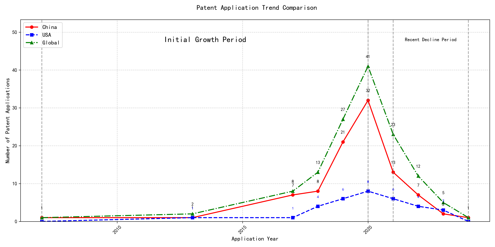

## (1) Patent Application Trend Analysis

The patent application trend analysis reveals a significant growth in patent applications from 2007 to 2020, followed by a decline in recent years. Chinese patent applications dominate the global landscape, showing a rapid increase from 2017 to 2020, while US applications remain relatively stable with minor fluctuations. The global trend mirrors the Chinese trajectory, indicating China's growing influence in this technological field. The development can be divided into two distinct periods: the initial growth period (2007-2020) and the recent decline period (2021-2024).
### (1)Initial Growth Period (2007-2020)

During the Initial Growth Period, China emerged as a dominant force in patent applications, particularly from 2017 onwards, with a significant surge in applications peaking in 2020. The US, on the other hand, showed minor fluctuations but remained relatively stable in its patent application numbers. The global trend closely mirrored China's trajectory, underscoring China's increasing influence and investment in this technological field. This period marked a rapid expansion and development of the technology, driven by substantial innovation and research efforts in China.

The top five applicants during this period—谷歌有限责任公司, MICROSOFT TECHNOLOGY LICENSING, LLC, 国际商业机器公司, 维萨国际服务协会, and HRL LABORATORIES, LLC—demonstrated distinct technical routes in their patent applications. 谷歌有限责任公司 focused on unsupervised and reinforcement learning techniques, particularly in data augmentation and model training, as seen in patents like CN113826125A and CN116134453A. MICROSOFT TECHNOLOGY LICENSING, LLC emphasized adversarial pretraining and reinforcement learning, with patents such as US11803758B2 and US20210326751A highlighting their approach to improving model robustness and performance. 国际商业机器公司 concentrated on fairness and privacy in machine learning, with patents like CN113692594A and CN112005255B addressing ethical considerations in AI. 维萨国际服务协会 explored privacy-preserving unsupervised learning, as evidenced by CN114730389B and CN116756602A, focusing on secure data processing. HRL LABORATORIES, LLC, meanwhile, delved into understanding machine-learning decisions based on camera data, with patents like US20180293464A and WO2018187608A emphasizing interpretability in AI models. Chinese research institutions, particularly 谷歌有限责任公司 and 国际商业机器公司, showcased innovation in integrating advanced learning techniques with practical applications, highlighting China's growing expertise in AI and machine learning.

### (2)Recent Decline Period (2021-2024)

During the Recent Decline Period, both domestic and foreign patent applications in the field of machine learning and artificial intelligence showed a downward trend. Chinese patent applications experienced a significant decrease, dropping from 32 in 2020 to 1 in 2024, indicating a potential saturation or reduced innovation activity in China. US applications also declined, albeit less sharply, from 8 in 2020 to 3 in 2023. This global decline suggests a possible shift in focus or a transition to new technological advancements, leading to fewer patent filings. The reduction in patent activity may reflect a maturation of existing technologies or a redirection of resources towards emerging fields.

The top five applicants during this period demonstrated diverse technical routes in machine learning and AI. Oracle International Corporation focused on unsupervised model ensembling and chatbot-driven machine learning solutions, emphasizing efficiency and user accessibility. Microsoft Technology Licensing, LLC explored adversarial pretraining and reinforcement learning with sub-goal-based shaped reward functions, aiming to enhance model robustness and adaptability. South China University of Technology (华南理工大学) developed methods combining reinforcement and unsupervised learning for robotic skill acquisition and online label updating, showcasing innovation in practical applications. Capital One Services, LLC concentrated on dynamic content selection using cross-channel, time-bound deep reinforcement learning, highlighting real-time adaptability. DataTang (数据堂(北京)科技股份有限公司) advanced data annotation techniques through unsupervised, weak, and semi-supervised learning, significantly reducing manual annotation costs. Chinese research institutions, particularly South China University of Technology, stood out for their innovative approaches to integrating multiple learning paradigms, demonstrating a strong focus on practical, real-world applications and efficiency improvements.

