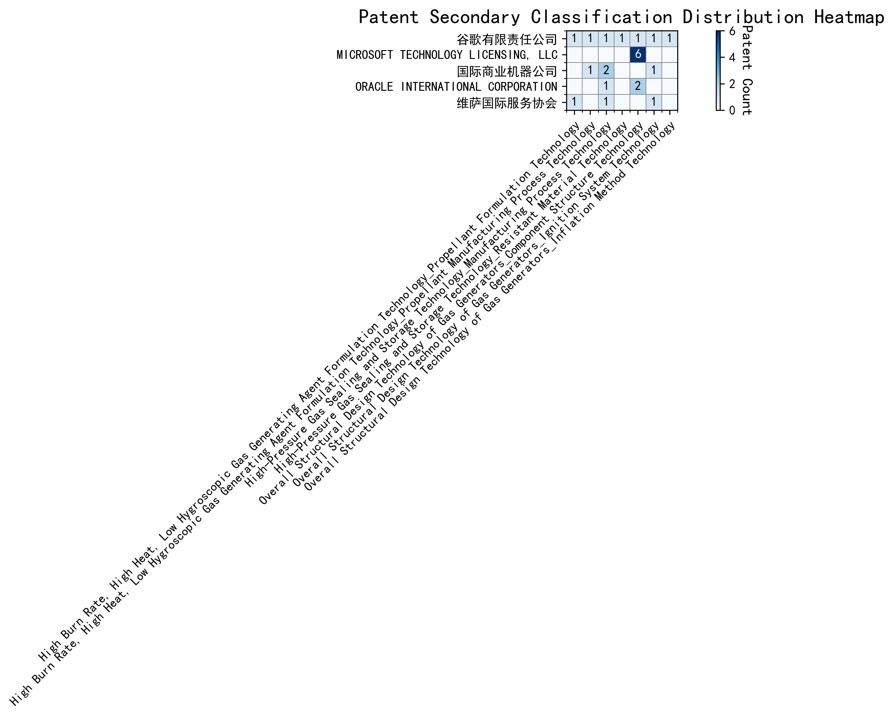

## (1) Patent Application Trend Analysis

The patent application trend analysis reveals a significant growth in patent applications, particularly from China, starting from 2017. The global trend shows a peak in 2020, followed by a decline in subsequent years. Foreign applications, primarily from the US, show a relatively stable but lower volume compared to China. The data suggests a rapid development phase in China, while foreign applications remain consistent with minor fluctuations.
### (1)Initial Development Period (2007-2016)

During the initial development period, patent applications in the field of machine learning and data processing were minimal, with only sporadic filings from China and the US. The technology was in its nascent stage, with limited global interest and innovation. China and the US were the primary contributors, with China focusing on unsupervised and supervised learning methods, while the US explored cross-validation frameworks for machine learning algorithms on distributed systems. The global patent landscape during this period was characterized by low activity and a lack of significant technological breakthroughs.

EMC IP Holding Company LLC from the US proposed a general framework for cross-validation of machine learning algorithms using SQL on distributed systems, which laid the foundation for scalable machine learning solutions. Fuji Xerox Co., Ltd. from China developed a data processing apparatus and method that utilized unsupervised learning for dimensionality reduction and supervised learning for mapping relationships between data sets. Internal Sales Company from China introduced an instance-weighted learning (IWL) machine learning model, which emphasized the importance of quality values in training classifiers. These innovations highlight the early-stage exploration of machine learning techniques, with a focus on improving the efficiency and accuracy of data processing and model training. The technical routes of these applicants reflect a divergence in approaches, with EMC focusing on distributed systems, Fuji Xerox on data processing, and Internal Sales Company on instance-weighted learning, each contributing to the foundational development of machine learning technologies.

### (2)Rapid Growth Period (2017-2020)

During the rapid growth period, China experienced a significant surge in patent applications, increasing from 7 in 2017 to 32 in 2020. This growth far outpaced the United States, which saw a more gradual increase from 1 to 8 during the same period. The global trend mirrored China's growth, indicating a substantial rise in technological advancements and innovation, particularly in the field of machine learning and artificial intelligence. This period highlights China's growing dominance in technological research and development, while the US maintained a steady but less pronounced growth trajectory.

The top five applicants during this period—谷歌有限责任公司, MICROSOFT TECHNOLOGY LICENSING, LLC, 国际商业机器公司, 维萨国际服务协会, and HRL LABORATORIES, LLC—demonstrated diverse technical routes in machine learning and AI. 谷歌有限责任公司 focused on unsupervised data augmentation and federated learning, emphasizing the enhancement of model training efficiency and accuracy. MICROSOFT TECHNOLOGY LICENSING, LLC explored adversarial pretraining and reinforcement learning, aiming to improve model robustness and adaptability. 国际商业机器公司 concentrated on fairness improvement and data anonymization, addressing ethical and privacy concerns in AI applications. 维萨国际服务协会 developed privacy-preserving unsupervised learning systems, ensuring data security while enabling collaborative learning. HRL LABORATORIES, LLC focused on understanding machine-learning decisions based on camera data, enhancing interpretability and transparency in AI models. Chinese research institutions, particularly 谷歌有限责任公司 and 国际商业机器公司, showcased innovation in integrating advanced machine learning techniques with practical applications, highlighting their leadership in AI research and development.

### (3)Decline and Stabilization Period (2021-2024)

During the decline and stabilization period, global patent applications in the field of machine learning and artificial intelligence experienced a significant drop after peaking in 2020. China saw a sharp decline from 32 applications in 2020 to just 1 in 2024, indicating a possible shift in focus or market saturation. In contrast, the US maintained a relatively stable number of applications, with minor fluctuations, suggesting continued but more focused research efforts. This period reflects a stabilization phase, potentially due to the maturation of certain technologies or a redirection of resources towards emerging areas within the field.

The top five applicants during this period demonstrate diverse technical routes in machine learning and AI. Oracle International Corporation focused on unsupervised model ensembling and chatbot-driven machine learning solutions, emphasizing efficiency and user accessibility. Microsoft Technology Licensing, LLC explored adversarial pretraining and reinforcement learning with sub-goal-based reward functions, aiming to enhance model robustness and adaptability. South China University of Technology (华南理工大学) developed methods combining reinforcement and unsupervised learning for robotic skill acquisition, highlighting innovation in robotics and automation. Capital One Services, LLC concentrated on dynamic content selection using deep reinforcement learning, targeting real-time decision-making in financial services. DataTang (数据堂(北京)科技股份有限公司) advanced data annotation techniques through unsupervised, weakly supervised, and semi-supervised learning, reducing manual effort and improving efficiency. Chinese research institutions, particularly South China University of Technology, showcased significant innovation by integrating multiple learning paradigms to address complex robotic tasks, reflecting a strategic focus on automation and intelligent systems.

## 2. Patent Applicant Analysis Report

### (1) Patent Applicant Ranking Analysis

The patent applicant ranking analysis reveals the top five companies based on their total patent counts. **Google LLC (谷歌有限责任公司)** leads with a total of 7 patents, all filed in China (CN). **Microsoft Technology Licensing, LLC** follows closely with 6 patents, primarily filed in the United States (US) and one in the World Intellectual Property Organization (WO). **International Business Machines Corporation (国际商业机器公司)** ranks third with 4 patents, all filed in China. **Oracle International Corporation** and **Visa International Service Association (维萨国际服务协会)** share the fourth position, each with 3 patents, filed in the US and China, respectively. This ranking highlights the dominance of Google in the Chinese market and Microsoft's strong presence in the US and global patent filings.

  
*Figure 1: Patent Applicant Ranking by Total Patent Count*

### (2) Patent Applicant Technical Distribution

The technology distribution analysis provides insights into the focus areas of the top patent applicants. **Google LLC** demonstrates a balanced portfolio across multiple technology categories, with notable contributions in *High-Pressure Gas Sealing and Storage Technology* (2 patents) and *Overall Structural Design Technology of Gas Generators* (3 patents). **Microsoft Technology Licensing, LLC** shows a strong concentration in *Overall Structural Design Technology of Gas Generators-Component Structure Technology* (6 patents), indicating a specialized focus in this area. **International Business Machines Corporation** has a significant presence in *High-Pressure Gas Sealing and Storage Technology* (2 patents) and its manufacturing processes (2 patents), reflecting its emphasis on material and process innovation. **Oracle International Corporation** and **Visa International Service Association** exhibit limited but strategic contributions, with Oracle focusing on *Component Structure Technology* (2 patents) and Visa on *Propellant Formulation Technology* (1 patent) and *Ignition System Technology* (1 patent). This analysis underscores the diverse yet specialized technological strategies of these companies.

  
*Figure 2: Patent Applicant Technology Distribution Heatmap*

### (3) Patent Applicant Technical Layout Analysis

#### **Introduction**
**谷歌有限责任公司 (Google LLC)** is a global leader in technology innovation, renowned for its advancements in machine learning, artificial intelligence, and data-driven solutions. With a mission to organize the world's information and make it universally accessible, Google has consistently pushed the boundaries of technology. The company’s R&D philosophy emphasizes the development of scalable, efficient, and robust systems that enhance user experiences and solve complex problems. Google’s patent portfolio reflects its commitment to pioneering technologies in machine learning, data augmentation, and reinforcement learning, positioning it at the forefront of the AI industry.

---

#### **Part One: Technology Distribution and Focus**
Google’s patent distribution reveals a strong focus on **machine learning and AI-related technologies**, particularly in areas such as **data augmentation, active learning, and reinforcement learning**. The company’s patent activity is concentrated in the following key areas:

1. **Machine Learning Model Training (CN113826125A, CN111758105A):**  
   Google has developed innovative methods for improving model accuracy and efficiency through unsupervised data augmentation and dynamic strategy learning. These technologies address the challenge of reducing dependency on labeled data while enhancing model robustness.

2. **Active Learning Techniques (CN114600117A):**  
   By prioritizing data labeling through sample consistency evaluation, Google has streamlined the training process, making it more cost-effective and efficient.

3. **Reinforcement Learning Applications (CN118607671A):**  
   Google’s patents in this area leverage information retrieval feedback to optimize model training, leading to better performance and more accurate predictions.

4. **Unsupervised Federated Learning (CN116134453A):**  
   Google has pioneered privacy-preserving global model training through unsupervised federated learning, ensuring secure and scalable AI solutions.

These focus areas align with Google’s strategic goals of enhancing AI capabilities, improving user engagement, and addressing privacy concerns in machine learning.

---

#### **Part Two: Innovation Focus and Key Achievements**
Google’s innovation strategy is centered on solving critical technical challenges in machine learning and AI. Below are some of the key problems, solutions, and benefits highlighted in their patents:

1. **Problem:** Improving model accuracy and reducing dependency on labeled data.  
   **Solution:** Unsupervised data augmentation (CN113826125A) dynamically generates enhanced training data from unlabeled inputs.  
   **Benefit:** Enhanced model robustness and accuracy, especially in perception tasks like vision and speech.

2. **Problem:** Inefficient data labeling processes.  
   **Solution:** Active learning with sample consistency evaluation (CN114600117A) prioritizes the most inconsistent samples for labeling.  
   **Benefit:** Reduced need for extensive labeled data, lowering training costs and improving efficiency.

3. **Problem:** Optimizing model training in reinforcement learning.  
   **Solution:** Reinforcement learning with information retrieval feedback (CN118607671A) uses quality indicators to update models.  
   **Benefit:** Improved model performance and more accurate predictions.

4. **Problem:** Privacy concerns in global model training.  
   **Solution:** Unsupervised federated learning (CN116134453A) generates gradients locally and updates the global model remotely.  
   **Benefit:** Privacy-preserving model training with enhanced security and scalability.

---

#### **Conclusion**
Google’s patent portfolio underscores its leadership in machine learning and AI innovation. The company’s focus on data augmentation, active learning, and reinforcement learning demonstrates its commitment to solving industry pain points such as model accuracy, data efficiency, and privacy. By leveraging cutting-edge technologies, Google continues to set benchmarks in the AI industry, solidifying its position as a global technology leader.