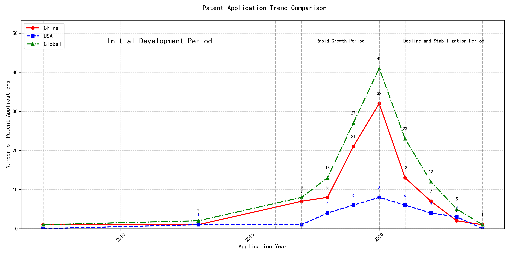

## (1) Patent Application Trend Analysis

The patent application trend analysis reveals a significant growth in patent applications, particularly from China, starting from 2017. The global trend shows a peak in 2020, followed by a decline in subsequent years. Foreign applications, primarily from the US, show a relatively stable but lower volume compared to China. The data suggests a rapid development phase in China, while foreign applications remain consistent with minor fluctuations.
### (1)Initial Development Period (2007-2016)

During the initial development period, patent applications in the field of machine learning and data processing were minimal, with only sporadic filings from China and the US. The technology was in its nascent stage, with limited global interest and innovation. China and the US were the primary contributors, with China focusing on unsupervised and supervised learning methods, while the US explored cross-validation frameworks for machine learning algorithms on distributed systems. The global patent landscape during this period was characterized by low activity and a lack of significant technological breakthroughs.

EMC IP Holding Company LLC from the US proposed a general framework for cross-validation of machine learning algorithms using SQL on distributed systems, which laid the foundation for scalable machine learning solutions. Fuji Xerox Co., Ltd. from China developed a data processing apparatus and method that utilized unsupervised learning for dimensionality reduction and supervised learning for mapping relationships between data sets. Internal Sales Company from China introduced an instance-weighted learning (IWL) machine learning model, which emphasized the importance of quality values in training classifiers. These innovations highlight the early-stage exploration of machine learning techniques, with a focus on improving the efficiency and accuracy of data processing and model training. The technical routes of these applicants reflect a divergence in approaches, with EMC focusing on distributed systems, Fuji Xerox on data processing, and Internal Sales Company on instance-weighted learning, each contributing to the foundational development of machine learning technologies.

### (2)Rapid Growth Period (2017-2020)

During the rapid growth period, China experienced a significant surge in patent applications, increasing from 7 in 2017 to 32 in 2020. This growth far outpaced the United States, which saw a more gradual increase from 1 to 8 during the same period. The global trend mirrored China's growth, indicating a substantial rise in technological advancements and innovation, particularly in the field of machine learning and artificial intelligence. This period highlights China's growing dominance in technological research and development, while the US maintained a steady but less pronounced growth trajectory.

The top five applicants during this period—谷歌有限责任公司, MICROSOFT TECHNOLOGY LICENSING, LLC, 国际商业机器公司, 维萨国际服务协会, and HRL LABORATORIES, LLC—demonstrated diverse technical routes in machine learning and AI. 谷歌有限责任公司 focused on unsupervised data augmentation and federated learning, emphasizing the enhancement of model training efficiency and accuracy. MICROSOFT TECHNOLOGY LICENSING, LLC explored adversarial pretraining and reinforcement learning, aiming to improve model robustness and adaptability. 国际商业机器公司 concentrated on fairness improvement and data anonymization, addressing ethical and privacy concerns in AI applications. 维萨国际服务协会 developed privacy-preserving unsupervised learning systems, ensuring data security while enabling collaborative learning. HRL LABORATORIES, LLC focused on understanding machine-learning decisions based on camera data, enhancing interpretability and transparency in AI models. Chinese research institutions, particularly 谷歌有限责任公司 and 国际商业机器公司, showcased innovation in integrating advanced machine learning techniques with practical applications, highlighting their leadership in AI research and development.

### (3)Decline and Stabilization Period (2021-2024)

During the decline and stabilization period, global patent applications in the field of machine learning and artificial intelligence experienced a significant drop after peaking in 2020. China saw a sharp decline from 32 applications in 2020 to just 1 in 2024, indicating a possible shift in focus or market saturation. In contrast, the US maintained a relatively stable number of applications, with minor fluctuations, suggesting continued but more focused research efforts. This period reflects a stabilization phase, potentially due to the maturation of certain technologies or a redirection of resources towards emerging areas within the field.

The top five applicants during this period demonstrate diverse technical routes in machine learning and AI. Oracle International Corporation focused on unsupervised model ensembling and chatbot-driven machine learning solutions, emphasizing efficiency and user accessibility. Microsoft Technology Licensing, LLC explored adversarial pretraining and reinforcement learning with sub-goal-based reward functions, aiming to enhance model robustness and adaptability. South China University of Technology (华南理工大学) developed methods combining reinforcement and unsupervised learning for robotic skill acquisition, highlighting innovation in robotics and automation. Capital One Services, LLC concentrated on dynamic content selection using deep reinforcement learning, targeting real-time decision-making in financial services. DataTang (数据堂(北京)科技股份有限公司) advanced data annotation techniques through unsupervised, weakly supervised, and semi-supervised learning, reducing manual effort and improving efficiency. Chinese research institutions, particularly South China University of Technology, showcased significant innovation by integrating multiple learning paradigms to address complex robotic tasks, reflecting a strategic focus on automation and intelligent systems.

