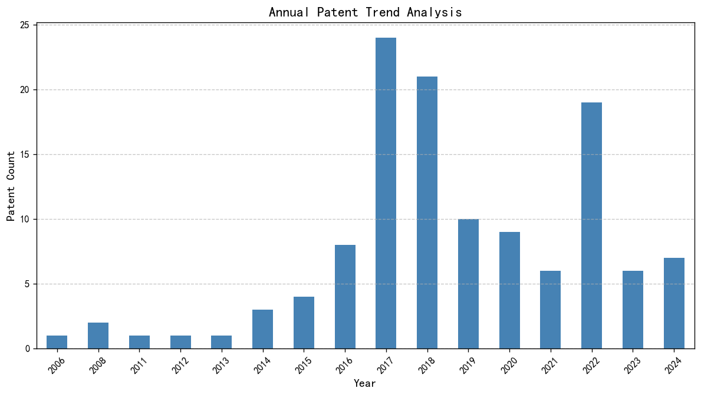
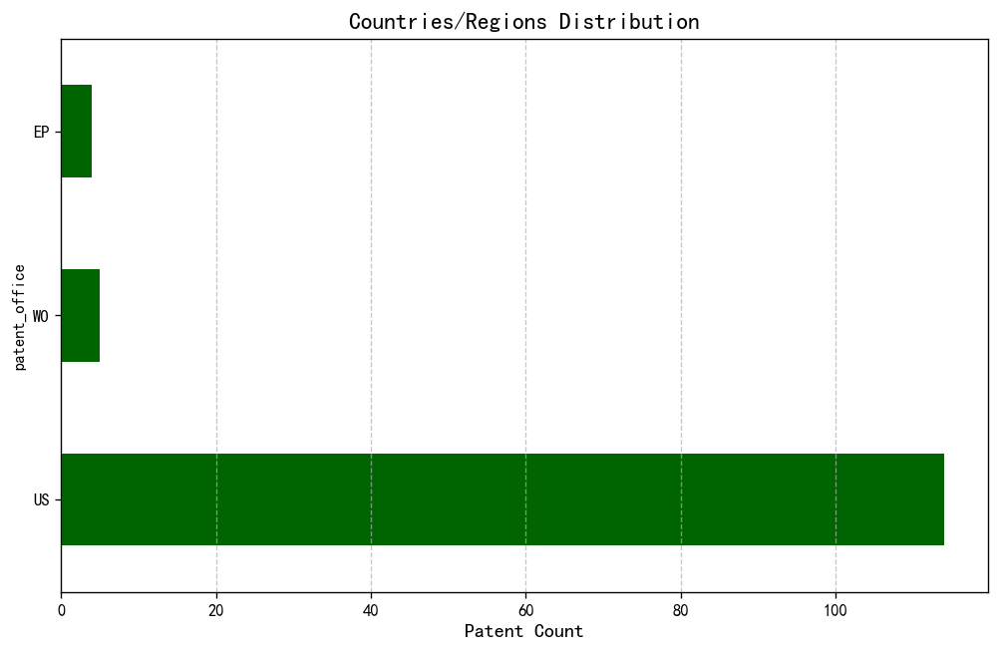

### 专利数据概况

---

#### 各技术领域专利数量

| 技术领域                                  |   专利数量 |
|:---:|:---:|
| Machine Learning - Supervised Learning    |         50 |
| Machine Learning - Unsupervised Learning  |         50 |
| Machine Learning - Reinforcement Learning |         50 |

#### 专利年度趋势分析

|   count |
|:---:|:---:|
|       1 |
|       2 |
|       1 |
|       1 |
|       1 |
|       3 |
|       4 |
|       8 |
|      24 |
|      21 |
|      10 |
|       9 |
|       6 |
|      19 |
|       6 |
|       7 |

#### 国家/地区分布分析

|   count |
|:---:|:---:|
|     114 |
|       5 |
|       4 |

