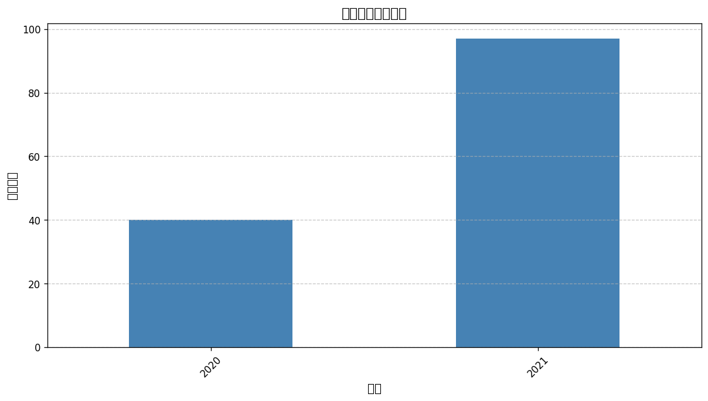
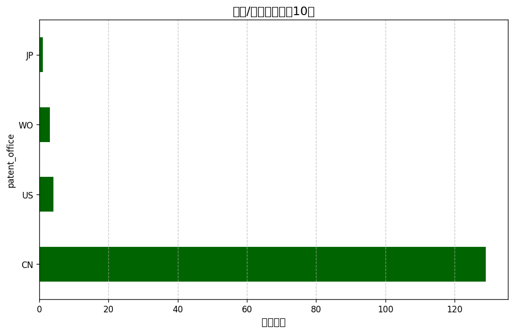

### 专利数据概况
---
#### 各技术领域专利数量
| 技术领域           |   专利数量 |
|:---:|:---:|
| 机器学习 - 监督学习    |     10 |
| 机器学习 - 无监督学习   |     10 |
| 机器学习 - 强化学习    |     10 |
| 自然语言处理 - 文本分类  |     10 |
| 自然语言处理 - 情感分析  |     10 |
| 自然语言处理 - 机器翻译  |     10 |
| 计算机视觉 - 图像识别   |     10 |
| 计算机视觉 - 目标检测   |     10 |
| 计算机视觉 - 图像分割   |     10 |
| 知识表示与推理 - 知识图谱 |     10 |
| 知识表示与推理 - 逻辑推理 |     10 |
| 知识表示与推理 - 语义网络 |     10 |
| 智能决策系统 - 专家系统  |     10 |
| 智能决策系统 - 推荐系统  |     10 |
| 智能决策系统 - 自动化决策 |     10 |
#### 专利年度趋势分析

**详细数据:**
|   count |
|:---:|:---:|
|      40 |
|      97 |
#### 国家/地区分布分析

**Top 10 国家/地区:**
|   count |
|:---:|:---:|
|     129 |
|       4 |
|       3 |
|       1 |
