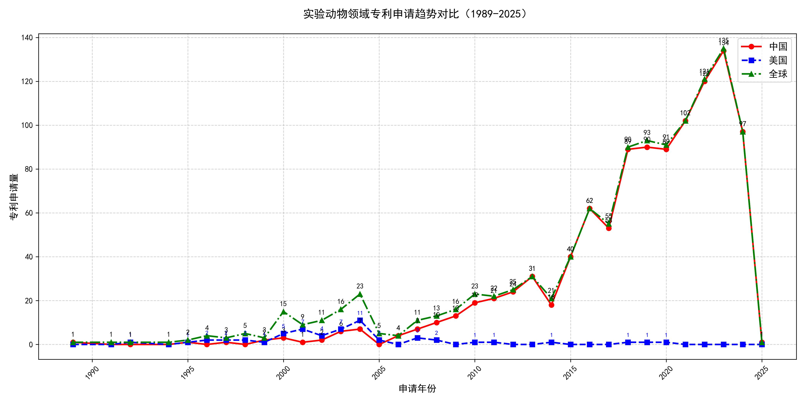

技术发展趋势：根据专利申请统计数据，可以看出中国（CN）的专利申请量从1989年的1件增长到2025年的134件，显示出显著的增长趋势，尤其是在2000年后，年增长率显著提高。这表明中国技术正处于成长期，技术研发加速。美国（US）的专利申请量在1996年后逐渐减少，可能表明其技术处于成熟期或衰退期。全球专利申请量在2000年后达到峰值，随后有所下降，但整体上仍保持较高水平，显示出技术发展的持续活跃。不同国家的技术竞争力体现在专利申请量的增长速度和领域分布上，中国在某些领域如信息技术和制造业展现出技术领域的差异化布局。

产业洞见：这些技术发展趋势可能在信息技术、制造业、新能源等领域产生影响。中国可能在未来成为信息技术和制造业领域的领导者。技术转化为市场竞争力的路径可能包括技术创新、产业升级和国际合作。

国际技术竞争与合作：从专利申请趋势看，中国与美国在技术竞争力上存在差距，但中国的发展速度表明其有望缩小差距。在某些领域，如信息技术，国际合作或竞争加剧的可能性增加。中国在某些战略性技术领域的申请量激增，表明其可能专注于这些领域的长期发展。